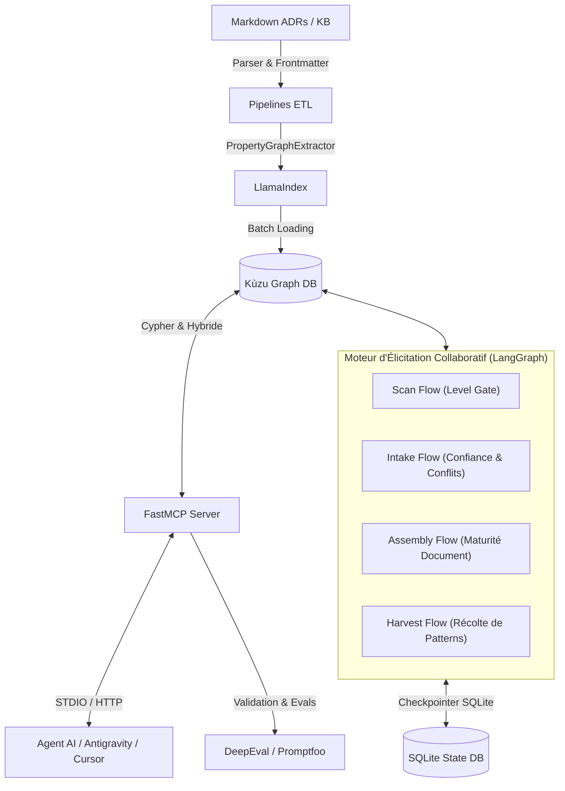

# 🧠 LLMOps — Architecture Neuro-Symbolique & Élicitation Collaborative (GraphRAG + FastMCP + LangGraph)


Une plateforme MLOps / LLMOps robuste conçue pour ingérer des dossiers d'architecture (ADRs, Principes, Glossaire, Risques en Markdown), extraire une ontologie et un graphe de connaissances (**Kùzu DB**) via **LlamaIndex PropertyGraph**, élaborer des documents d'architecture de manière collaboratives avec plusieurs architectes grâce à un **Moteur d'Élicitation LangGraph**, exposer des artefacts typés via un serveur **FastMCP**, et automatiser les tests de non-régression sémantique avec **DeepEval** et **Promptfoo**.

---

## 📐 Architecture Neuro-Symbolique & Élicitatoire

Plutôt que d'effectuer du RAG classique par découpage de texte (chunking naïf), cette plateforme combine :
1. **Raisonnement Symbolique :** Nœuds et relations explicites (`Asset`, `Subject`, `Statement`, `Conflict`, `Question`, `Uncertainty`) stockés dans **Kùzu DB**.
2. **Moteur d'Élicitation Collaboratif (LangGraph) :** Orchestration par machines d'état avec **Level Gate de maturité** (`L0_named` → `L4_specified`), détection automatique de contradictions (`check_node`), contestation et arbitrage traçables, et persistance inter-processus via Checkpointer SQLite.
3. **Capacité Neuro-Sémantique & MCP :** Extraction d'ontologies complexes par LLM via **LlamaIndex** et exposition d'outils typés via **FastMCP**.



---

## 📂 Structure du Répertoire

```text
LLMOps/
├── .github/workflows/    # CI automatisée, Ingestion KB & Évaluations sémantiques
├── artifacts/            # Artefacts générés (Rapports de progression, document.md, harvest.json)
├── data/kb/              # Base de connaissances d'architecture (ADRs, Glossaire, Principes...)
├── docs/                 # Documentation d'architecture logicielle & Manuel utilisateur
│   ├── architecture.md
│   └── user_manual.md
├── docker/               # Dockerfiles & docker-compose.yml
├── mcp_server/           # Serveur FastMCP (Client Kùzu DB, Outils typés & GraphRAG)
├── pipelines/            # Pipeline d'ingestion LlamaIndex & CLI Typer
├── tools/
│   └── elicitation/      # Moteur d'élicitation LangGraph (flows, repository Cypher, adapters)
├── tests/                # Unit tests, integration tests & Evals (DeepEval / Promptfoo)
├── pyproject.toml        # Dépendances Poetry & Outillage
└── README.md
```

---

## 🚀 Démarrage Rapide

### 1. Prérequis
- Python `>= 3.11`
- [Poetry](https://python-poetry.org/) pour la gestion de l'environnement virtuel.

### 2. Installation
```bash
# Cloner le repository et installer les dépendances
poetry install
```

### 3. Ingestion de la Base de Connaissances (GraphRAG)
Traiter l'ensemble du dossier `data/kb/` et construire le graphe dans Kùzu DB :
```bash
poetry run ingest --kb-dir data/kb --db-path data/kuzu_db
```

### 4. Démarrer le Serveur FastMCP
Lancer le serveur FastMCP sur STDOUT ou en mode Dev Inspector :
```bash
# Lancement direct du serveur MCP
poetry run mcp-server

# Mode dev interactif avec FastMCP Inspector
poetry run fastmcp dev mcp_server/main.py
```

### 5. Exécuter le Scénario d'Élicitation Référent (Démonstration Nordwave MCX v2)
Le test d'intégration [tests/integration/test_scenario_nordwave_mcx_v2.py](file:///home/momo/Dev/LLMOps/tests/integration/test_scenario_nordwave_mcx_v2.py) constitue le **scénario exemple de référence v2** illustrant l'ensemble des capacités avancées de la plateforme LLMOps :
- Collaboration multi-acteurs entre architectes (*Amina*, *Rui*, *Sofia*).
- Progression par paliers de maturité (*Level Gate* `L0` → `L4`).
- Ingestion documentaire et réconciliation avec le blueprint.
- Reprise d'élicitation inter-processus via SQLite Checkpointer (`thread_id`).
- Trajectoire d'avancement observée par sujet (`get_subject_trajectory`).
- Rétrogradation non-monotone (`demote_subject`) conservant les réponses antérieures sous revue.
- Soumission et validation à double confirmation des contributions externes (`build_contribution_graph`).
- Détection de manques génératifs, décomposition et arbitrage traçable non-manichéen.
- Récolte de candidats de patterns d'architecture (`build_harvest_graph`).
- Génération du rapport de progression et de l'assemblage provisionnel (`document.md`).

```bash
poetry run pytest tests/integration/test_scenario_nordwave_mcx_v2.py -v
```

### 6. Exécuter les Tests & Évaluations Sémantiques
```bash
# Linting & validation syntaxique
poetry run ruff check .

# Suite complète de tests unitaires et d'intégration
poetry run pytest tests/unit tests/integration -v

# Tests de non-régression sémantique (DeepEval)
poetry run deepeval test run tests/evals/deepeval/test_semantic_regression.py
```

---

## 🛠 Outils Exposés par FastMCP

| Outil FastMCP | Description | Paramètres |
|---|---|---|
| `list_assets` | Lister les documents selon leur statut, domaine ou phase | `type`, `phase`, `domain`, `status` |
| `get_asset` | Obtenir le contenu complet d'un artefact avec son frontmatter | `id` |
| `search_assets` | Recherche hybride sur les métadonnées et le graphe | `query`, `filters` |
| `get_principles_for` | Récupérer les principes d'architecture actifs | `phase`, `domain` |
| `get_decision_trail` | Historique et chaîne d'antériorité d'un ADR (`SUPERSEDES`) | `id` |
| `get_glossary_term` | Obtenir la définition canonique d'un terme du glossaire | `term` |
| `query_graph` | Exécuter une requête Cypher directe sur Kùzu DB | `cypher_query` |
| `get_render_payload` | Payload JSON complet d'affichage pour les renderers | `engagement` |
| `get_diagram_graph` | Graphe structuré & code Mermaid prêt à être rendu | `engagement`, `format` |
| `get_subject_trajectory_tool` | Trajectoire d'avancement par sujet pour timeline | `engagement`, `subject` |

---

## 📚 Documentation & Exemples
- 🏆 [Scénario d'Élicitation de Référence v2 (Test d'Intégration Nordwave MCX v2)](file:///home/momo/Dev/LLMOps/tests/integration/test_scenario_nordwave_mcx_v2.py)
- 🎨 [Guide d'Intégration du Moteur de Rendu (Renderer)](file:///home/momo/Dev/LLMOps/docs/renderer_integration.md)
- 📊 [Rapport Visuel de Progression Généré](file:///home/momo/Dev/LLMOps/artifacts/nordwave-mcx-2027/progression.md)
- 📖 [Documentation d'Architecture Logicielle](file:///home/momo/Dev/LLMOps/docs/architecture.md)
- 📗 [Manuel Utilisateur Pas-à-Pas](file:///home/momo/Dev/LLMOps/docs/user_manual.md)
- 📄 [Spécification Ingestion Documentaire](file:///home/momo/Dev/LLMOps/Arborescence%20exemple/architecture-kb/tools/elicitation/SPEC-DOCUMENT-INGESTION.md)
- 📄 [Spécification Raffinement & Contributions](file:///home/momo/Dev/LLMOps/Arborescence%20exemple/architecture-kb/tools/elicitation/SPEC-REFINEMENT-AND-CONTRIBUTIONS.md)

---

## 📄 Licence
Sous licence MIT. Voir `LICENSE` pour plus de détails.
