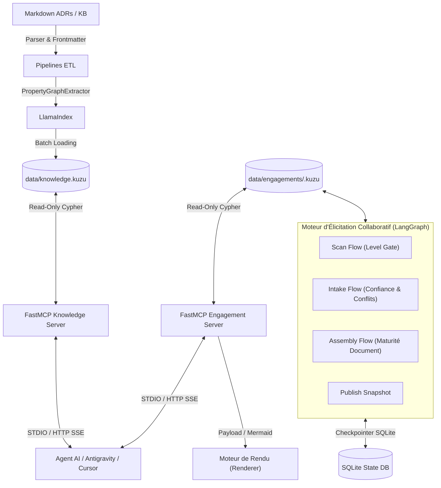

# LLMOps — Plateforme GraphRAG & Élicitation d'Architecture (LadybugDB + LangGraph + FastMCP)


Une plateforme LLMOps conçue pour ingérer des dossiers d'architecture (ADRs, Principes, Glossaire, Risques en Markdown), extraire un graphe de connaissances (**LadybugDB** / **Kùzu DB**) via **LlamaIndex PropertyGraph**, piloter le processus d'élicitation collaboratif via un **moteur d'état LangGraph 100% déterministe**, exposer des outils typés via **FastMCP**, et automatiser les tests de non-régression sémantique avec **DeepEval** et **Promptfoo**.

> **Principe Architectural Clef : Serveur Déterministe & Intelligence Client**
> Le serveur LLMOps est **100% déterministe et auditable** : il ne réalise aucun appel LLM en boîte noire au runtime de requêtage. L'intelligence raisonnante et l'interprétation sémantique résident chez le **client** (Agent AI, IDE Antigravity / Cursor / Claude Desktop), qui consomme les outils MCP typés du serveur.
> - **Zero Coût d'API Serveur** : Aucun abonnement ou clé LLM requis pour faire tourner le serveur de connaissances.
> - **Zéro Hallucination de Serving** : Les requêtes Cypher et les payloads de rendu sont 100% reproductibles et vérifiables.
> - **Liberté Totale du Client** : Chaque utilisateur ou agent client choisit son propre modèle (OpenAI, Gemini, Anthropic, Ollama local).

---

## Documentation & Spécification des Interfaces

Pour intégrer un système tiers ou connecter un moteur de rendu externe (UI Web, React, Vue, Canvas interactive, ou générateur PDF/Mermaid) :

- **[Spécification d'Interface Externe (INTERFACE.md)](docs/INTERFACE.md)** : Spécification technique complète avec les **schémas JSON de réponse** pour chaque outil.
- **[Guide d'Intégration du Moteur de Rendu (Renderer Interface Doc)](docs/renderer_integration.md)** : Manuel dédié aux développeurs de moteurs de rendu (SDK Python / HTTP SSE).
- **[Spécification du Schéma Graphe (SCHEMA.md)](docs/SCHEMA.md)** : Structure des tables et propriétés générée automatiquement depuis les bases.
- **[Guide de Déploiement GCP Cloud Run & CI](docs/user_manual.md)** : Instructions d'hébergement Serverless GCP et pipelines GitHub Actions.

---

## Architecture Hybride Graphe & Moteur d'Élicitation (ADR-0014, ADR-0015 & LadybugDB)

Au lieu d'un RAG basique par découpage de texte (chunking naïf), cette plateforme s'appuie sur une approche hybride (graphe de connaissances déterministe + serveur FastMCP) :
1. **Moteur Graphique Haute Performance & Séparation Physique (ADR-0015) :** Nœuds et relations explicites gérés par **LadybugDB** (avec rétrocompatibilité Kùzu DB via le flag `GRAPH_BACKEND`), isolés dans deux espaces physiques :
   - `data/knowledge.kuzu` (`database.lbug`) : Actifs réutilisables d'architecture (`Asset`, `GlossaryTerm`, `SUPERSEDES`).
   - `data/engagements/<engagement-id>.kuzu` : État dynamique par projet client (`Subject`, `Statement`, `Conflict`, `Question`, `Uncertainty`).
2. **Moteur d'Élicitation Collaboratif (LangGraph) :** Orchestration par machines d'état déterministes avec **Level Gate de maturité** (`L0_named` → `L4_specified`), détection automatique de contradictions (`check_node`), contestation et arbitrage traçables, et persistance inter-processus via Checkpointer SQLite.
3. **Services FastMCP :** Exposition d'outils Cypher/JSON typés via **FastMCP** avec enveloppe de réponse normalisée.



---

## Structure du Répertoire (Complete Workspace Layout)

```text
LLMOps/
├── .github/workflows/         # CI automatisée, Ingestion KB & Évaluations sémantiques
├── apps/
│   └── kb-client-app/         # App cliente dédiée SvelteKit + Threlte 3D (Multi-KB, Analytics & Lecteur KB)
├── artifacts/                 # Artefacts générés (Rapports de progression, document.md, instantanés)
├── data/
│   ├── kb/                    # Dossier source des documents Markdown (ADRs, Glossaire, Principes...)
│   ├── knowledge.kuzu         # [ADR-0015] Base physique de la base de connaissances réutilisable
│   └── engagements/           # [ADR-0015] Répertoire des bases physiques par projet client (.kuzu)
│       └── nordwave-mcx-2027.kuzu
├── docker/                    # Dockerfile, docker-compose.yml & scripts conteneurisés
├── docs/                      # Documentation complète du projet
│   ├── INTERFACE.md           # Spécification complète de l'interface & schémas JSON des réponses
│   ├── SCHEMA.md              # Spécification du schéma Kùzu DB générée automatiquement
│   ├── architecture.md        # Spécification de l'architecture logicielle (ADR-0014 / ADR-0015)
│   ├── renderer_integration.md# Guide d'intégration dédié au moteur de rendu (Renderer)
│   ├── user_manual.md         # Manuel d'utilisation pas-à-pas
│   └── graph_explorer.html    # Visualiseur interactif de graphe HTML/JS
├── mcp_server/                # Serveurs FastMCP & architecture multi-bases
│   ├── core/                  # Configuration, auth (`authorise()`), DB (`open_connection()`), envelope
│   ├── knowledge/             # Outils du Knowledge Server (Assets, Glossaire, ADRs)
│   ├── engagement/            # Outils de l'Engagement Server (Sujets, Énoncés, Conflits, Renderer)
│   ├── main_knowledge.py      # Point d'entrée du Knowledge Server (`mcp-server-knowledge`)
│   ├── main_engagement.py     # Point d'entrée de l'Engagement Server (`mcp-server-engagement`)
│   ├── main.py                # Point d'entrée serveur unique rétrocompatible (`mcp-server`)
│   └── renderer_interface.py  # SDK Client Python Native (`RendererClient`)
├── pipelines/                 # Pipelines ETL & Ingestion LlamaIndex
│   ├── ingestion/             # Extracteur GraphRAG, migration ADR-0015, générateurs
│   │   ├── migrate_adr0015.py        # Script de migration vers le layout multi-bases ADR-0015
│   │   ├── generate_schema_doc.py    # Générateur de docs/SCHEMA.md à partir des bases
│   │   ├── markdown_parser.py        # Parser frontmatter & sections Markdown
│   │   └── graph_loader.py           # Chargeur Kùzu DB PropertyGraph LlamaIndex
│   └── cli.py                 # CLI Typer d'ingestion (`poetry run ingest`)
├── tools/                     # Moteur d'élicitation collaboratif LangGraph
│   └── elicitation/           # Repository Cypher, flows (Scan, Intake, Assemble), Mailbox & CLI `elicit`
├── tests/                     # Tests unitaires, d'intégration & évaluations sémantiques
│   ├── unit/                  # test_server_contract.py, test_renderer_interface.py
│   ├── integration/           # test_scenario_nordwave_mcx_v2.py
│   └── evals/                 # Benchmarks DeepEval & Promptfoo
├── cloudbuild.yaml            # Configuration de build automatisé GCP Cloud Build
├── pyproject.toml             # Dépendances Poetry & points d'entrée CLI
└── README.md
```

---

## Démarrage Rapide

### 1. Prérequis
- Python `>= 3.11`
- [Poetry](https://python-poetry.org/) pour la gestion de l'environnement virtuel.

### 2. Installation
```bash
# Cloner le repository et installer les dépendances
poetry install
```

### 3. Ingestion & Migration des Bases Graphiques (ADR-0015 & LadybugDB)
Exécuter la migration physique des bases vers LadybugDB pour créer `data/knowledge.kuzu` (`database.lbug`) et `data/engagements/nordwave-mcx-2027.kuzu` :
```bash
# Exécuter la migration d'ingestion (GRAPH_BACKEND=ladybug par défaut)
poetry run python -m pipelines.ingestion.migrate_adr0015
```

Générer la documentation à jour du schéma graphique ([docs/SCHEMA.md](docs/SCHEMA.md)) :
```bash
poetry run python -m pipelines.ingestion.generate_schema_doc
```

### 4. Démarrer les Serveurs FastMCP (Découpage ADR-0014 / ADR-0015)
```bash
# Serveur 1 : Base Connaissances Réutilisables (Assets, ADRs, Principes)
poetry run mcp-server-knowledge

# Serveur 2 : État d'Engagement Projet Client (Sujets, Énoncés, Conflits)
poetry run mcp-server-engagement
```

### 5. Exécution de la Suite de Tests & Non-Régression
```bash
# Lancer l'intégralité de la suite déterministe (Unitaires, Contrats, Équivalence LadybugDB)
poetry run pytest -m deterministic -v

# Lancer la suite de benchmarks et d'évaluations DeepEval
poetry run python tests/bench/harness.py
poetry run pytest tests/bench/test_bench.py -v
```

### 6. Gestion des Engagements & Publication d'Instantannés (CLI `elicit`)
```bash
# Publier un instantané atomique du graphe de travail vers data/engagements/
poetry run elicit publish --engagement nordwave-mcx-2027

# Créer un nouvel engagement vierge
poetry run elicit engagement create client-demo-2026

# Archiver un engagement
poetry run elicit engagement archive client-demo-2026
```

---

## Publication & Déploiement GCP Cloud Run

Le serveur FastMCP est déployé sur **Google Cloud Platform (GCP) Cloud Run** (région `europe-west1`) sous forme de conteneur Serverless sécurisé par jeton d'authentification (`SERVER_TOKEN`).

### Spécifications de Déploiement
- **Image Docker multi-stage** basée sur `python:3.11-slim` avec installation Poetry.
- **Points d'accès HTTP/SSE Serverless** :
  - Endpoint SSE MCP : `https://llmops-mcp-server-344571265365.europe-west1.run.app/sse?token=llmops-token-2026-sec-98a41f`
  - Visualiseur Graphe interactif : `https://llmops-mcp-server-344571265365.europe-west1.run.app/visualize?token=llmops-token-2026-sec-98a41f`
  - Health check : `https://llmops-mcp-server-344571265365.europe-west1.run.app/health`

### Commandes de Déploiement Manuel
```bash
# 1. Build de l'image Docker avec Google Cloud Build
gcloud builds submit --config cloudbuild.yaml .

# 2. Déploiement sur GCP Cloud Run (Serverless)
gcloud run deploy llmops-mcp-server \
  --image europe-west1-docker.pkg.dev/llmops-platform-450000/llmops-repo/llmops-mcp-server:latest \
  --platform managed \
  --region europe-west1 \
  --allow-unauthenticated \
  --set-env-vars SERVER_TOKEN="llmops-token-2026-sec-98a41f",GRAPH_BACKEND="ladybug"
```

---

## Outils Exposés par les Serveurs FastMCP

Tous les outils retournent une **enveloppe de réponse normalisée** : `{"status": "ok" | "not_found" | "invalid_argument" | "error", "count": int, "data": ...}`.

### Serveur 1 — Knowledge Server (`mcp_server/main_knowledge.py`)
| Outil MCP | Description | Paramètres |
|---|---|---|
| `list_assets` | Lister les documents selon leur statut, domaine ou phase | `type`, `phase`, `domain`, `status` |
| `get_asset` | Obtenir le contenu complet d'un artefact avec son frontmatter | `id` |
| `get_assets` | Résolution par lot (*batch*) d'artefacts d'architecture | `ids` |
| `search_assets` | Recherche hybride sur les métadonnées et le graphe | `query`, `filters` |
| `get_principles_for` | Récupérer les principes d'architecture actifs | `phase`, `domain` |
| `get_decision_trail` | Historique et chaîne d'antériorité d'un ADR (`SUPERSEDES`) | `id` |
| `get_glossary_term` | Obtenir la définition canonique d'un terme du glossaire | `term` |
| `get_knowledge_analytics` | Métriques de volume, statut, confiance et antériorité | *(aucun)* |
| `get_domain_prominence_report` | Volume et matrice des dépendances inter-domaines (`REQUIRES`) | *(aucun)* |
| `query_graph` | Exécuter une requête Cypher en lecture seule sur la KB | `cypher_query` |
| `get_graph_summary` | Résumé des nœuds et relations de la base de connaissances | *(aucun)* |

### Serveur 2 — Engagement Server (`mcp_server/main_engagement.py`)
| Outil MCP | Description | Paramètres |
|---|---|---|
| `get_subject` | Consulter l'état de maturité d'un sujet d'architecture | `engagement`, `subject` |
| `get_subject_trajectory` | Trajectoire d'avancement par sujet pour timeline | `engagement`, `subject` |
| `get_board` | Tableau de maturité des sujets pour un engagement | `engagement` |
| `get_statements` | Énoncés d'architecture actifs pour un engagement | `engagement` |
| `get_conflicts` | Conflits d'architecture ouverts pour un engagement | `engagement` |
| `get_open_questions` | Questions d'élicitation ouvertes | `engagement` |
| `get_diagram_graph` | Graphe structuré & code Mermaid prêt à être rendu | `engagement`, `format` |
| `get_render_payload` | Payload JSON complet d'affichage pour les renderers | `engagement` |
| `get_dangling_references` | Rapport d'identifiants d'actifs non résolus ou obsolètes | `engagement` |
| `query_graph` | Exécuter une requête Cypher en lecture seule sur l'engagement | `cypher_query`, `engagement` |
| `get_graph_summary` | Résumé des nœuds et relations du plan d'engagement | *(aucun)* |

---

## Liens Utiles vers la Documentation
- **[Spécification d'Interface Externe (INTERFACE.md)](docs/INTERFACE.md)**
- **[Guide d'Intégration du Moteur de Rendu (Renderer Interface Doc)](docs/renderer_integration.md)**
- **[Spécification Auto-générée du Schéma Graphe Kùzu DB](docs/SCHEMA.md)**
- **[Documentation d'Architecture Logicielle (ADR-0014 / ADR-0015)](docs/architecture.md)**
- **[Test d'Intégration de l'Interface Renderer (Python SDK)](tests/unit/test_renderer_interface.py)**
- **[Scénario d'Élicitation de Référence (Test Nordwave MCX v2)](tests/integration/test_scenario_nordwave_mcx_v2.py)**
- **[Manuel Utilisateur Pas-à-Pas](docs/user_manual.md)**

---

## Licence
Sous licence MIT. Voir `LICENSE` pour plus de détails.
