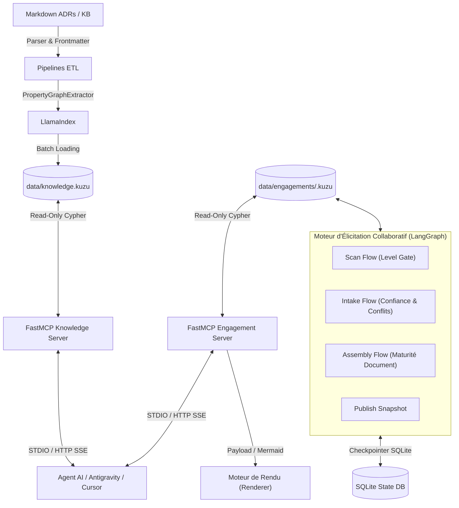

# 🧠 LLMOps — Architecture Neuro-Symbolique & Élicitation Collaborative (GraphRAG + FastMCP + LangGraph)


Une plateforme MLOps / LLMOps robuste conçue pour ingérer des dossiers d'architecture (ADRs, Principes, Glossaire, Risques en Markdown), extraire une ontologie et un graphe de connaissances (**Kùzu DB**) via **LlamaIndex PropertyGraph**, élaborer des documents d'architecture de manière collaboratives avec plusieurs architectes grâce à un **Moteur d'Élicitation LangGraph**, exposer des artefacts typés via un serveur **FastMCP**, et automatiser les tests de non-régression sémantique avec **DeepEval** et **Promptfoo**.

---

## 🎨 Document d'Interface pour Moteur de Rendu (Renderer)

Pour connecter un moteur de rendu externe (UI Web, React, Vue, Canvas interactive, ou générateur PDF/Mermaid), consultez la documentation dédiée :

👉 **[Guide d'Intégration du Moteur de Rendu (Renderer Interface Doc)](file:///home/momo/Dev/LLMOps/docs/renderer_integration.md)** 👈

---

## 📐 Architecture Neuro-Symbolique, ADR-0014 & ADR-0015

Plutôt que d'effectuer du RAG classique par découpage de texte (chunking naïf), cette plateforme combine :
1. **Raisonnement Symbolique & Séparation Physique (ADR-0015) :** Nœuds et relations explicites isolés dans deux espaces physiques Kùzu DB :
   - `data/knowledge.kuzu` : Actifs réutilisables d'architecture (`Asset`, `GlossaryTerm`, `SUPERSEDES`).
   - `data/engagements/<engagement-id>.kuzu` : État dynamique par projet client (`Subject`, `Statement`, `Conflict`, `Question`, `Uncertainty`).
2. **Moteur d'Élicitation Collaboratif (LangGraph) :** Orchestration par machines d'état avec **Level Gate de maturité** (`L0_named` → `L4_specified`), détection automatique de contradictions (`check_node`), contestation et arbitrage traçables, et persistance inter-processus via Checkpointer SQLite.
3. **Capacité Neuro-Sémantique & MCP :** Extraction d'ontologies complexes par LLM via **LlamaIndex** et exposition d'outils typés via **FastMCP** avec enveloppe de réponse normalisée.



---

## 📂 Structure du Répertoire (Mise à Jour ADR-0015)

```text
LLMOps/
├── .github/workflows/    # CI automatisée, Ingestion KB & Évaluations sémantiques
├── artifacts/            # Artefacts générés (Rapports de progression, document.md, instantanés)
├── data/
│   ├── kb/               # Dossier source Markdown (ADRs, Glossaire, Principes...)
│   ├── knowledge.kuzu    # [ADR-0015] Base physique de la base de connaissances réutilisable
│   └── engagements/      # [ADR-0015] Répertoire des bases physiques par projet client (.kuzu)
│       └── nordwave-mcx-2027.kuzu
├── docs/                 # Documentation d'architecture logicielle & Manuels
│   ├── architecture.md           # Spécification d'architecture logicielle ADR-0014/ADR-0015
│   ├── renderer_integration.md   # 🎨 Spécification d'interface Moteur de Rendu (Renderer)
│   ├── SCHEMA.md                 # 📊 Spécification du schéma Kùzu DB générée automatiquement
│   └── user_manual.md            # Manuel d'utilisation pas-à-pas
├── docker/               # Dockerfiles & docker-compose.yml
├── mcp_server/           # Serveurs FastMCP (Core Auth/DB, Knowledge, Engagement, Renderer Interface)
├── pipelines/            # Ingestion GraphRAG, migration ADR-0015 & générateur de schéma
│   └── ingestion/
│       ├── migrate_adr0015.py         # Script d'exécution de la migration physique multi-bases
│       └── generate_schema_doc.py     # Générateur de docs/SCHEMA.md
├── tools/
│   └── elicitation/      # Moteur d'élicitation LangGraph (flows, repository Cypher, CLI publish)
├── tests/                # Unit tests (test_server_contract, test_renderer_interface), Evals
├── pyproject.toml        # Dépendances Poetry & scripts d'entrée CLI
└── README.md
```

---

## 🚀 Démarrage Rapide

### 1. Prérequis
- Python `>= 3.11`
- [Poetry](https://python-poetry.org/) pour la gestion de l'environnement virtuel.

### 2. Installation
```bash
# Cloner le repository et installer les dépendances
poetry install
```

### 3. Ingestion & Migration des Bases Graphiques (ADR-0015)
Exécuter la migration physique des bases pour créer `data/knowledge.kuzu` et `data/engagements/nordwave-mcx-2027.kuzu` :
```bash
poetry run python -m pipelines.ingestion.migrate_adr0015
```

Générer la documentation à jour du schéma graphique ([docs/SCHEMA.md](file:///home/momo/Dev/LLMOps/docs/SCHEMA.md)) :
```bash
poetry run python -m pipelines.ingestion.generate_schema_doc
```

### 4. Démarrer les Serveurs FastMCP (Découpage ADR-0014 / ADR-0015)
```bash
# Serveur 1 : Base Connaissances Réutilisables (Assets, ADRs, Principes)
poetry run mcp-server-knowledge

# Serveur 2 : État d'Engagement Projet Client (Sujets, Énoncés, Conflits)
poetry run mcp-server-engagement
```

### 5. Gestion des Engagements & Publication d'Instantannés (CLI `elicit`)
```bash
# Publier un instantané atomique du graphe de travail vers data/engagements/
poetry run elicit publish --engagement nordwave-mcx-2027

# Créer un nouvel engagement vierge
poetry run elicit engagement create client-demo-2026

# Archiver un engagement
poetry run elicit engagement archive client-demo-2026
```

---

## 🛠 Outils Exposés par les Serveurs FastMCP

Tous les outils retournent une **enveloppe de réponse normalisée** : `{"status": "ok" | "not_found" | "invalid_argument" | "error", "count": int, "data": ...}`.

### 📚 Serveur 1 — Knowledge Server (`mcp_server/main_knowledge.py`)
| Outil MCP | Description | Paramètres |
|---|---|---|
| `list_assets` | Lister les documents selon leur statut, domaine ou phase | `type`, `phase`, `domain`, `status` |
| `get_asset` | Obtenir le contenu complet d'un artefact avec son frontmatter | `id` |
| `get_assets` | Résolution par lot (*batch*) d'artefacts d'architecture | `ids` |
| `search_assets` | Recherche hybride sur les métadonnées et le graphe | `query`, `filters` |
| `get_principles_for` | Récupérer les principes d'architecture actifs | `phase`, `domain` |
| `get_decision_trail` | Historique et chaîne d'antériorité d'un ADR (`SUPERSEDES`) | `id` |
| `get_glossary_term` | Obtenir la définition canonique d'un terme du glossaire | `term` |
| `query_graph` | Exécuter une requête Cypher en lecture seule sur la KB | `cypher_query` |
| `get_graph_summary` | Résumé des nœuds et relations de la base de connaissances | *(aucun)* |

### 🎯 Serveur 2 — Engagement Server (`mcp_server/main_engagement.py`)
| Outil MCP | Description | Paramètres |
|---|---|---|
| `get_subject` | Consulter l'état de maturité d'un sujet d'architecture | `engagement`, `subject` |
| `get_subject_trajectory` | Trajectoire d'avancement par sujet pour timeline | `engagement`, `subject` |
| `get_board` | Tableau de maturité des sujets pour un engagement | `engagement` |
| `get_statements` | Énoncés d'architecture actifs pour un engagement | `engagement` |
| `get_conflicts` | Conflits d'architecture ouverts pour un engagement | `engagement` |
| `get_open_questions` | Questions d'élicitation ouvertes | `engagement` |
| `get_diagram_graph` | Graphe structuré & code Mermaid prêt à être rendu | `engagement`, `format` |
| `get_render_payload` | Payload JSON complet d'affichage pour les renderers | `engagement` |
| `get_dangling_references` | Rapport d'identifiants d'actifs non résolus ou obsolètes | `engagement` |
| `query_graph` | Exécuter une requête Cypher en lecture seule sur l'engagement | `cypher_query`, `engagement` |
| `get_graph_summary` | Résumé des nœuds et relations du plan d'engagement | *(aucun)* |

---

## 📚 Liens Utiles vers la Documentation
- 🔌 **[Spécification d'Interface Externe (INTERFACE.md)](file:///home/momo/Dev/LLMOps/docs/INTERFACE.md)**
- 🎨 **[Guide d'Intégration du Moteur de Rendu (Renderer Interface Doc)](file:///home/momo/Dev/LLMOps/docs/renderer_integration.md)**
- 📊 **[Spécification Auto-générée du Schéma Graphe Kùzu DB](file:///home/momo/Dev/LLMOps/docs/SCHEMA.md)**
- 📖 **[Documentation d'Architecture Logicielle (ADR-0014 / ADR-0015)](file:///home/momo/Dev/LLMOps/docs/architecture.md)**
- 🟢 **[Test d'Intégration de l'Interface Renderer (Python SDK)](file:///home/momo/Dev/LLMOps/tests/unit/test_renderer_interface.py)**
- 🏆 **[Scénario d'Élicitation de Référence (Test Nordwave MCX v2)](file:///home/momo/Dev/LLMOps/tests/integration/test_scenario_nordwave_mcx_v2.py)**
- 📗 **[Manuel Utilisateur Pas-à-Pas](file:///home/momo/Dev/LLMOps/docs/user_manual.md)**

---

## 📄 Licence
Sous licence MIT. Voir `LICENSE` pour plus de détails.
