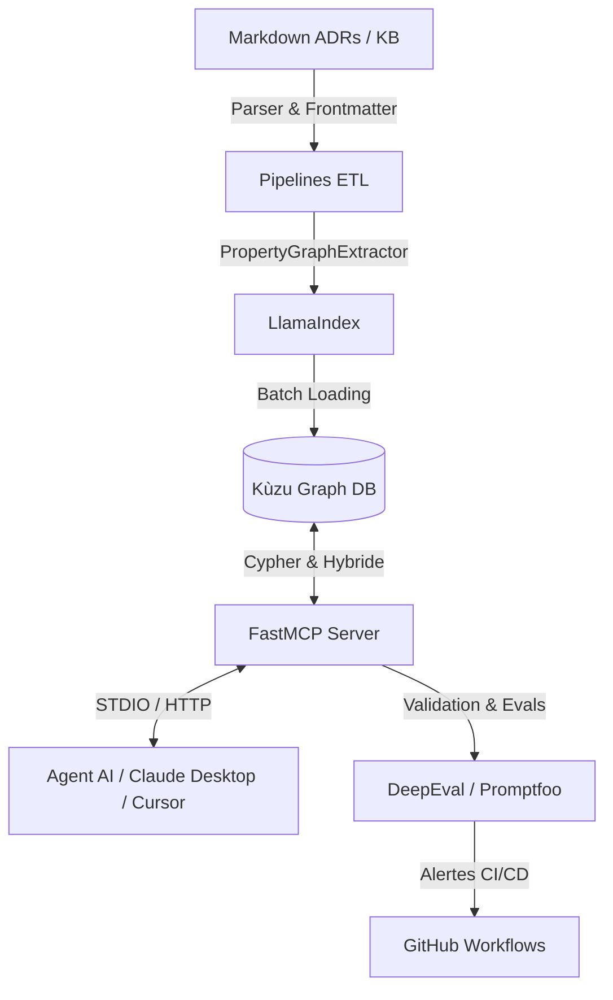

# 🧠 LLMOps — Architecture Neuro-Symbolique (GraphRAG + FastMCP)


Une plateforme MLOps / LLMOps robuste conçue pour ingérer des dossiers d'architecture (ADRs, Principes, Glossaire, Risques en Markdown), extraire une ontologie et un graphe de connaissances (Kùzu DB) via **LlamaIndex PropertyGraph**, exposer les artefacts typés et des requêtes hybrides à un Agent via un serveur **FastMCP**, et automatiser les tests de non-régression sémantique avec **DeepEval** et **Promptfoo**.

---

## 📐 Architecture Neuro-Symbolique

Plutôt que d'effectuer du RAG classique par découpage de texte (chunking naïf), cette plateforme combine :
1. **Raisonnement Symbolique :** Nœuds et relations explicites (ADRs, Principes, Termes de glossaire, dépendances `SUPERSEDES` / `REQUIRES`) stockés dans **Kùzu DB**.
2. **Capacité Neuro-Sémantique (LLM) :** Extraction d'ontologies complexes par LLM via **LlamaIndex** et exposition d'outils typés via **FastMCP**.



---

## 📂 Structure du Répertoire

```text
LLMOps/
├── .github/workflows/    # Automated CI, KB Ingestion & Semantic Evals
├── data/kb/              # Base de connaissances d'architecture (ADRs, Glossaire, Principes...)
├── docs/                 # Documentation d'architecture logicielle & Manuel utilisateur
│   ├── architecture.md
│   └── user_manual.md
├── docker/               # Dockerfiles & docker-compose.yml
├── mcp_server/           # Serveur FastMCP (Client Kùzu DB, Outils typés & GraphRAG)
├── pipelines/            # Pipeline d'ingestion LlamaIndex & CLI Typer
├── tests/                # Unit tests, integration tests & Evals (DeepEval / Promptfoo)
├── pyproject.toml        # Dépendances Poetry & Outillage
└── README.md
```

---

## 🚀 Démarrage Rapide

### 1. Prérequis
- Python `>= 3.11`
- [Poetry](https://python-poetry.org/) pour la gestion de l'environnement virtuel.
- Clé d'API OpenAI (`OPENAI_API_KEY`) pour l'extraction LlamaIndex et les évaluations DeepEval.

### 2. Installation
```bash
# Cloner le repository et installer les dépendances
poetry install
```

### 3. Ingestion de la Base de Connaissances (GraphRAG)
Traiter l'ensemble du dossier `data/kb/` et construire le graphe dans Kùzu DB :
```bash
poetry run ingest --kb-dir data/kb --db-path data/kuzu_db
```

### 4. Démarrer le Serveur FastMCP
Lancer le serveur FastMCP sur STDOUT ou en mode Dev Inspector :
```bash
# Lancement direct du serveur MCP
poetry run mcp-server

# Mode dev interactif avec FastMCP Inspector
poetry run fastmcp dev mcp_server/main.py
```

### 5. Exécuter les Tests & Évaluations Sémantiques
```bash
# Tests unitaires & intégration
poetry run pytest tests/unit tests/integration

# Tests de non-régression sémantique (DeepEval)
poetry run deepeval test run tests/evals/deepeval/test_semantic_regression.py
```

---

## 🛠 Outils Exposés par FastMCP

| Outil FastMCP | Description | Paramètres |
|---|---|---|
| `list_assets` | Lister les documents selon leur statut, domaine ou phase | `type`, `phase`, `domain`, `status` |
| `get_asset` | Obtenir le contenu complet d'un artefact avec son frontmatter | `id` |
| `search_assets` | Recherche hybride sur les métadonnées et le graphe | `query`, `filters` |
| `get_principles_for` | Récupérer les principes d'architecture actifs | `phase`, `domain` |
| `get_decision_trail` | Historique et chaîne d'antériorité d'un ADR (`SUPERSEDES`) | `id` |
| `get_glossary_term` | Obtenir la définition canonique d'un terme du glossaire | `term` |
| `query_graph` | Exécuter une requête Cypher directe sur Kùzu DB | `cypher_query` |

---

## 📚 Documentation
- 📖 [Documentation d'Architecture Logicielle](file:///home/momo/Dev/LLMOps/docs/architecture.md)
- 📗 [Manuel Utilisateur Pas-à-Pas](file:///home/momo/Dev/LLMOps/docs/user_manual.md)

---

## 📄 Licence
Sous licence MIT. Voir `LICENSE` pour plus de détails.
