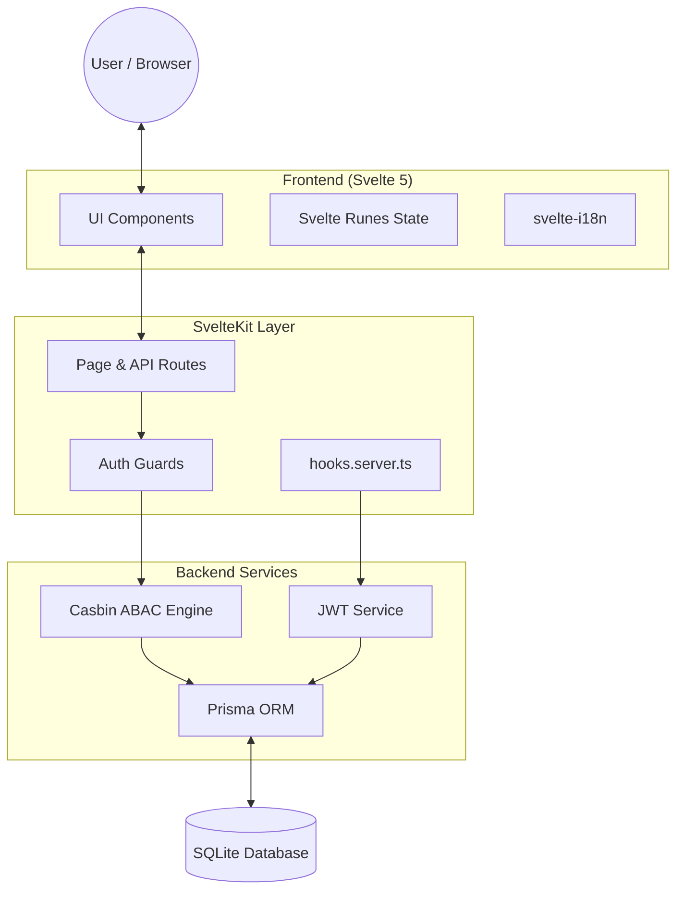
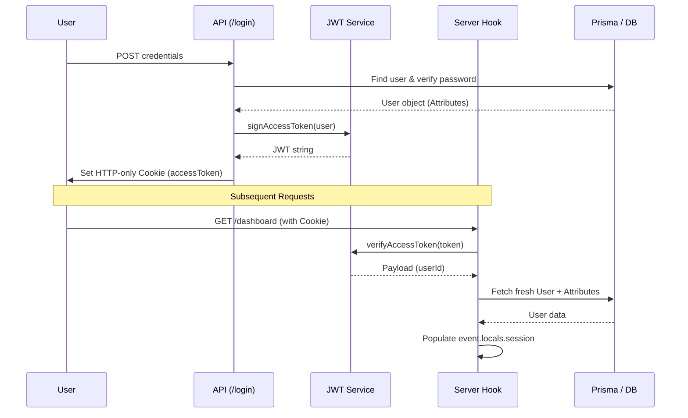
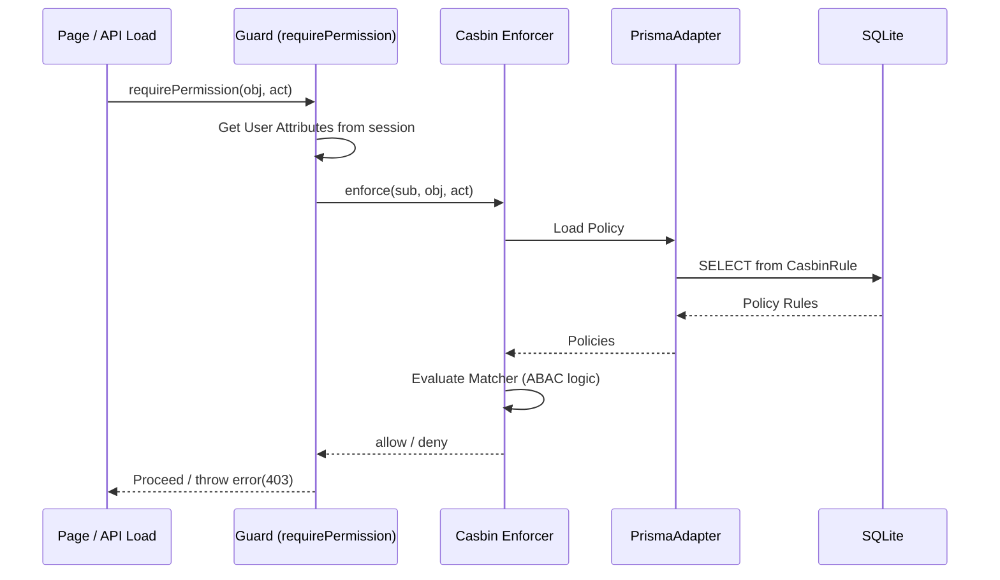
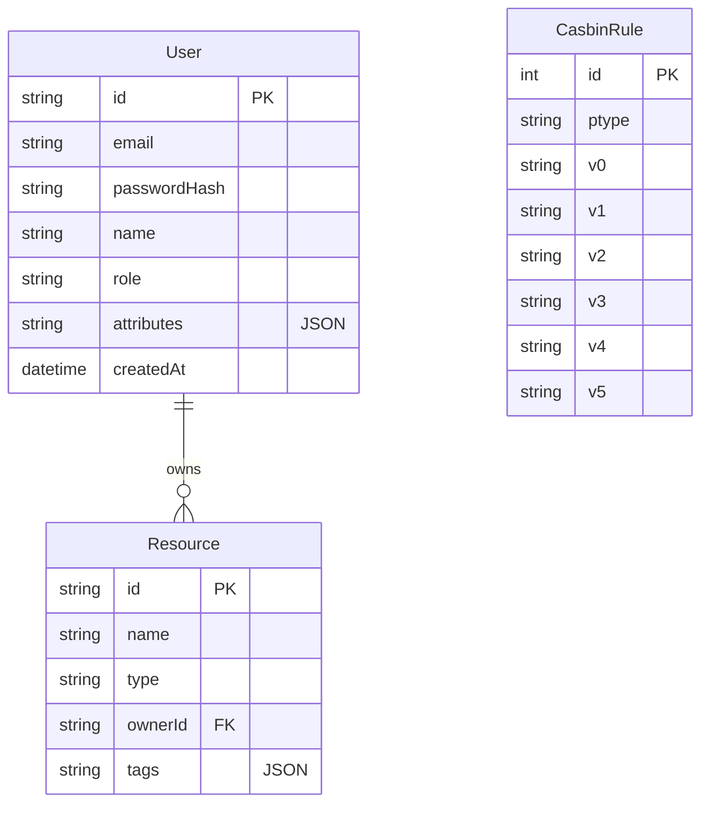

# Software Architecture Documentation

This document describes the high-level architecture, data flow, and design patterns used in the SvelteKit Admin Boilerplate.

## 1. High-Level Overview

The application follows a modern full-stack architecture using SvelteKit, where the frontend and backend are tightly integrated but maintain clear boundaries for security-critical logic.

---

## 2. Authentication & Session Management

We use a stateless JWT-based authentication system with secure HTTP-only cookies.

---

## 3. Authorization (ABAC) Flow

Authorization is enforced using **Casbin**, allowing for both Role-Based (RBAC) and Attribute-Based (ABAC) Access Control.

---

## 4. Database Schema (ERD)

Managed via Prisma, the schema supports users, their dynamic attributes, and persistent authorization policies.

---

## 5. Technical Stack

| Layer | Component | Description |
|---|---|---|
| **Framework** | SvelteKit / Svelte 5 | Reactive UI with Runes and SSR capabilities. |
| **Persistence** | Prisma / SQLite | Type-safe database access with easy migrations. |
| **Auth Engine** | Casbin | Policy-based authorization (ABAC/RBAC). |
| **Security** | jose (JWT) | Secure token signing and verification. |
| **I18n** | svelte-i18n | Multi-language support with SSR hydration. |
| **Styling** | Tailwind CSS v4 | Utility-first styling with modern CSS variables. |

---

## 6. Key Design Patterns

### 6.1 Server-Side Guards
To prevent sensitive logic from leaking to the client, we use `.server.ts` files for guards. `requirePermission` and `requireRole` are exclusively server-side.

### 6.2 Global Hooks
`hooks.server.ts` acts as a centralized middleware that validates the session on every request and populates `locals`, ensuring security context is available to all routes.

### 6.3 Example Routes
The `/users` and `/settings` routes are provided as architectural examples of CRUD and profile management. They demonstrate how to use Casbin guards and Prisma together. They can be safely removed or adapted for specific business needs.

### 6.4 ABAC Matchers
Casbin is configured with a custom matcher that evaluates user attributes (e.g., `clearance`) against resource requirements, enabling dynamic access control without hardcoding roles.

> [!IMPORTANT]
> **Initial Access**: After pushing the Prisma schema, you **MUST** run `npx prisma db seed` to create the initial admin user and Casbin policies. Without this step, you will not be able to log in to the administrative dashboard.

### 6.4 Admin Management Suite
The template includes a pre-built Admin Management Suite that abstracts raw Casbin rules (`p` and `g`) into a classical **Groups & Roles** UI. 
- **Groups**: Casbin roles are dynamically inferred. Users can be assigned to groups.
- **Permissions**: Casbin policies are assigned to groups, linking Resources and Actions.
- **Validation**: All API endpoints (`/api/admin/*`) strictly validate relational integrity (e.g., verifying user existence in Prisma before adding grouping policies).
