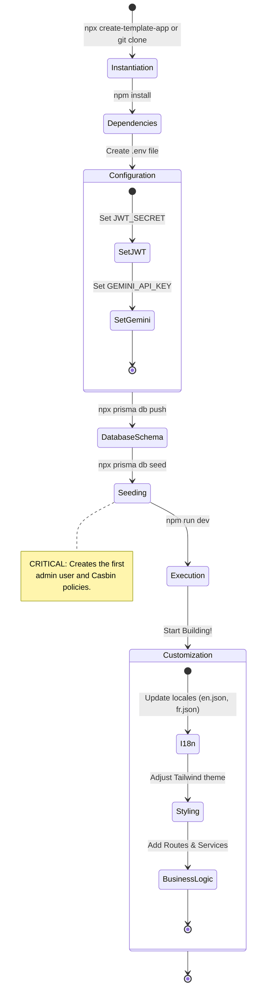

# Developer Guide — template-app

This guide explains the technical workflow to instantiate a new project from the boilerplate and the mandatory steps to get it running.

## 1. Instantiation Workflow

The following activity diagram shows the steps a developer must follow to go from the boilerplate to a functional, customized application.



## 2. Mandatory Post-Clone Steps

### 2.1 Environment Variables
Create a `.env` file in the root directory:
```bash
DATABASE_URL="file:./dev.db"
JWT_SECRET="your-super-secret-key"
GEMINI_API_KEY="your-gemini-api-key" # For AI features
```

### 2.2 Database Initialization
We use Prisma for ORM. You need to push the schema and seed the database to have access to the admin dashboard.
```bash
npx prisma db push
npx prisma db seed
```

## 3. Customizing the Boilerplate

*   **Authentication**: The core auth logic is in `src/lib/server/auth.ts`.
*   **Authorization**: Policies are managed via Casbin. See `src/lib/server/casbin.ts`.
*   **UI Components**: We use a custom design system based on Tailwind CSS v4.
*   **Locales**: Add or modify translations in `src/lib/locales/`.

---

**Generated by**: Antigravity (ArcKit AI)
**Framework**: ArcKit / template-app
