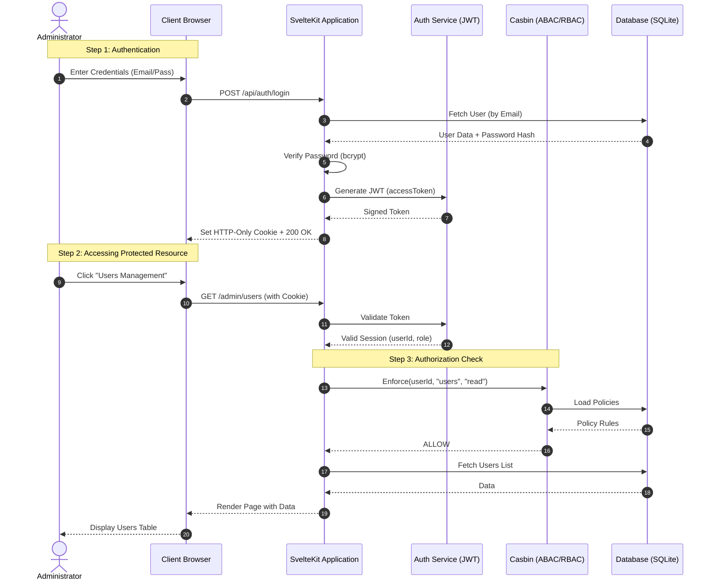

# User Documentation — template-app

This guide explains how to use the **template-app** boilerplate and describes the core user journeys.

## 1. Main User Journey: Authentication & Access

The following sequence diagram illustrates the standard flow when a user logs in and accesses a protected resource (like the Admin Dashboard).

### Sequence Diagram: User Flow

## 2. Key Features

*   **Login**: Secure authentication using JWT and HTTP-only cookies.
*   **Admin Dashboard**: Centralized management for users, roles, and permissions.
*   **Internationalization**: Full support for multiple languages (English and French included).
*   **Responsive Design**: Modern UI built with Tailwind CSS v4.

## 3. Getting Started (User Perspective)

1.  **Access the Login Page**: Navigate to the root URL.
2.  **Authenticate**: Use the default credentials (e.g., `admin@example.com` / `admin123` after seeding).
3.  **Explore the Sidebar**: Access different modules based on your assigned roles.
4.  **Manage Permissions**: If you are a Super Admin, use the settings to adjust Casbin policies dynamically.

---

**Generated by**: Antigravity (ArcKit AI)
**Framework**: ArcKit / template-app
