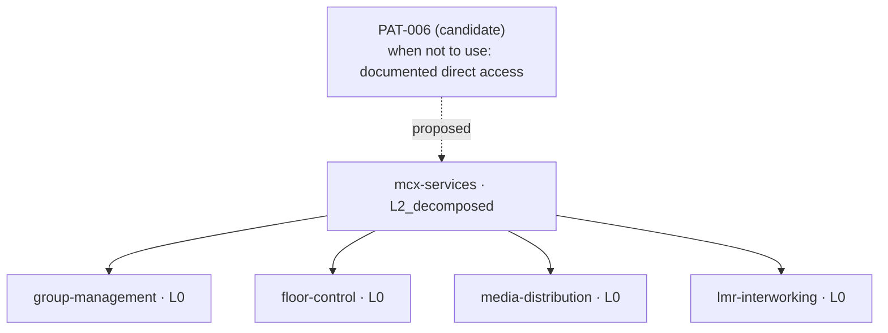

# Progression report — nordwave-mcx-2027

_Generated by the acceptance test, from the engagement graph. Every board and every diagram below is a projection of the database at that point in the run; none of it is written by hand._

---

## Act 1 — first scan on an empty graph

Gaps found: **26** · dispatched: **3** ·
held by the level gate: **23**.

The ratio is what matters, not the values. Suppression reasons are
carried on every held gap; a sample follows.

| Held gap | Reason |
|---|---|
| G1_empty_section | subject mobile-core is at L0_named, needs L3_decided |
| G3_unspecified_parameter | subject mcx-services is at L0_named, needs L1_framed |
| G3_unspecified_parameter | subject mcx-services is at L0_named, needs L2_decomposed |
| G3_unspecified_parameter | subject mcx-services is at L0_named, needs L2_decomposed |
| G3_unspecified_parameter | subject mcx-services is at L0_named, needs L2_decomposed |

| Question | Subject | Routed to | Blocks |
|---|---|---|---|
| Q-0001 | mcx-services | mcx-service-architect | 4.1.1, 4.1.2 |
| Q-0002 | mobile-core | mobile-core-architect | 5.1.1, 5.1.2 |
| Q-0003 | transport | mobile-core-architect | 5.4.1, 5.4.2 |

---

## Act 2 — framing, and what the extraction makes of a nuanced answer

Amina's answer produced **2 statements** with
**2 distinct confidence levels**, one uncertainty, and
advanced `mcx-services` from `L0_named` to `L1_framed`.

| Id | Predicate | Value | Confidence |
|---|---|---|---|
| S-0001 | is_constrained_by | 3GPP MC service layer boundary | designed |
| S-0002 | has_property | group voice must survive site isolation from national data centres | stated-by-client |

| Recorded uncertainty |
|---|
| I do not yet know whether the platform we shortlist can do it without a local instance |

---

## Act 2b — resuming an interrupted conversation from another process

The conversation was paused in this process and resumed in a **separate
one**, addressed only by the question identifier. This is what allows an
expert to answer three days later; without it the model is a demo.

---

## Act 3 — decomposition, and what the base has to offer

The decomposition created **4 sub-subjects** at `L0_named`
(`group-management`, `floor-control`, `media-distribution`, `lmr-interworking`),
engendered **8 active framing questions** dispatched to architects,
advanced `mcx-services` to `L2_decomposed`, and released
**3** previously held parameter gaps for `mcx-services`.
Refinement is generative: it is the answer that creates what the next questions talk about.

The base proposed **PAT-006**, written for a different domain, because
the interworking part has the same shape: a vendor system that must be
observed without being controlled. It reported having **no pattern** for
the decomposition itself — a first occurrence, and a promotion candidate.

**Maturity board after decomposition**

| Subject | L0 L1 L2 L3 L4 | Level | Blocked by |
|---|---|---|---|
| mcx-services | █ █ █ · · | L2_decomposed | — |
| mobile-core | █ █ · · · | L1_framed | — |
| transport | █ · · · · | L0_named | — |
| group-management | █ · · · · | L0_named | — |
| floor-control | █ · · · · | L0_named | — |
| media-distribution | █ · · · · | L0_named | — |
| lmr-interworking | █ · · · · | L0_named | — |

---

## Act 5a — a declared conflict: an architect steps in

Rui contested statement `S-0003`. The target statement stays in the graph
marked `contested`; a new counter-statement is created with confidence
`assumed`; a `Conflict` entity is born connecting them. The machine does
not resolve this — it holds both and waits for arbitration.

| Statement | Role | Status | Value |
|---|---|---|---|
| S-0001 | mcx-service-architect | active | 3GPP MC service layer boundary |
| S-0005 | mobile-core-architect | active | depends on a committed priority and pre-emption profile in the core |

---

## Act 5b — a detected conflict: two answers collide without anyone noticing

Neither architect contested anything: two answers on
`media-distribution` landed independently and the check node found the
contradiction by query. This is the path that proves detection works —
a declared conflict proves only that a human can raise one.

| Statement Id | Author | Subject | Value | Conflict Id | Origin |
|---|---|---|---|---|---|
| S-0006 | Amina Duarte | media-distribution | multicast on the radio side | C-0001 | detected |
| S-0007 | Rui Vasconcelos | media-distribution | unicast only, multicast deferred | C-0001 | detected |

---

## Act 6 — arbitration: amend one, keep the other, record the consequence

Sofia amended one statement and kept the other, because the disagreement
was one of scope rather than of substance. The previous wording is in the
history. An arbitration that could only pick a winner would have forced
her to discard a true statement.

| Statement | Status | Value |
|---|---|---|
| S-0001 | active | floor arbitration terminates in the MC service layer at the site |
| S-0005 | active | depends on a committed priority and pre-emption profile in the core |

---

## Act 7 — assembly: provisional because subjects are immature

Status **PROVISIONAL**, with **0** conflict(s) open and
**7** subjects below `L3_decided`. The reason matters: the
document is not held back by a disagreement but by immaturity. A run
that reaches COMPLETE here has failed — this engagement is not finished.

| Section | Status |
|---|---|
| 4.1 | PROVISIONAL |
| 4.2 | INCOMPLETE |
| 4.3 | PROVISIONAL |
| 4.4 | INCOMPLETE |
| 5.1 | PROVISIONAL |

| Subject not ripe | Level |
|---|---|
| mcx-services | L2_decomposed |
| mobile-core | L1_framed |
| transport | L0_named |
| group-management | L0_named |
| floor-control | L0_named |
| media-distribution | L0_named |
| lmr-interworking | L0_named |

**Maturity board at assembly**

| Subject | L0 L1 L2 L3 L4 | Level | Blocked by |
|---|---|---|---|
| mcx-services | █ █ █ · · | L2_decomposed | — |
| mobile-core | █ █ · · · | L1_framed | — |
| transport | █ · · · · | L0_named | — |
| group-management | █ · · · · | L0_named | — |
| floor-control | █ · · · · | L0_named | — |
| media-distribution | █ · · · · | L0_named | — |
| lmr-interworking | █ · · · · | L0_named | — |

---

## Act 8 — harvest

The harvest proposes what generalises. Promotion requires a second
occurrence on a different engagement, so nothing is promoted here — these
are candidates, held until they recur.

| Candidate | Kind | Rationale |
|---|---|---|
| MCX Service Layer Decomposition (4 sub-domains) | decomposition | First occurrence of 3GPP MC service layer decomposition on mission-critical voice. |
