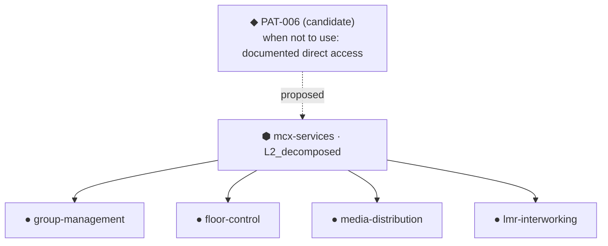

# Progression report — nordwave-mcx-2027

_Generated by the acceptance suite from the engagement graph. Provenance is marked: ⬢ blueprint (existed before the engagement), ◆ knowledge base (reusable), ● engagement (produced here)._

---

## Phase 0 — the three planes

The blueprint declares **3 subjects**, all created at
`L0_named` with origin `blueprint`. Nothing is discovered yet: discovery
is what answers produce.

This is the separation that makes the rest legible — ⬢ existed before the
engagement, ● is produced by it.

**Board after binding**

| Subject | L0 L1 L2 L3 L4 | Level | Origin | Blocked by |
|---|---|---|---|---|
| ⬢ mcx-services | █ · · · · | L0_named | blueprint | — |
| ⬢ mobile-core | █ · · · · | L0_named | blueprint | — |
| ⬢ transport | █ · · · · | L0_named | blueprint | — |

The plan covers **10 sections** and derives the expertise
needed from the routing of every gap, not only the dispatched ones.
**1 role(s) unstaffed** — reported now rather than found later.

| Role | Gaps | Staffed by |
|---|---|---|
| mcx-service-architect | 6 | amina |
| mobile-core-architect | 3 | rui |
| security-architect | 1 | ⚠ NOT STAFFED |

---

## Phase 1 — gap detection is computed, not enumerated

A section added to the blueprint produced a gap; removing it removed the
gap; and no subject name appears in the detector's source. Gaps are the
distance between what the blueprint requires and what the engagement
holds — nothing is enumerated.

**11** gaps evaluated · dispatchable **3** ·
held-premature **8** · held-queued **0** ·
satisfied **0**. The four sum to the total: nothing is
dropped, and the two kinds of holding are never merged — one says *later,
when there is room*, the other *later, when we know more*.

| Section | Subject | Status | Reason |
|---|---|---|---|
| 4.2 | mcx-services | held_premature | subject at L0_named, needs L2_decomposed |
| 4.3 | floor-control | held_premature | subject does not exist yet |
| 4.3.1 | floor-control | held_premature | subject does not exist yet |
| 4.4 | media-distribution | held_premature | subject does not exist yet |

Second scan: **new 0 · open 3**. A question already open is
refreshed, never duplicated — otherwise the mailbox fills with the same
card and the reader concludes the system is stuck.

With a cap of one per role, **3 questions** went out across
**3 roles** — a global cap would have sent one. Breadth strategy:
every dispatched question is a framing question.

---

## Phase 2 — refinement, seen through one subject

Amina answered by editing the card file. **2 statements**,
**2 confidence levels**, one recorded
uncertainty, `mcx-services` → `L1_framed`.

| Id | Predicate | Value | Confidence |
|---|---|---|---|
| S-0001 | is_constrained_by | 3GPP MC service layer boundary | designed |
| S-0002 | has_property | group voice must survive site isolation from national data centr | stated-by-client |

Paused in one process, resumed in another, addressed only by the question
identifier.

The decomposition created **4 subjects**, all marked
`discovered` — distinct from the 4 the blueprint declared. The
base proposed **PAT-006**, written for another domain, and reported having
**no pattern** for the decomposition itself: a first occurrence, and a
promotion candidate.

**Board after decomposition**

| Subject | L0 L1 L2 L3 L4 | Level | Origin | Blocked by |
|---|---|---|---|---|
| ⬢ mcx-services | █ █ █ · · | L2_decomposed | blueprint | — |
| ⬢ mobile-core | █ █ · · · | L1_framed | blueprint | — |
| ⬢ transport | █ · · · · | L0_named | blueprint | — |
| ⬢ synthetic-subject | █ · · · · | L0_named | blueprint | — |
| ● group-management | █ · · · · | L0_named | discovered | — |
| ● floor-control | █ · · · · | L0_named | discovered | — |
| ● media-distribution | █ · · · · | L0_named | discovered | — |
| ● lmr-interworking | █ · · · · | L0_named | discovered | — |

Every dispatched framing or decomposition question was checked against its
level contract: no threshold, unit or technology name. Specificity is
declared, not left to the model's judgement.

**Trajectory of `mcx-services`** — coarse to fine, one step per level.

| Level | Question | What it produced |
|---|---|---|
| L1_framed | Cadrage de mcx-services | Boundary definition and framing |
| L2_decomposed | Décomposition de mcx-services | Four parts decomposition |

---

## Phase 3 — disagreement, declared and detected

Rui was never asked this question. He contested a specific statement, and
the conflict is marked **declared** — a human asserted it. Both positions
remain active.

Nobody contested: two answers landed independently and the check node
found the contradiction by query, `origin: detected`. A declared conflict
proves only that a human can raise one.

Sofia amended one statement and kept the other: the disagreement was one of
scope. The previous wording is in the history. An arbitration that could
only pick a winner would have forced her to discard a true statement.

---

## Phase 4 — refinement is not monotonic, and outsiders can contribute

`floor-control` demoted to `L2_decomposed`. **2 statements** marked
`under_review` rather than deleted, and **2** questions reopened
carrying their previous answers.

An architect outside the engagement offered a note on vendor export limits.
Two distinct confirmations were required: the **author confirmed the
meaning**, the **lead accepted the entry**. Accepting before the author had
confirmed was refused. **1 statements** recorded, credited to the
contributor, with their material attached.

---

## Phase 5 — the deliverable, and why it is honest about being unfinished

**PROVISIONAL** with **1** conflict(s) open and
**8** subjects below their required level. The document is held
back by immaturity, not by disagreement. A run reaching COMPLETE here would
have failed: this engagement is not finished.

| Section | Status | Required |
|---|---|---|
| 4.1 | provisional | mcx-services@L1_framed |
| 4.2 | empty | mcx-services@L2_decomposed |
| 4.3 | provisional | floor-control@L3_decided |
| 4.4 | empty | media-distribution@L3_decided |
| 5.1 | provisional | mobile-core@L1_framed |

**Board at assembly**

| Subject | L0 L1 L2 L3 L4 | Level | Origin | Blocked by |
|---|---|---|---|---|
| ⬢ mcx-services | █ █ █ · · | L2_decomposed | blueprint | — |
| ⬢ mobile-core | █ █ · · · | L1_framed | blueprint | — |
| ⬢ transport | █ · · · · | L0_named | blueprint | — |
| ⬢ synthetic-subject | █ · · · · | L0_named | blueprint | — |
| ● group-management | █ · · · · | L0_named | discovered | — |
| ● floor-control | █ █ █ · · | L2_decomposed | discovered | — |
| ● media-distribution | █ · · · · | L0_named | discovered | — |
| ● lmr-interworking | █ · · · · | L0_named | discovered | — |

---

## Phase 6 — harvest

| Candidate | Kind | Source |
|---|---|---|
| MCX Service Layer Decomposition (4 sub-domains) | decomposition | decomposition |
| Element manager bulk export limit (2000 objects) | pattern | external-contribution |
