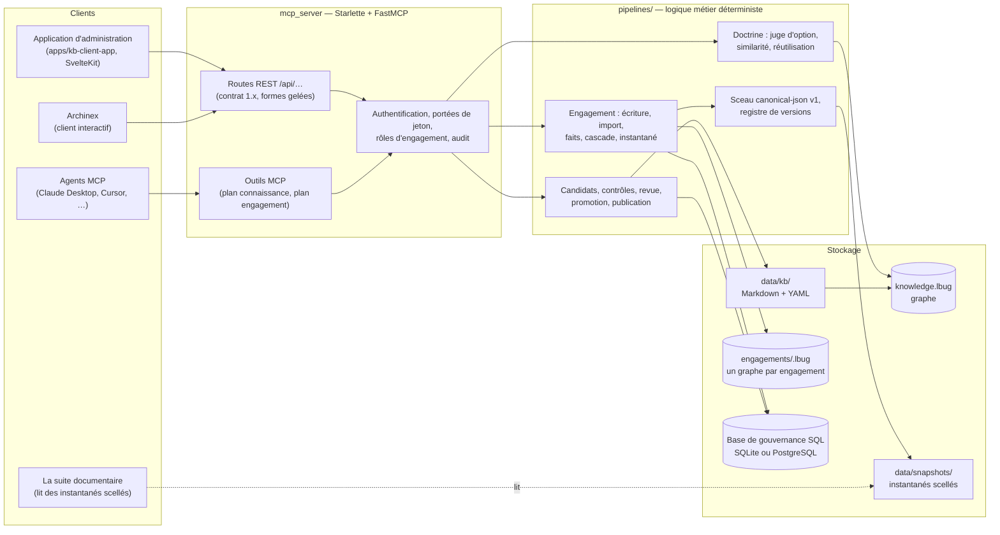
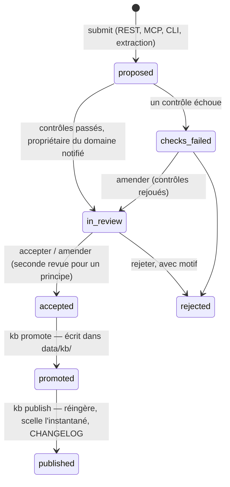
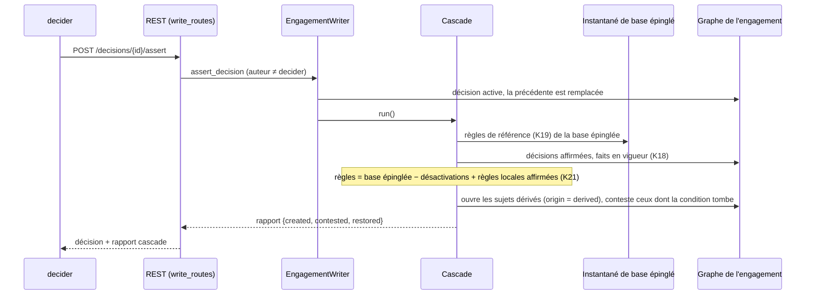
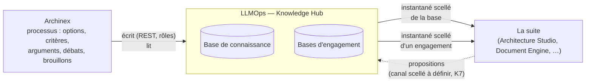

# LLMOps — Document d'architecture

État : 8 octobre 2026. Code de `main` au contrat **1.24** ; le contrat **1.25** (K22, revue des règles de déclenchement) est dans la PR #76, pas encore fusionnée.
Public : architectes et développeurs qui doivent comprendre, exploiter ou faire évoluer LLMOps, et les équipes des composants voisins (Archinex, suite documentaire).

Ce document décrit **l'architecture actuelle**. Il complète, sans les remplacer :

| Document | Sujet |
|---|---|
| [`SUITE-MAP.md`](SUITE-MAP.md) | qui fait quoi dans la suite, avec le niveau de preuve de chaque affirmation |
| [`contracts/knowledge-hub-api-v1.md`](contracts/knowledge-hub-api-v1.md) | le contrat d'interface, §5.1 à §5.25 |
| [`adr/ADR-KH-01-contrats-exposes.md`](adr/ADR-KH-01-contrats-exposes.md) | les décisions d'architecture du Hub (A1 à A11) |
| [`plans/PLAN-IMPLEMENTATION-Bundle-Engagement.md`](plans/PLAN-IMPLEMENTATION-Bundle-Engagement.md) | les lots K1 à K22 et leur état |
| [`ZOOM-LangGraph-elicitation.md`](ZOOM-LangGraph-elicitation.md) | zoom sur l'usage de LangGraph : flux, pause durable, écarts avec l'API d'écriture |
| [`architecture.md`](architecture.md) | **historique** : la vue d'origine (moteur d'élicitation LangGraph, ontologie du graphe), toujours exacte pour ces deux sujets |
| [`deployment.md`](deployment.md), [`VERSIONING.md`](VERSIONING.md) | exploitation, politique de versions |

---

## 1. Rôle et périmètre

LLMOps est le **Knowledge Hub** : la mémoire d'ingénierie d'architecture, exposée aux outils et aux agents par des interfaces typées et versionnées. Il tient **deux bases isolées** :

| | Base de connaissance | Base d'engagement |
|---|---|---|
| Contenu | principes, patterns, décisions d'architecture (ADR), contrôles réglementaires, glossaire, règles de déclenchement, vocabulaire des faits | exigences, sujets et leur maturité, énoncés, décisions, questions, conflits, manques d'**un programme** |
| Nature | générique, **agnostique de tout programme** (verticale TELCO / MCX) | spécifique à un programme, confidentielle |
| Écrit par | un cycle de revue humaine (candidats, promotion, publication) | des membres, selon leur rôle, par l'API d'écriture |
| Stockage | fichiers `data/kb/` + graphe `knowledge.lbug` | une base graphe par engagement `data/engagements/<id>.lbug` + l'état d'accès en SQL |
| Émis vers la suite | instantané scellé de la base | instantané scellé d'un engagement |

Le Hub est **le seul émetteur** d'instantanés scellés vers la suite. Archinex (outil d'aide à la décision et de sollicitation des experts) en est un **client** : il garde le processus (options, critères, arguments, débats) et n'émet rien lui-même. Ligne de partage : le Hub enregistre l'état **engagé** (exigences, sujets, questions, énoncés, décisions, conflits) ; Archinex garde ce qui n'est jamais scellé.

**Ce que LLMOps n'est pas.** Il ne génère pas de livrable rédigé, il ne vérifie rien (aucun statut `verified` n'est produit par un calcul du Hub), et **aucun modèle de langage n'est appelé sur une route servie** : le seul usage d'un modèle est hors ligne, en ligne de commande, et ses sorties restent des candidats à revoir.

### Principes qui structurent tout le reste

1. **Rien n'est affirmé sans une personne.** Une contribution est *proposée* ; une affirmation exige un `decider` distinct de l'auteur ; un contenu dérivé d'un modèle reste proposé jusqu'à revue.
2. **Déterminisme.** Mêmes entrées, mêmes octets : sérialisation canonique, empreintes, identifiants dérivés du contenu. Aucun modèle dans les calculs (cascade, conformité, vérification).
3. **Rien n'est réparé en silence.** Une valeur invalide est refusée avec le chemin du champ ; un lot d'import est refusé en entier par défaut.
4. **Compatibilité ascendante.** Un contrat qui évolue ajoute, il ne casse pas ; toute forme de réponse exposée est gelée par un test.
5. **Étanchéité.** La connaissance générique ne contient aucune ancre de programme ; un engagement ne lit que ses propres données.

---

## 2. Vue d'ensemble

Trois modes d'accès au même cœur :

- **MCP** (`mcp-server`, `mcp-server-knowledge`, `mcp-server-engagement`) : outils typés pour les agents, en SSE (Cloud Run) ou en STDIO (local). Le plan se choisit par `LLMOPS_PLANE` (`knowledge`, `engagement`, `all`).
- **REST** (`/api/…`, `/snapshot/…`, `/health`) : pour les clients applicatifs (Archinex, application d'administration, adaptateurs). C'est là que vivent les écritures, les revues et les instantanés d'engagement.
- **Fichiers scellés** : la suite ne rappelle jamais le Hub en RPC ; elle **lit des instantanés publiés** (ADR-SUITE-05, canal à instantané scellé).

---

## 3. Carte du dépôt

| Répertoire | Rôle |
|---|---|
| `mcp_server/` | serveur : `main.py` (application Starlette, routes, exceptions), `main_knowledge.py` / `main_engagement.py` (serveurs MCP par plan), `core/` (authentification, enveloppes de réponse, configuration, version du contrat, dépréciation, notifications), `knowledge/tools.py` (outils et fonctions du plan connaissance), `engagement/` (outils, routes d'écriture et d'export), `db/` (clients graphe) |
| `pipelines/` | logique métier, sans dépendance au serveur : `kb_candidates/` (cycle d'enrichissement), `doctrine/` (juge, index, évaluations), `similarity/`, `frameworks/` (ingestion des référentiels), `governance/` (schéma SQL, journaux, évaluations, registre), `engagement/` (accès, écriture, import, faits, cascade, règles, instantané), `ingestion/` (Markdown vers graphe), `publication/`, `canonical.py`, `knowledge_ref.py`, `triggers.py` |
| `tools/elicitation/` | moteur d'élicitation (LangGraph : scan, intake, assemblage, harvest ; voir [`ZOOM-LangGraph-elicitation.md`](ZOOM-LangGraph-elicitation.md)), schéma et dépôt du graphe d'engagement, CLI `elicit` |
| `tools/ports`, `tools/adapters` | port `GraphStore` et ses adaptateurs (LadybugDB, Kuzu) |
| `data/kb/` | **la base de connaissance** (voir §4) ; `data/snapshots/` instantanés scellés ; `data/engagements/` bases d'engagement ; `data/knowledge.lbug` graphe construit |
| `schemas/` | schémas JSON des échanges (instantané, engagement, candidats…) et types TypeScript générés |
| `scripts/` | génération et gel : `export_sealed_snapshot.py`, `freeze_interfaces.py`, `generate_schemas.py`, exemples, exports de fixtures |
| `apps/kb-client-app/` | application d'administration SvelteKit (exploration, gouvernance, revue des règles) |
| `tests/` | `unit`, `contract` (+ `frozen/`), `integration`, `e2e`, `eval`, `golden`, `bench` |
| `docker/`, `Dockerfile`, `cloudbuild.yaml` | image et déploiement Cloud Run |

---

## 4. La base de connaissance

**Contenu** (`data/kb/`) : Markdown à front matter YAML pour les principes (`P-…`), patterns (`PAT-…`), décisions (`ADR-…`), contrôles réglementaires (`controls/<référentiel>/`), questionnaires, risques, modèles ; `glossary/` ; `blueprints/` ; et, pour la cascade de questions :

- `vocabulary/facts.yaml` : le **vocabulaire des faits d'architecture** (clés typées : entier, booléen, énumération, durée), versionné et citable ;
- `triggers/TRG-*.yaml` : les **règles de déclenchement** (« si ces faits sont affirmés, cette question devient pertinente »), une par fichier, rattachées à l'élément qui les justifie.

**Graphe.** `pipelines.cli ingest` parse les fichiers et construit `knowledge.lbug` (nœuds `Asset`, `Control`, `GlossaryTerm`, relations `SUPERSEDES`, `IMPLEMENTS`…). Le graphe est un **index reconstructible** : la source de vérité est le contenu des fichiers.

**Versions citables (K3).** Chaque élément porte une `revision` ; le registre `data/kb/version-ledger.json` enregistre le hash de contenu de chaque révision publiée, en ajout seul. Une même référence `{knowledgeKey, version}` désigne toujours les mêmes octets ; modifier un contenu sans nouvelle révision est refusé à l'export. Le vocabulaire (`vocabulary:facts`) et chaque règle (`trigger:<id>`) sont suivis de la même façon.

**Étanchéité.** Aucun nom de client ou de site, aucune adresse IP ou e-mail n'entre dans la base (liste noire `anonymization_denylist.txt`, contrôle `anonymization` du cycle de revue).

### Cycle d'enrichissement (contrats 1.2, 1.5, 1.8, 1.25)

Toute connaissance nouvelle, quelle que soit son origine (expert, Archinex, suite, modèle local), passe par ce cycle : contrôles déterministes (`schema`, `references`, `duplicate`, `anonymization`, `doctrine_conflict`, `llm_unreviewed`, `previously_rejected`), revue d'un propriétaire déclaré dans `owners.yaml`, promotion (confiance **calculée depuis les preuves**, jamais déclarée), publication. Les règles de déclenchement et les clés du vocabulaire y entrent comme deux types de candidat (`trigger`, `fact_key`) dont le contrôle `schema` est le validateur de K19.

### Doctrine, similarité, réutilisation

- **Juge d'option** (`pipelines/doctrine`) : évalue une option d'architecture contre les clauses de contrôle des principes et décisions, de façon déterministe ; un jeu d'évaluation mesure sa qualité.
- **Similarité** (`pipelines/similarity`) : LLMOps **ne contient aucun modèle**. Le client calcule les vecteurs, le Hub les stocke (avec modèle et version) et calcule un cosinus. Un résultat n'est jamais une décision : il porte `requires_confirmation: true`.
- **Réutilisation** : acquise seulement quand une personne a confirmé une à une les hypothèses de la décision d'origine ; journal en ajout seul.

---

## 5. La base d'engagement

### 5.1 Stockage

Un engagement a **son propre graphe** (`data/engagements/<id>.lbug` : `Subject`, `Statement`, `Decision`, `Question`, `Conflict`, `Requirement`, `RuleAdjustment`…) et des lignes dans la base de gouvernance SQL (registre, membres, journal d'accès, instantanés émis, base de connaissance épinglée). Les identifiants d'engagement sont validés (`[a-z0-9-]+`) avant tout accès disque.

### 5.2 Accès (K14)

Un engagement inscrit au registre est **géré** : fermé à tous sauf à ses membres, dans tous les environnements.

| Rôle | Actions |
|---|---|
| `reader` | lire |
| `contributor` | + proposer (sujets, énoncés, décisions, questions, règles locales) |
| `decider` | + affirmer, arbitrer, désactiver une règle, avancer la maturité |
| `admin` | + exporter, importer, épingler la base de connaissance, gérer les membres |

La personne est identifiée par un **client de confiance** (jeton portant `eng:delegate`, en-tête `X-Actor-Email`) ; `eng:service` lit sans personne, `eng:create` crée un engagement. Le jeton d'exploitation (`server_admin`) gère les membres **sans pouvoir lire le contenu**. Le journal d'accès enregistre le handle de la personne ou l'empreinte du jeton, jamais un secret ni un e-mail. Séparation des tâches : l'auteur d'un énoncé, d'une décision ou d'une règle ne peut pas l'affirmer.

### 5.3 Écriture (K15), import (K12)

`POST /api/engagements/{id}/{subjects, statements, decisions, questions, requirements, rules, …}` : l'auteur est **le membre derrière l'appel**, jamais un champ du corps ; rien n'est né affirmé ; une clé d'idempotence (`Idempotency-Key`) dérive l'identifiant, donc un import se rejoue sans dupliquer. `POST …/import` (admin) reprend un engagement d'un autre système : simulation (`dry_run`), tout ou rien par défaut, provenance conservée, jamais d'auto-validation ni de valideur inventé.

### 5.4 Décisions, faits, cascade (K16, K18 à K21)

Une **décision** porte l'option retenue, les options écartées avec leur raison, la justification, la réversibilité, les conséquences et les violations acceptées ; un sujet n'atteint `L3_decided` que sur une décision **affirmée**. Elle peut aussi porter des **faits** lisibles par machine (`topology.dc_count = 2`), dans le vocabulaire partagé de la base de connaissance.

Propriétés du moteur (`pipelines/engagement/cascade.py`) : il **n'infère jamais de décision**, il ouvre des questions ; une règle n'ouvre qu'un sujet par engagement (idempotence) ; quand une condition ne tient plus, le sujet dérivé passe à `foundation_contested` avec sa cause et **n'est jamais supprimé** ; une règle `mandatory` (contrôle réglementaire) ouvre une question bloquante que seul un `decider` clôt avec une justification ; une clé affirmée avec deux valeurs par deux décisions en vigueur est inutilisable (personne n'est départagé). La base de connaissance lue est **épinglée** par engagement (fixée à la première dérivation, déplacée seulement par un admin) pour que le même état donne toujours les mêmes sujets. `GET …/lineage` donne l'arbre de dérivation.

### 5.5 Instantané d'engagement (K11)

`POST /api/engagements/{id}/exports` (admin) construit les données de façon pure (`build_data`), les **vérifie** (`verify`), les scelle et les stocke de façon immuable. L'identifiant dérive de l'empreinte (`eng-<engagement>-<12 hex>`). Si la vérification échoue, **rien n'est produit** : pas d'e-mail, pas d'actif sans personne, pas d'auto-validation, `is_provisional` dérivé de la maturité et des conflits, faits et lignée cohérents avec les décisions et la base épinglée, règles locales et désactivations attribuées. Schéma : `schemas/engagement_snapshot.schema.json` (version 1.5).

---

## 6. Instantanés scellés et intégrité

- **Sérialisation canonique** (`pipelines/canonical.py`, profil *canonical-json v1* de la suite) : un nombre non fini, un entier au-delà de 2⁵³−1 ou un type non JSON fait échouer l'export au lieu d'être approximé.
- **Enveloppe de la suite** : `snapshotId`, `sourceSystem`, `schemaVersion`, `createdAt`, `sourceRevision`, `checksum` (calculé sur `data` seul).
- **Instantané de la base** (`scripts/export_sealed_snapshot.py`) : `payload_sha256` couvre six sections historiques (index d'applicabilité, actifs, glossaire, référentiels, contrôles, index de conformité). Les sections ajoutées ensuite (`fact_vocabulary`, `question_triggers`) sont scellées par **leur propre empreinte, hors de `payload_sha256`**, pour qu'un consommateur qui recalcule le sceau sur les six sections continue de vérifier.
- **Test de fraîcheur** : le fichier publié doit être celui que le code reconstruit, octet pour octet, dans un répertoire temporaire (`rebuiltByEmitterTest`).
- **Formes gelées** (`tests/contract/frozen/`, `scripts/freeze_interfaces.py`) : chaque route et chaque outil exposé a sa forme de réponse gelée ; une forme qui change est une rupture détectée par un test.

---

## 7. Sécurité

| Sujet | Mécanisme |
|---|---|
| Authentification | `SERVER_TOKEN` (jeton d'exploitation) et `ENGAGEMENT_TOKENS` (`jeton:portées`), portées `kb:review`, `kb:maintain`, `kb:delegate`, `eng:delegate`, `eng:service`, `eng:create` |
| Cloisonnement des engagements | un engagement géré n'est lisible que par ses membres ; hors production et sans `ENGAGEMENT_TOKENS`, l'accès est ouvert avec un avertissement au démarrage ; **en production (`LLMOPS_ENV=production`) l'accès est fermé par défaut** |
| Autorisation | point de passage unique `authorise_action` ; chaque refus est journalisé |
| Chemins | identifiants d'engagement validés avant toute opération sur disque (un audit a trouvé et fermé un chemin d'écriture par traversée) |
| Données personnelles | jamais d'e-mail dans les réponses, les journaux ou les instantanés : des handles |
| Contenu de modèle | marqué `llm-derived`, proposé seulement |

**Limite assumée.** L'identité d'une personne est **attestée par le client de confiance** (en-tête `X-Actor-Email`), pas signée : un client compromis peut parler au nom de n'importe quel membre. La signature et le SSO sont un chantier ouvert (issue #7).

---

## 8. Déploiement et exploitation

- **Image** : `Dockerfile` (Python 3.11, LadybugDB embarqué, extra `postgres`), déployée sur **Cloud Run** par `cloudbuild.yaml` ; transport SSE ; jeton injecté par Secret Manager.
- **Configuration** par variables d'environnement (`LLMOPS_PLANE`, `LLMOPS_KB_DIR`, `LLMOPS_ENGAGEMENTS_DIR`, `GRAPH_BACKEND`, `LLMOPS_TRANSPORT`, `LLMOPS_ENV`, `SERVER_TOKEN`, `ENGAGEMENT_TOKENS`, `CANDIDATES_BACKEND`, `GOVERNANCE_DATABASE_URL`, `LLMOPS_STORAGE_PERSISTENT`, `LLM_ENDPOINT`/`LLM_MODEL` pour les commandes hors ligne). Détail : [`deployment.md`](deployment.md).
- **Base de gouvernance** : SQLAlchemy Core sur SQLite (développement, démo) ou PostgreSQL / Cloud SQL (production). Les tables sont créées au premier usage ; un changement de schéma existant exige un `ALTER` explicite. Elle porte : candidats, revues, journaux, propriétaires, évaluations, ingestion des référentiels, vecteurs, confirmations de réutilisation, et pour l'engagement : registre, membres, journal d'accès, instantanés émis, base épinglée.
- **Stockage éphémère** : sur Cloud Run, le disque du conteneur est perdu au redémarrage. La doctrine promue y est donc perdue (mode démo, `LLMOPS_STORAGE_PERSISTENT=false`, signalé par `warnings: ["ephemeral-storage"]`). En exploitation normale, le mainteneur promeut et publie hors ligne puis commite `data/kb/`, `data/knowledge.lbug` et l'instantané. Les bases d'engagement exigent un stockage qui survit au conteneur.
- **Commandes** : `ingest` (graphe), `kb` (candidats, promotion, publication, extraction de règles, référentiels, relances), `elicit` (élicitation), `make demo`, `make verify`.

---

## 9. Qualité

- `make verify` : `ruff` + `mypy` + tests de contrat + tests unitaires. La suite complète est `pytest tests/contract tests/unit tests/integration tests/e2e`.
- **Contrat** : formes gelées, version du contrat (`mcp_server/core/version.py`), schémas JSON, exemple d'instantané reconstruit par le code, fixtures versionnées.
- **Mutation** : pour chaque règle de sécurité ou d'intégrité (auteur distinct, justification obligatoire, citation vérifiée, filtre « décision affirmée »), un test échoue quand la règle est retirée. C'est la discipline des lots K11 à K22.
- **Évaluations** : jeu d'options de la doctrine (rappel des violations attendues), jeu de similarité FR/EN.

---

## 10. Relations avec Archinex et la suite

- **Archinex → Hub** : écriture dans l'engagement par l'API (membre, rôle, clé d'idempotence), reprise des projets existants par `import`, lecture des règles et des faits. Archinex extrait les faits des décisions (assisté) et affiche la cascade ; il n'ouvre aucun sujet lui-même.
- **Hub → suite** : par fichiers scellés, jamais en RPC ; la suite ne connaît pas Archinex.
- **Suite → Hub** : le canal de propositions (K7) n'existe pas encore ; aujourd'hui `POST /api/knowledge/candidates` est réservé aux clients non-suite. Qui consomme l'instantané d'engagement (adaptateur vers le graphe projeté, issue #40) reste à désigner.

---

## 11. Décisions d'architecture structurantes

| Décision | Raison | Conséquence |
|---|---|---|
| Deux bases isolées (connaissance / engagement) | séparer ce qui est réutilisable de ce qui est confidentiel et propre à un programme | un graphe par engagement, étanchéité testée, deux familles d'instantanés |
| Le Hub est le seul émetteur vers la suite | une seule source de vérité, un seul point de scellement | Archinex n'émet rien ; l'import (K12) reprend ses projets |
| Pas de modèle sur les routes servies | reproductibilité, absence de spéculation | calculs déterministes ; l'usage d'un modèle est hors ligne et ses sorties sont des candidats |
| Graphe = index reconstructible, fichiers = vérité | revue par git, version citable, reconstruction | registre de versions, test de fraîcheur |
| Engagement géré fermé par défaut | une fuite entre programmes est le pire échec | rôles, audit, séparation des tâches, opérateur sans lecture du contenu |
| Faits dans un vocabulaire partagé, règles déclaratives | qu'un évaluateur donne le même résultat partout | pas de code dans les règles ; l'aperçu de l'administration et le moteur partagent leur évaluation |
| Base de connaissance épinglée par engagement | même état, mêmes sujets dérivés | un déplacement d'épinglage est un geste d'admin, journalisé, qui réévalue |
| Sections ajoutées hors du sceau historique | ne pas casser les consommateurs qui recalculent le checksum | `fact_vocabulary` et `question_triggers` ont leur propre empreinte |
| Contrat additif, formes gelées | compatibilité ascendante avec la suite et Archinex | une rupture exige une nouvelle version majeure et une PR côté consommateur |

---

## 12. Limites connues et questions ouvertes

- **Identité non signée** (§7) : confiance dans le client délégué.
- **Parité avec le bundle d'Archinex** : la matrice de conformité exigence → contrôle et les manques G3 dérivés ne sont pas encore dans l'instantané d'engagement (K17, qui dépend de la correction de `compliance_mapper`, K6) ; c'est la porte du retrait de l'émission locale d'Archinex.
- **Capitalisation** : la remontée d'une règle locale ou d'une décision d'engagement vers la base de connaissance, sans ancre de programme, n'est pas livrée (K13, K7).
- **Lecture directe de la base** par `get_asset(id)` sans paramètre : conservée pour la compatibilité ; sa dépréciation reste à planifier.
- **Consommateur de l'instantané d'engagement** : adaptateur non attribué (issue #40).
- **Application d'administration** : l'écran de revue des règles est vérifié par `svelte-check` et par le build, non validé visuellement.
- **Amorçage des règles par un modèle** : le flux est livré et testé avec un faux modèle ; aucune exécution réelle n'a encore été observée. Les six règles de départ sont écrites à la main.
- **Stockage des déploiements de démonstration** : éphémère par construction.
- **ADR** : A10 et A11 (ADR-KH-01) et la proposition d'amendement d'ADR-SUITE-05 ne sont pas encore adoptés par les propriétaires de la suite ; le Hub applique la décision de son mainteneur en attendant.
