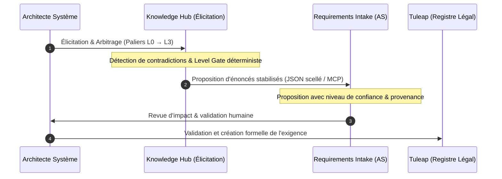

# Alignement Épistémique & Frontières de Confiance

Ce document formalise la **table de correspondance épistémique** et les **règles de frontière de confiance** entre le *Knowledge Hub (LLMOps)* et la suite *Architecture Studio* (notamment *Document Engine*, *Conformity Engine* et *Tuleap*).

---

## 1. Principes Directeurs

1. **La Connaissance n'est pas un Fait de Programme** :
   Le Knowledge Hub héberge des doctrines, des patrons d'architecture, des retours d'expérience (REX) et des normes générales. Une doctrine, même marquée `verified` au niveau de l'entreprise, n'est qu'une **suggestion** pour un projet client spécifique tant qu'elle n'a pas été formellement prouvée et qualifiée dans l'environnement cible.

2. **Principe P9 — Aucune Écriture Directe dans les Registres Légaux** :
   Le Knowledge Hub ne réalise aucune écriture dans *Tuleap*, dans le *Digital Thread* ou dans les modèles C4 d'*Architecture Studio*. Toute transition d'état ou création d'exigence passe par un port de proposition soumis à **validation humaine formelle**.

3. **Citations Immuables pour l'Homologation** :
   Les documents d'architecture préliminaires (**HLD** - *High-Level Design*) gelés lors des jalons de certification ne peuvent pointer vers des objets mutables. Ils citent des références scellées au format `ExternalRef` (`KH:AssetId@vVersion` ou `KH:AssetId@sha256:...`).

---

## 2. Table de Correspondance Épistémique

| Statut Knowledge Hub (KH) | Définition KH | Statut dans Architecture Studio (AS) | Traitement dans un Dossier d'Homologation |
|---|---|---|---|
| **`verified`** | Validé formellement par benchmark ou audit transverse. | **Suggestion Validée** | Ne devient un **Fait** que si une preuve d'intégration locale (test, spec) est fournie dans AS. |
| **`vendor-stated`** | Affirmé par un fournisseur tiers (datasheet, SLA constructeur). | **Hypothèse Fournisseur** | Requiert une mesure ou une clause de garantie contractuelle avant d'être acté. |
| **`designed`** | Énoncé formulé par un architecte système lors du cadrage. | **Intention d'Architecture** | Proposé à *Requirements Intake* pour devenir une exigence projet dans *Tuleap*. |
| **`stated-by-client`** | Contrainte brute exprimée par le client / utilisateur final. | **Besoin Client Exprimé** | Doit être raffiné et validé face aux contraintes de faisabilité technique. |
| **`assumed`** | Hypothèse de travail non arbitrée. | **Présomption** | Retenu par le *Level Gate* (L0→L4) ; interdit dans tout document d'homologation officiel. |

---

## 3. Format des Références Externes (`ExternalRef`)

Pour préserver la souveraineté de chaque système et éviter l'absorption de modèles :

```
<System>:<Identifier>@<Version>
```

### Exemples :
* **Référence Knowledge Hub** : `KH:PAT-006@v1.0.0` (ou `KH:P-002@sha256:4a8e3290...`)
* **Référence Architecture Studio** : `AS:C4-FW-17@v12`
* **Référence Exigence Tuleap** : `TULEAP:REQ-9821@v3`

---

## 4. Cycle de Vie : De l'Élicitation au Registre Tuleap



> **Règle d'or :** L'invariant *"aucun statut sans preuve"* d'Architecture Studio est strictement préservé.

