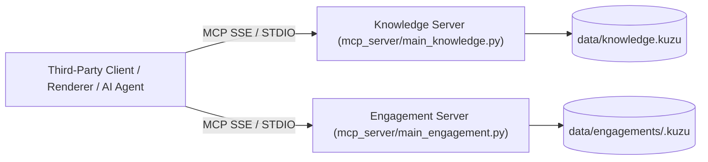

# 🔌 External Interface Specification & MCP Response Schemas (ADR-0014 / ADR-0015)

This document is the official technical contract specification for the **FastMCP** server interface exposed by the **LLMOps** platform. It provides the full response structure and **JSON Schemas** for all tools under `schema_version: "1.0"`.

---

## 🎯 1. Architecture Overview & Plane Separation

The MCP server is split into two independent entities to guarantee physical isolation between reusable enterprise knowledge and dynamic project data:

1. **Knowledge Server (`mcp_server/main_knowledge.py`)**: Serves reusable architecture assets (`Asset`, `GlossaryTerm`, `SUPERSEDES`, `REQUIRES`, `DEFINES`).
2. **Engagement Server (`mcp_server/main_engagement.py`)**: Serves per-project dynamic state (`Subject`, `Statement`, `Conflict`, `Question`, `Uncertainty`).



---

## 🌐 2. Transports, Endpoints & Authentication

- **Recommended Transport:** HTTP SSE (`Server-Sent Events`) at endpoint `/sse`.
- **STDIO Transport (Local Agents):** `poetry run mcp-server-knowledge` and `poetry run mcp-server-engagement`.
- **Public Production Endpoint (GCP Cloud Run):** `https://llmops-mcp-server-344571265365.europe-west1.run.app/sse`
- **HTTP Authentication (Bearer Token):**
  - FastMCP HTTP startup requires environment variable `SERVER_TOKEN` (or `LLMOPS_AUTH_TOKEN`).
  - Requests must supply the token in HTTP header: `Authorization: Bearer <SERVER_TOKEN>` (or `X-API-Key: <SERVER_TOKEN>`).
  - Constant-time verification (`secrets.compare_digest`) returns `HTTP 401 Unauthorized` if invalid or missing.
- **Connection Safety & Semantics:**
  - Read-Only connection on the underlying Kùzu DB / LadybugDB graph databases in production.
  - Any Cypher write attempt (`CREATE`, `SET`, `DELETE`) via public read tools is rejected at driver level.

---

## 📋 3. Standardized Response Envelope & Error Handling

All FastMCP tools return a **standardized JSON envelope**:

```json
{
  "$schema": "http://json-schema.org/draft-07/schema#",
  "title": "ResponseEnvelope",
  "type": "object",
  "properties": {
    "status": {
      "type": "string",
      "enum": ["ok", "not_found", "invalid_argument", "error", "unauthorized"]
    },
    "count": {
      "type": "integer",
      "minimum": 0
    },
    "data": {
      "description": "Response payload whose structure depends on the tool called."
    },
    "reason": {
      "type": "string",
      "description": "Provided when status is error, invalid_argument, or unauthorized."
    }
  },
  "required": ["status", "count", "data"]
}
```

### Behavior across Statuses:
- **Nominal Success (`status: "ok"`)**: Returns `count` (integer `>= 0`) and the data payload.
- **Not Found (`status: "not_found"`)**: Identifier not found in database. Returns `data: null`.
- **Error / Invalid Argument (`status: "error"` / `"invalid_argument"`)**: Contains explanatory string in `reason`.

---

## 📚 4. Knowledge Server Tools Summary

| Tool Name | Description | Key Parameters |
|---|---|---|
| `list_assets` | List architecture asset metadata | `type`, `phase`, `domain`, `status` |
| `get_asset` | Retrieve single asset with full content | `id` |
| `get_assets` | Batch retrieve multiple assets by ID list | `ids` |
| `search_assets` | Hybrid search across assets and graph | `query`, `filters` |
| `get_principles_for` | Fetch active architecture principles | `phase`, `domain` |
| `get_decision_trail` | History trail of an ADR (`SUPERSEDES`) | `id` |
| `get_glossary_term` | Fetch canonical term definition | `term` |
| `query_graph` | Execute read-only Cypher query on knowledge graph | `cypher_query` |
| `get_graph_summary` | Graph summary node/rel counts and schema version | *(none)* |

---

## 🚀 5. Engagement Server Tools Summary

| Tool Name | Description | Key Parameters |
|---|---|---|
| `get_subject` | Subject maturity state | `engagement`, `subject` |
| `get_subject_trajectory` | Maturity timeline history | `engagement`, `subject` |
| `get_board` | Per-subject maturity board | `engagement` |
| `get_statements` | Active architectural statements | `engagement` |
| `get_conflicts` | Open architecture conflicts | `engagement` |
| `get_open_questions` | Open elicitation questions | `engagement` |
| `get_diagram_graph` | Structured graph & Mermaid code string | `engagement`, `format` |
| `get_render_payload` | Complete render payload for offline renderers | `engagement` |
| `get_engagement_export` | Single bulk export payload for third-party tools | `engagement` |
| `query_graph` | Execute read-only Cypher query on engagement graph | `cypher_query`, `engagement` |
| `get_graph_summary` | Graph summary node/rel counts and schema version | *(none)* |

---

## 🎨 6. Complementary Documentation

- 🎨 **[Third-Party Integration Guide](THIRD-PARTY-INTEGRATION-GUIDE.md)**: Full guide to writing custom renderers (DOCX, PPTX, Web UI) without running the server.
- 📊 **[Graph Schema Specification (SCHEMA.md)](SCHEMA.md)**: Automatically generated Kùzu DB table & property schemas.
- 📖 **[Software Architecture Specification (architecture.md)](architecture.md)**: ADR-0014 and ADR-0015 specification.
