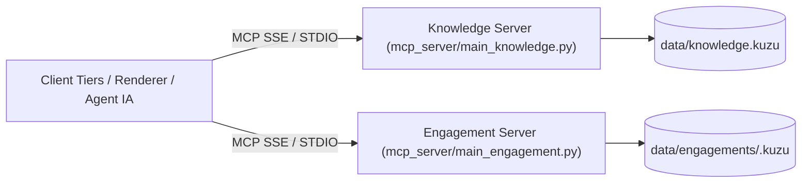

# 🔌 Spécification d'Interface Externe & Schémas des Réponses MCP (ADR-0014 / ADR-0015)

Ce document constitue la spécification technique officielle du contrat d'interface exposé par les serveurs **FastMCP** de la plateforme **LLMOps**. Il fournit la structure complète et les **schémas JSON de réponse** pour chaque outil.

---

## 🎯 1. Vue d'Ensemble & Architecture de Découpage

Le serveur MCP est découpé en deux entités indépendantes pour garantir la séparation stricte de la base de connaissances réutilisable et des données projets :

1. **Knowledge Server (`mcp_server/main_knowledge.py`)** : Héberge les actifs réutilisables (`Asset`, `GlossaryTerm`, `SUPERSEDES`).
2. **Engagement Server (`mcp_server/main_engagement.py`)** : Héberge l'état d'avancement des projets clients (`Subject`, `Statement`, `Conflict`, `Question`, `Uncertainty`).



---

## 🌐 2. Transports, Endpoints & Authentification

- **Transport Recommandé :** HTTP SSE (`Server-Sent Events`) à la racine du serveur `/sse`.
- **Transport STDIO (Agents Locaux) :** `poetry run mcp-server-knowledge` et `poetry run mcp-server-engagement`.
- **Endpoint Public GCP Cloud Run :** `https://llmops-mcp-server-344571265365.europe-west1.run.app/sse`
- **Authentification HTTP (Bearer Token) :**
  - Tout démarrage du serveur HTTP exige la variable d'environnement `SERVER_TOKEN` (ou `LLMOPS_AUTH_TOKEN`).
  - Les requêtes HTTP / SSE doivent fournir le jeton dans l'en-tête HTTP : `Authorization: Bearer <SERVER_TOKEN>` (ou `X-API-Key: <SERVER_TOKEN>`).
  - Le serveur valide le jeton de manière constante (`secrets.compare_digest`) et retourne `HTTP 401 Unauthorized` si le jeton est invalide ou absent.
- **Sûreté de Connexion & Sémantique :** 
  - Connexion strictement **Read-Only** sur la base de données graphique Kùzu DB en production.
  - Toute tentative de mutation Cypher via l'interface publique est refusée au niveau du driver.
  - Ordre de contrôle : l'autorisation (`authorise`) est toujours vérifiée avant la résolution de fichier.

---

## 📋 3. Enveloppe de Réponse Standardisée & Gestion des Erreurs

Tous les outils FastMCP retournent une **enveloppe JSON uniformisée** :

```json
{
  "$schema": "http://json-schema.org/draft-07/schema#",
  "title": "ResponseEnvelope",
  "type": "object",
  "properties": {
    "status": {
      "type": "string",
      "enum": ["ok", "not_found", "invalid_argument", "error", "unauthorized"]
    },
    "count": {
      "type": "integer",
      "minimum": 0
    },
    "data": {
      "description": "Payload de réponse dont le schéma dépend de l'outil appelé"
    },
    "reason": {
      "type": "string",
      "description": "Présent uniquement en cas d'erreur ou d'argument invalide"
    }
  },
  "required": ["status", "count", "data"]
}
```

### Comportement des Cas Limites :
- **Cas Nominal (`status: "ok"`)** : Contient `count` (ex: `1` ou nombre d'éléments) et le payload dans `data`.
- **Cas Non Trouvé (`status: "not_found"`)** : Identifiant inexistant ou non résolu. Contient `data: null` ou l'ID réclamé. Distinct d'une erreur.
- **Cas Erreur / Argument Invalide (`status: "error"` / `"invalid_argument"`)** : Contient un champ `reason` explicatif en anglais.
- **Cas Résultat Vide (`count: 0, data: []`)** : Un filtre valide sans résultat renvoie une liste vide `[]`, pas une erreur.

---

## 📚 4. Schémas de Réponse — Knowledge Server

### 4.1 `list_assets` & `search_assets`
**Payload Schema (`data`) :**
```json
{
  "type": "array",
  "items": {
    "type": "object",
    "properties": {
      "id": { "type": "string", "example": "ADR-0014" },
      "title": { "type": "string", "example": "Server Splitting & Security Contract" },
      "type": { "type": "string", "example": "decision" },
      "status": { "type": "string", "example": "active" },
      "confidence": { "type": "string", "example": "verified" },
      "phase": { "type": "string", "example": "BUILD" },
      "domain": { "type": "string", "example": "ai-assistance" },
      "last_reviewed": { "type": "string", "example": "2026-07-27" }
    },
    "required": ["id", "title", "type"]
  }
}
```

### 4.2 `get_asset`
**Payload Schema (`data`) :**
```json
{
  "type": "object",
  "properties": {
    "id": { "type": "string" },
    "title": { "type": "string" },
    "type": { "type": "string" },
    "status": { "type": "string" },
    "confidence": { "type": "string" },
    "sections": {
      "type": "object",
      "additionalProperties": { "type": "string" }
    },
    "raw_body": { "type": "string" }
  },
  "required": ["id", "title", "type"]
}
```

### 4.3 `get_decision_trail`
**Payload Schema (`data`) :**
```json
{
  "type": "object",
  "properties": {
    "asset": { "$ref": "#/definitions/Asset" },
    "supersedes": {
      "type": "array",
      "items": {
        "type": "object",
        "properties": {
          "supersedes_id": { "type": "string" },
          "supersedes_title": { "type": "string" }
        }
      }
    },
    "superseded_by": {
      "type": "array",
      "items": {
        "type": "object",
        "properties": {
          "superseded_by_id": { "type": "string" },
          "superseded_by_title": { "type": "string" }
        }
      }
    }
  },
  "required": ["asset", "supersedes", "superseded_by"]
}
```

### 4.4 `get_knowledge_analytics`
Rapport global sur les métriques de volume, de statut et d'antériorité de la base de connaissances.

**Payload Schema (`data`) :**
```json
{
  "type": "object",
  "properties": {
    "total_assets": { "type": "integer" },
    "by_type": { "type": "object", "additionalProperties": { "type": "integer" } },
    "by_status": { "type": "object", "additionalProperties": { "type": "integer" } },
    "by_confidence": { "type": "object", "additionalProperties": { "type": "integer" } },
    "total_relations": { "type": "integer" }
  },
  "required": ["total_assets", "by_type", "by_status", "by_confidence", "total_relations"]
}
```

### 4.5 `get_domain_prominence_report`
Rapport de poids et de centralité des domaines d'expertise avec matrice des dépendances inter-domaines (`REQUIRES`).

**Payload Schema (`data`) :**
```json
{
  "type": "object",
  "properties": {
    "domain_volumes": {
      "type": "array",
      "items": {
        "type": "object",
        "properties": {
          "domain": { "type": "string" },
          "count": { "type": "integer" },
          "share_pct": { "type": "number" }
        }
      }
    },
    "cross_domain_matrix": {
      "type": "array",
      "items": {
        "type": "object",
        "properties": {
          "source": { "type": "string" },
          "target": { "type": "string" },
          "count": { "type": "integer" }
        }
      }
    }
  },
  "required": ["domain_volumes", "cross_domain_matrix"]
}
```

---

## 🎯 5. Schémas de Réponse — Engagement Server (Moteur de Rendu)

### 5.1 `get_render_payload` (Payload Complet Renderer)
**Payload Schema (`data`) :**
```json
{
  "type": "object",
  "properties": {
    "engagement": { "type": "string", "example": "nordwave-mcx-2027" },
    "status": { "type": "string", "enum": ["provisional", "final"] },
    "is_provisional": { "type": "boolean" },
    "maturity_board": {
      "type": "array",
      "items": {
        "type": "object",
        "properties": {
          "subject": { "type": "string", "example": "mcx-services" },
          "level": { "type": "string", "enum": ["L0_named", "L1_framed", "L2_decomposed", "L3_designed", "L4_specified"] },
          "origin": { "type": "string" },
          "open_question_ref": { "type": ["string", "null"] },
          "days_at_level": { "type": "integer" },
          "is_stalled": { "type": "boolean" },
          "updated_at": { "type": "string" }
        },
        "required": ["subject", "level"]
      }
    },
    "active_statements": {
      "type": "array",
      "items": {
        "type": "object",
        "properties": {
          "id": { "type": "string", "example": "S-0001" },
          "section": { "type": "string", "example": "4.1" },
          "subject": { "type": "string", "example": "mcx-services" },
          "predicate": { "type": "string", "example": "runs_on" },
          "value": { "type": "string", "example": "Kubernetes site dual-homed" },
          "author": { "type": "string" },
          "role": { "type": "string" },
          "confidence": { "type": "string", "enum": ["declared", "designed", "validated", "tested"] },
          "status": { "type": "string", "enum": ["active", "under_review", "contested", "superseded"] },
          "based_on": {
            "type": "array",
            "items": {
              "type": "object",
              "properties": {
                "id": { "type": "string" },
                "resolved": { "type": "boolean" }
              }
            }
          }
        },
        "required": ["id", "subject", "predicate", "value"]
      }
    },
    "open_conflicts": {
      "type": "array",
      "items": {
        "type": "object",
        "properties": {
          "id": { "type": "string", "example": "C-0001" },
          "kind": { "type": "string", "enum": ["contradiction", "incompatibility", "scope_overlap"] },
          "detail": { "type": "string" },
          "status": { "type": "string", "enum": ["open", "arbitrated"] },
          "statement_ids": { "type": "array", "items": { "type": "string" } }
        },
        "required": ["id", "kind", "detail", "status"]
      }
    },
    "uncertainties": { "type": "array", "items": { "type": "object" } },
    "unripe_subjects": { "type": "array", "items": { "type": "string" } }
  },
  "required": ["engagement", "status", "is_provisional", "maturity_board", "active_statements", "open_conflicts"]
}
```

### 5.2 `get_diagram_graph` (Graphe & Mermaid)
**Payload Schema (`data`) :**
```json
{
  "type": "object",
  "properties": {
    "nodes": {
      "type": "array",
      "items": {
        "type": "object",
        "properties": {
          "id": { "type": "string" },
          "label": { "type": "string" },
          "type": { "type": "string" },
          "level": { "type": "string" }
        },
        "required": ["id", "label", "type"]
      }
    },
    "edges": {
      "type": "array",
      "items": {
        "type": "object",
        "properties": {
          "id": { "type": "string" },
          "source": { "type": "string" },
          "target": { "type": "string" },
          "predicate": { "type": "string" }
        },
        "required": ["source", "target", "predicate"]
      }
    },
    "mermaid": { "type": "string", "example": "flowchart TD\n    mcx-services[\"mcx-services (L2_decomposed)\"]" }
  },
  "required": ["nodes", "edges", "mermaid"]
}
```

### 5.3 `get_subject_trajectory` (Trajectoire Chronologique)
**Payload Schema (`data`) :**
```json
{
  "type": "array",
  "items": {
    "type": "object",
    "properties": {
      "level": { "type": "string", "enum": ["L0_named", "L1_framed", "L2_decomposed", "L3_designed", "L4_specified"] },
      "question": { "type": "string" },
      "answer_excerpt": { "type": "string" }
    },
    "required": ["level", "question", "answer_excerpt"]
  }
}
```

### 5.4 `get_dangling_references` (Références Obsolètes / Manquantes)
**Payload Schema (`data`) :**
```json
{
  "type": "array",
  "items": {
    "type": "object",
    "properties": {
      "statement_id": { "type": "string", "example": "S-0012" },
      "referenced_id": { "type": "string", "example": "ADR-9999" },
      "note": { "type": "string" }
    },
    "required": ["statement_id", "referenced_id"]
  }
}
```

302: ### 5.5 `get_graph_summary` (Découverte Multi-Bases ADR-0015 & schema_version)
303: **Payload Schema (`data`) :**
304: ```json
305: {
306:   "type": "object",
307:   "properties": {
308:     "schema_version": { "type": "string", "example": "1.0" },
309:     "knowledge": {
310:       "type": "object",
311:       "properties": {
312:         "dataset": { "type": "string", "example": "data/knowledge.kuzu" },
313:         "node_counts": {
314:           "type": "object",
315:           "properties": {
316:             "Asset": { "type": "integer" },
317:             "GlossaryTerm": { "type": "integer" }
318:           }
319:         }
320:       }
321:     },
322:     "engagements": {
323:       "type": "array",
324:       "items": {
325:         "type": "object",
326:         "properties": {
327:           "id": { "type": "string", "example": "nordwave-mcx-2027" },
328:           "dataset": { "type": "string", "example": "data/engagements/nordwave-mcx-2027.kuzu" },
329:           "node_counts": {
330:             "type": "object",
331:             "properties": {
332:               "Subject": { "type": "integer" },
333:               "Statement": { "type": "integer" },
334:               "Conflict": { "type": "integer" }
335:             }
336:           }
337:         }
338:       }
339:     }
340:   },
341:   "required": ["schema_version", "knowledge", "engagements"]
342: }
343: ```
344: 
345: ### 5.6 `get_engagement_export` (Export Global en Un Seul Appel - E4)
346: **Payload Schema (`data`) :**
347: ```json
348: {
349:   "type": "object",
350:   "properties": {
351:     "engagement": { "type": "string", "example": "nordwave-mcx-2027" },
352:     "board": { "type": "array" },
353:     "render_payload": { "type": "object" },
354:     "diagram_graph": { "type": "object" }
355:   },
356:   "required": ["engagement", "board", "render_payload", "diagram_graph"]
357: }
358: ```

---

## 🎨 6. Documents de Référence Complémentaires

- 🎨 **[Guide d'Intégration du Moteur de Rendu (Renderer Integration Guide)](file:///home/momo/Dev/LLMOps/docs/renderer_integration.md)** : Manuel dédié au développement de moteurs de rendu (UI Web, React, PDF).
- 📊 **[Spécification du Schéma Graphe Kùzu DB (SCHEMA.md)](file:///home/momo/Dev/LLMOps/docs/SCHEMA.md)** : Structure des tables et propriétés pour les utilisateurs de `query_graph`.
- 📖 **[Documentation d'Architecture Logicielle (architecture.md)](file:///home/momo/Dev/LLMOps/docs/architecture.md)** : Spécification des choix d'architecture interne (ADR-0014 / ADR-0015).
