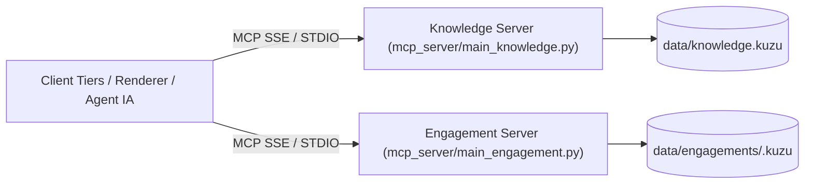

# 🔌 Spécification d'Interface Externe du Serveur MCP (ADR-0014 / ADR-0015)

Ce document constitue la spécification technique officielle du contrat d'interface exposé par les serveurs **FastMCP** de la plateforme **LLMOps**. Il permet à tout développeur ou système tiers (moteur de rendu, UI web, agent IA, client SDK) d'intégrer et de consommer les services d'architecture.

---

## 🎯 1. Vue d'Ensemble & Architecture de Découpage

Le serveur MCP est découpé en deux entités indépendantes pour garantir la séparation stricte de la base de connaissances réutilisable et des données projets :

1. **Knowledge Server (`mcp_server/main_knowledge.py`)** : Héberge les actifs réutilisables (`Asset`, `GlossaryTerm`, `SUPERSEDES`).
2. **Engagement Server (`mcp_server/main_engagement.py`)** : Héberge l'état d'avancement des projets clients (`Subject`, `Statement`, `Conflict`, `Question`, `Uncertainty`).



---

## 🌐 2. Transports, Endpoints & Authentification

- **Transport Recommandé :** HTTP SSE (`Server-Sent Events`) à la racine du serveur `/sse`.
- **Transport STDIO (Agents Locaux) :** `poetry run mcp-server-knowledge` et `poetry run mcp-server-engagement`.
- **Endpoint Public GCP Cloud Run :** `https://llmops-mcp-server-344571265365.europe-west1.run.app/sse`
- **Sûreté de Connexion & Sémantique :** 
  - Connexion strictement **Read-Only** sur la base de données graphique Kùzu DB.
  - Toute tentative de mutation Cypher (`CREATE`, `SET`, `DELETE`) est refusée au niveau du driver.
  - Ordre de contrôle : l'autorisation (`authorise`) est toujours vérifiée avant la résolution de fichier.

---

## 📋 3. Enveloppe de Réponse Standardisée & Gestion des Erreurs

Tous les outils FastMCP retournent une **enveloppe JSON uniformisée** :

```json
{
  "status": "ok" | "not_found" | "invalid_argument" | "error" | "unauthorized",
  "count": 1,
  "data": { ... }
}
```

### Comportement des Cas Limites :
- **Cas Nominal (`status: "ok"`)** : Contient `count` et le payload dans `data`.
- **Cas Non Trouvé (`status: "not_found"`)** : Identifiant inexistant ou non résolu. Distinct d'une erreur.
- **Cas Erreur ou Argument Invalide (`status: "error"` / `"invalid_argument"`)** : Contient un champ `reason` explicatif en anglais.
- **Cas Résultat Vide (`count: 0, data: []`)** : Un filtre valide sans résultat renvoie une liste vide, pas une erreur.

---

## 📚 4. Référence des Outils — Knowledge Server

| Outil | Description | Paramètres Requis / Optionnels | Retour Nominal |
|---|---|---|---|
| `list_assets` | Lister les documents d'architecture selon leur statut, domaine ou phase | `type`, `phase`, `domain`, `status` (def: 'active') | Liste d'objets `Asset` |
| `get_asset` | Obtenir le contenu complet et le frontmatter d'un actif | `id` (ex: 'ADR-0014') | Objet `Asset` complet ou `not_found` |
| `get_assets` | Résolution par lot (*batch*) de plusieurs actifs | `ids: list[str]` | Liste des résultats résolus |
| `search_assets` | Recherche hybride sur les titres, identifiants et métadonnées | `query`, `filters` | Liste des correspondances |
| `get_principles_for` | Obtenir les principes d'architecture pour une phase/domaine | `phase`, `domain` | Liste de principes |
| `get_decision_trail` | Historique et chaîne de supersession d'un ADR | `id` | Payload avec relations `SUPERSEDES` |
| `get_glossary_term` | Récupérer la définition canonique d'un terme | `term` | Définition du terme |
| `query_graph` | Exécuter une requête Cypher en lecture seule sur la KB | `cypher_query` | Résultat de la requête Cypher |
| `get_graph_summary` | Résumé des nœuds et relations de la base de connaissances | *(aucun)* | Dictionnaire de comptage des nœuds |

---

## 🎯 5. Référence des Outils — Engagement Server

| Outil | Description | Paramètres Requis / Optionnels | Retour Nominal |
|---|---|---|---|
| `get_subject` | Détails et niveau de maturité d'un sujet d'architecture | `subject`, `engagement` (def: 'nordwave-mcx-2027') | Objet `Subject` ou `not_found` |
| `get_subject_trajectory` | Trajectoire d'avancement historique (timeline) d'un sujet | `subject`, `engagement` | Liste des jalons franchis |
| `get_board` | Tableau de maturité complet (Maturity Board) | `engagement` | Liste de tous les sujets & niveaux |
| `get_statements` | Énoncés d'architecture actifs filtrables | `engagement`, `subject`, `section`, `status` | Liste des énoncés `Statement` |
| `get_conflicts` | Conflits d'architecture ouverts ou arbitrés | `engagement`, `status` (def: 'open') | Liste des conflits |
| `get_open_questions` | Questions d'élicitation ouvertes | `engagement`, `role` | Liste des questions ouvertes |
| `get_diagram_graph` | Graphe de structure & code **Mermaid** prêt à l'affichage | `engagement`, `format` ('json' ou 'mermaid') | Nœuds, arêtes & chaîne Mermaid |
| `get_render_payload` | Payload d'affichage complet structuré pour UI / PDF | `engagement` | Synthèse complète de l'engagement |
| `get_dangling_references` | Rapport d'identifiants d'actifs cités mais non résolus | `engagement` | Liste des références en suspens |
| `query_graph` | Exécuter une requête Cypher sur le graphe projet | `cypher_query`, `engagement` | Résultat Cypher |
| `get_graph_summary` | Découverte et résumé des nœuds des engagements | *(aucun)* | Nœuds et bases actives découvertes |

---

## 🎨 6. Documents de Référence Complémentaires

- 🎨 **[Guide d'Intégration du Moteur de Rendu (Renderer Integration Guide)](file:///home/momo/Dev/LLMOps/docs/renderer_integration.md)** : Manuel dédié au développement de moteurs de rendu (UI Web, React, PDF).
- 📊 **[Spécification du Schéma Graphe Kùzu DB (SCHEMA.md)](file:///home/momo/Dev/LLMOps/docs/SCHEMA.md)** : Structure des tables et propriétés pour les utilisateurs de `query_graph`.
- 📖 **[Documentation d'Architecture Logicielle (architecture.md)](file:///home/momo/Dev/LLMOps/docs/architecture.md)** : Spécification des choix d'architecture interne (ADR-0014 / ADR-0015).
