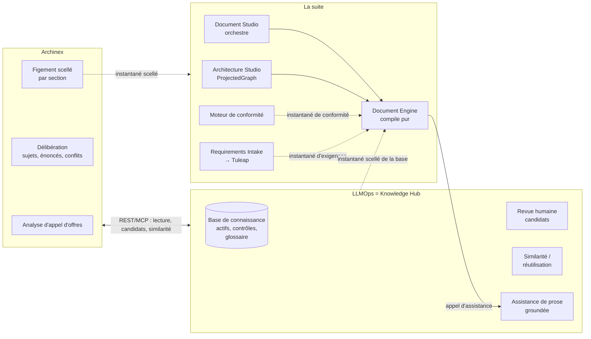

# Carte des composants : qui fait quoi, et par quelle interface

Date : 3 octobre 2026. Ce document décrit LLMOps (rôle « Knowledge Hub »), Archinex et les composants de la suite
(Document Studio, Document Engine, etc.). Chaque affirmation porte un niveau de preuve :

- **[lu]** : lu dans le code ou dans un texte du dépôt cité.
- **[ADR]** : dit par un ADR de la suite, dont certains sont encore *proposés* ; non vérifié dans le code du composant.
- **[déduit]** : mon inférence. À valider avec le propriétaire du composant avant toute décision.

Sources : `docs/plans/ALIGNEMENT-Document-Studio-Knowledge-Hub.md` (lectures de `Document-studio` et `document-engine`),
`docs/adr/ADR-KH-01-contrats-exposes.md`, le code de ce dépôt et d'Archinex. **Non lus** : les dépôts d'Architecture Studio,
de Requirements Intake, du moteur de conformité et de Tuleap ; ce que j'en dis vient des ADR.

## 1. Vue d'ensemble

Trait plein : appel direct. Trait pointillé : instantané scellé (fichier + empreinte), jamais d'appel en direct.

## 2. Qui fait quoi

| Composant | Rôle | Détient | Ne fait pas | Preuve |
|---|---|---|---|---|
| **LLMOps (Knowledge Hub)** | Mémoire de connaissance gouvernée : actifs, référentiels réglementaires (NIS2…), glossaire, doctrine ; revue humaine ; similarité et réutilisation | La connaissance **sur la base**, le journal de réutilisation | Données de programme (décisions, exigences, preuves) ; prose de livrable ; modèle dans le chemin d'élicitation | [lu] code ; [ADR] D2 |
| **Archinex** | Poste de travail du client : analyse un appel d'offres, délibère (sujets, énoncés, conflits, décisions), fige des sections | L'engagement : sujets, énoncés, décisions, conflits, brouillons figés | Génération de documents ; ne stocke pas la connaissance de base (la lit et y propose des candidats) | [lu] code Archinex |
| **Document Engine** | Compose un document : `compile(ProjectedGraph, Blueprint, GenerationContext)`, fonction pure ; reçoit les snapshots externes en paramètres | Le gabarit (Blueprint) et la composition | Ne décide ni ne détient de connaissance ; n'appelle le LLM que pour assister des blocs de prose | [lu] README, ADR-DE-02, `types.ts` |
| **Document Studio** | Orchestre ; « ne calcule jamais » | Le parcours de production | La composition (propriété du Document Engine) | [lu] `CLAUDE.md`, README |
| **Architecture Studio** | Produit le `ProjectedGraph` (éléments, couches, relations) et porte les décisions de programme | Le graphe d'architecture | — | [ADR] ; [lu] côté consommateur seulement |
| **Requirements Intake → Tuleap** | Prise en charge des exigences d'un appel d'offres | Les exigences de programme | — | [ADR], non lu |
| **Moteur de conformité** | Produit l'instantané de conformité | Les verdicts exigence → contrôle | — | [ADR], non lu |

Précisions :

- Il y a **deux** « prises en charge d'un appel d'offres » : celle d'Archinex (analyse et délibération) et celle de la suite
  (Requirements Intake). Leur recouvrement n'est pas tranché. **[déduit]** Elles ne se parlent pas aujourd'hui.
- La **prose** : le Document Engine compose de façon déterministe ; seul un bloc de prose peut recevoir une *suggestion*
  d'un LLM (Anthropic ou le Hub), jamais directement un contenu (ADR-DE-02). Un humain accepte.

## 3. Natures d'interface

| Interface | Nature | État |
|---|---|---|
| Archinex ↔ LLMOps | REST (et MCP) : lecture de la base, candidats, similarité, confirmations de réutilisation. Contrat versionné (1.0 à 1.13), formes figées dans `tests/contract/frozen/` | [lu] en production |
| Archinex → suite | Instantané scellé (`SealedSnapshot`) par section figée | [lu] existe côté Archinex ; **destinataire non établi** |
| LLMOps → suite | Instantané scellé de la base (`scripts/export_sealed_snapshot.py`) | [lu] existe ; écarts d'enveloppe et de version : K1 à K3 |
| Document Engine → LLMOps | Assistance de prose : `POST /api/prose/suggest-batch`, groundée (PR #39) | [lu] ; « l'assistance n'est pas un canal » [ADR] |
| Suite ↔ LLMOps (règle) | Canal à instantané scellé, **jamais de RPC** | [ADR] amendement du 2026-09-13, opposable |

Chaque canal d'instantané porte une enveloppe commune (émetteur, empreinte SHA-256 au profil canonical-json v1,
`rebuiltByEmitterTest`), des références `knowledge-hub:<slug>` avec version, et une qualification épistémique à deux étages
(confiance par élément, `is_provisional` par instantané).

## 4. Votre séquence, face à ce qui existe

| # | Étape | État |
|---|---|---|
| 1 | Base de connaissance vide, enrichie par Archinex (NIS2, etc.) | [lu] Archinex ingère par l'API LLMOps ; revue humaine avant canonisation |
| 2 | Soumission d'un appel d'offres, création de la base d'engagement | [lu] vit dans Archinex ; LLMOps ne garde plus d'engagement (déprécié 1.13) |
| 3 | Capitalisation de décisions vers la base | [lu] par candidats, revue humaine ; pas d'automatisme |
| 4 | Décisions propres au projet | [lu] restent dans Archinex, hors base |
| 5 | Délibération, puis instantanés scellés vers la suite | **Trou** : Archinex scelle (4), mais qui consomme quoi n'est pas établi (§5) |
| 6 | Génération de documents | [lu] Document Engine, sur `ProjectedGraph` + snapshots ; **pas** sur un « dossier d'engagement » |

« Dossier d'engagement » était mon nom pour l'agrégat de l'étape 5. Ce n'est pas un objet de la suite. Il se réduit à
l'export scellé d'Archinex, étendu au niveau de l'engagement (issue archinex#31).

## 5. Ce qui manque ou reste à établir

1. **Qui, dans la suite, consomme l'export scellé d'Archinex ?** Le Document Engine prend un `ProjectedGraph` et des
   instantanés d'exigences et de conformité. Il faut un adaptateur (LLMOps#40), dont le propriétaire n'est pas désigné.
2. **Où vont les décisions, les manques et les conflits ?** **[déduit]** de l'ADR-SUITE-05 : décisions vers Architecture
   Studio, manques vers Requirements Intake, conflits vers le moteur de conformité. À valider avec les propriétaires,
   d'où l'absence d'issue pour ces exports.
3. **Recouvrement des deux prises en charge d'appel d'offres** (Archinex et Requirements Intake).
4. **Maturité** : Archinex ajoute `L5_archived` à `L0_named…L4_specified` de la suite (archinex#31).
5. **Journal de réutilisation** : connaissance sur la base ou donnée de programme ? (Q1 de l'alignement.)
6. **Contrôle de la prose en sortie** : vérifier que chaque affirmation chiffrée ou normative se retrouve dans les énoncés
   cités. Amorcé dans `pipelines/prose_grounding.py` ; l'endroit idéal est le pipeline du Document Engine. Proposition,
   à confirmer avec son équipe.
7. **Statut des ADR** : ADR-KH-01 (PR #41) et la révision 2 d'ADR-SUITE-05 sont proposés, pas adoptés.

## 6. Questions à poser aux propriétaires de la suite

- Architecture Studio : reçoit-il des décisions d'une source externe, et sous quelle forme ?
- Requirements Intake : un manque exporté par Archinex a-t-il une entrée possible ?
- Moteur de conformité : accepte-t-il un conflit externe, ou seulement ses propres verdicts ?
- Document Engine : qui écrit l'adaptateur vers `ProjectedGraph` ?
- Tous : confirmer la maturité `L5_archived` et la liste des canaux (15 dans le registre) qui concernent Archinex.
