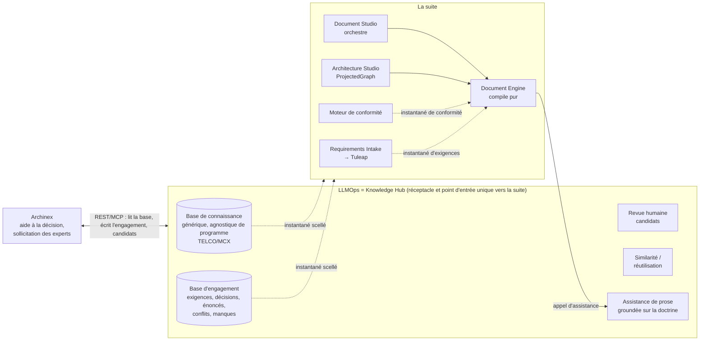

# Carte des composants : qui fait quoi, et par quelle interface

Date : 3 octobre 2026 (révisée après la décision du mainteneur : **le Hub contient deux bases**, ADR-KH-01 A10, projet ; état du code après K9 à K15 et K11, contrat 1.18).
Ce document décrit LLMOps (rôle « Knowledge Hub »), Archinex et les composants de la suite (Document Studio, Document Engine, etc.).
Chaque affirmation porte un niveau de preuve :

- **[lu]** : lu dans le code ou dans un texte du dépôt cité.
- **[ADR]** : dit par un ADR de la suite, dont certains sont encore *proposés* ; non vérifié dans le code du composant.
- **[décidé]** : décision du mainteneur du Hub (2026-10-03), en projet tant que l'ADR n'est pas adopté et que la suite n'a pas répondu.
- **[livré]** : implémenté dans ce dépôt et testé (contrat cité).
- **[déduit]** : mon inférence. À valider avec le propriétaire du composant.

Sources : `docs/plans/ALIGNEMENT-Document-Studio-Knowledge-Hub.md`, `docs/adr/ADR-KH-01-contrats-exposes.md` (A10),
`docs/adr/PROPOSITION-amendement-ADR-SUITE-05.md`, le code de ce dépôt et d'Archinex. **Non lus** : les dépôts d'Architecture Studio,
de Requirements Intake, du moteur de conformité et de Tuleap ; ce que j'en dis vient des ADR.

## 1. Vue d'ensemble

Trait plein : appel direct. Trait pointillé : instantané scellé (fichier + empreinte), jamais d'appel en direct.
Le Hub émet **deux familles de canaux** : connaissance (existant) et engagement (nouveau, lot K11). La suite ne connaît pas Archinex.

## 2. Qui fait quoi

| Composant | Rôle | Détient | Ne fait pas | Preuve |
|---|---|---|---|---|
| **LLMOps (Knowledge Hub)** | Réceptacle des deux bases ; revue humaine ; similarité et réutilisation ; point d'entrée unique vers la suite | **Base de connaissance** (expérience d'experts sur un vertical, agnostique de programme) et **base d'engagement** (exigences, décisions, énoncés, conflits, manques d'un programme) | Prose de livrable ; prendre une décision (il enregistre celles que des personnes posent) ; modèle dans le chemin d'élicitation | [lu] code ; [décidé] A10 |
| **Archinex** | Outil d'aide à la décision et de sollicitation des experts : ingère l'appel d'offres, fait vivre le débat, fige des sections | Rien en propre à terme : un client du Hub. **Aujourd'hui** l'engagement est encore dans sa base Prisma (reprise : K12) | Génération de documents ; émission vers la suite | [lu] code Archinex ; [décidé] rôle cible |
| **Document Engine** | Compose un document : `compile(ProjectedGraph, Blueprint, GenerationContext)`, fonction pure ; snapshots externes en paramètres | Le gabarit (Blueprint) et la composition | Ne détient pas de connaissance ; n'appelle le LLM que pour assister des blocs de prose | [lu] README, ADR-DE-02, `types.ts` |
| **Document Studio** | Orchestre ; « ne calcule jamais » | Le parcours de production | La composition (propriété du Document Engine) | [lu] `CLAUDE.md`, README |
| **Architecture Studio** | Produit le `ProjectedGraph` (éléments, couches, relations) | Le graphe d'architecture | — | [ADR] ; [lu] côté consommateur seulement |
| **Requirements Intake → Tuleap** | Prise en charge des exigences d'un appel d'offres côté suite | Les exigences de programme **côté suite** | — | [ADR], non lu |
| **Moteur de conformité** | Produit l'instantané de conformité | Les verdicts exigence → contrôle | — | [ADR], non lu |

Précisions :

- **Exigences** : deux endroits possibles, Hub (base d'engagement) et Requirements Intake. [décidé] Le Hub garde celles de
  l'appel d'offres pour l'instant : elles servent à solliciter les architectes et à leur faire expliciter leur savoir.
  La clarification avec la suite est en cours (question ouverte, §5).
- **Ingestion de l'appel d'offres** : faite côté Archinex avec un modèle ; ce qui en sort est marqué `llm-derived` et reste
  **proposé** ; seule une personne affirme. Le Hub reste déterministe (garantie D3-1). [décidé]
- **Prose** : le Document Engine compose de façon déterministe ; seul un bloc de prose peut recevoir une *suggestion* d'un
  LLM (Anthropic ou le Hub), jamais directement un contenu (ADR-DE-02). Un humain accepte. L'assistance de prose du Hub ne
  lit pas la base d'engagement et n'énonce rien sur le projet (A3-a, A10-d-4).

## 3. Natures d'interface

| Interface | Nature | État |
|---|---|---|
| Archinex ↔ LLMOps | REST (et MCP) : lecture de la base, candidats, similarité, confirmations de réutilisation, **écriture de l'engagement** (sujets, énoncés, questions, exigences, arbitrage). Contrat versionné (1.0 à 1.18), formes gelées dans `tests/contract/frozen/` | [livré] 1.14 (dépréciation levée), 1.16 (rôles), 1.17 (écriture) |
| LLMOps → suite (connaissance) | Instantané scellé (`scripts/export_sealed_snapshot.py`) | [livré] canonical-json v1, enveloppe de canal, versions citables et résolution (1.15, K1 à K3). Le contenu reste à plat (pas de wrapper `data`) : à valider avec la suite |
| LLMOps → suite (engagement) | Instantané scellé de la base d'engagement, `POST /api/engagements/{id}/exports` | [livré] 1.18 (K11) : enveloppe de la suite, identifiant dérivé du contenu, handles seulement, refus si la vérification échoue ; consommateur de la suite non établi |
| Document Engine → LLMOps | Assistance de prose : `POST /api/prose/suggest-batch`, groundée (PR #39) | [lu] ; « l'assistance n'est pas un canal » [ADR] |
| Suite ↔ LLMOps (règle) | Canal à instantané scellé, **jamais de RPC** | [ADR] amendement du 2026-09-13, opposable |
| Archinex → suite | **Aucune** | [décidé] la suite ne connaît pas Archinex |

Chaque canal d'instantané porte une enveloppe commune (émetteur, empreinte SHA-256 au profil canonical-json v1,
`rebuiltByEmitterTest`), des références `knowledge-hub:<slug>` avec version, et une qualification épistémique à deux étages
(confiance par élément, `is_provisional` par instantané).

## 4. Séquence cible

| # | Étape | État |
|---|---|---|
| 1 | Base de connaissance vide, enrichie par Archinex (NIS2, etc.) | [lu] Archinex ingère par l'API LLMOps ; revue humaine avant canonisation |
| 2 | Soumission d'un appel d'offres via Archinex : exigences, sujets et manques extraits (proposés) → **base d'engagement du Hub** | [livré] côté Hub (K15 : `POST requirements`, `subjects`, `statements`) ; l'engagement existant d'Archinex reste à reprendre (K12) |
| 3 | Sollicitation des architectes : leurs réponses deviennent des énoncés attribués, la base éclaire les propositions, la réutilisation est confirmée hypothèse par hypothèse | [livré] côté Hub (K15 : questions, réponses, énoncés proposés puis affirmés par un autre membre) ; reste côté Archinex d'écrire dans le Hub |
| 4 | Capitalisation de décisions vers la base de connaissance : candidat revu par un humain, **sans ancre de programme** | [lu] chemin des candidats ; test d'étanchéité : K13 |
| 5 | Décisions propres au projet : restent dans la base d'engagement | [décidé] |
| 6 | Délibération, puis **le Hub émet l'instantané scellé d'engagement** vers la suite | [livré] K11 (rôle `admin`, K14) |
| 7 | Génération de documents | [lu] Document Engine, sur `ProjectedGraph` + snapshots ; via l'adaptateur LLMOps#40 |

## 5. Ce qui manque ou reste à établir

1. **Consommateur de l'instantané d'engagement** : le Document Engine prend un `ProjectedGraph` et des instantanés
   d'exigences et de conformité, pas un dossier d'engagement. Il faut un adaptateur (LLMOps#40), propriétaire à désigner.
2. **Canal unique ou un canal par nature d'objet** (décisions, exigences, conflits, manques) : relève du registre de la suite.
   [déduit] des décisions vers Architecture Studio, des manques vers Requirements Intake, des conflits vers le moteur de
   conformité : à valider avec leurs propriétaires.
3. **Exigences** : Hub ou Requirements Intake / Tuleap, laquelle fait foi ? En clarification.
4. **L'émetteur d'un canal doit-il être un composant de la suite ?** Le Hub n'en est pas un (ADR-SUITE-05) ; à confirmer.
5. **Maturité** : Archinex a `L5_archived`, la suite s'arrête à `L4_specified` ; à projeter vers `L4_specified` (archinex#31).
6. **Autorisation** : [livré] K9 (403, énumération filtrée, identifiants validés) et K14 (engagements gérés, fermés à tous sauf leurs membres, dans tous les environnements, rôles et journal d'accès). Reste : l'identité de la personne est attestée par le client de confiance, sans signature ni SSO (#7). Tout engagement réel doit être **géré**.
7. **Transition** : [livré côté Hub] K12, contrat 1.20 : `POST /api/engagements/{id}/import` (simulation, provenance conservée, rien d'affirmé au nom du lot). Reste côté Archinex (archinex#34) : exécuter la reprise projet par projet puis basculer. Deux sources de vérité tant qu'un projet n'est pas basculé ; durée à borner avec l'équipe Archinex.
7bis. **Le contenu de l'instantané d'engagement** est celui que le Hub détient : exigences, sujets, énoncés, **décisions avec options écartées, rationale et réversibilité (K16, contrat 1.19)**, conflits, manques. Éléments d'architecture, conformité dérivée et réutilisation, que le modèle `engagement_bundle` prévoyait, n'y sont pas encore (conformité : K17). Ce qu'attend la suite (adaptateur vers `ProjectedGraph`, LLMOps#40) reste à établir.
7ter. **Archinex n'émet rien vers la suite** (directive du 2026-10-03) : son bundle et son figement scellé cessent d'être une source de la suite ; seul l'instantané du Hub l'est. Parité à atteindre : archinex#34.
8. **Contrôle de la prose en sortie** : vérifier que chaque affirmation chiffrée ou normative se retrouve dans les énoncés
   cités. Amorcé dans `pipelines/prose_grounding.py` ; l'endroit idéal est le pipeline du Document Engine (à confirmer).
9. **Statut des ADR** : ADR-KH-01 (PR #41, A10 incluse) et la proposition à ADR-SUITE-05 ne sont pas adoptés.

## 6. Questions à poser aux propriétaires de la suite

- Registre de canaux : accepte-t-il un émetteur qui n'est pas un composant de la suite ? un canal « engagement » ?
- Architecture Studio : ses décisions de programme sont-elles les mêmes objets que celles délibérées avec les architectes ?
- Requirements Intake : l'exigence d'un appel d'offres du Hub et celle de Tuleap, laquelle fait foi ?
- Document Engine : qui écrit l'adaptateur vers `ProjectedGraph` ?
- Tous : confirmer la maturité `L5_archived` et la liste des canaux (15 dans le registre) qui concernent l'engagement.
