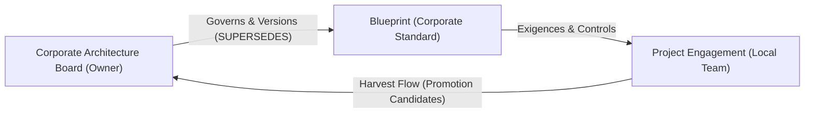

# Third-party integration guide

For a team that wants to build its own document generator, diagram renderer or
custom interface on top of this knowledge base, without adopting our CLI or our
templates. Verified against the deployed server on 2026-07-29.

Three things you can do, independently: read the reusable knowledge, inject and
read your own project data, and render either into whatever output format you
need. This guide covers all three, and ends with a list of what to build
yourself because the server does not yet provide it.

---

## 1. The two things you connect to

```
knowledge server   →  data/knowledge.lbug (or .kuzu)        principles, decisions, patterns,
                                                            questionnaires, glossary, compliance
engagement server  →  data/engagements/<id>.lbug (or .kuzu) subjects, statements, questions,
                                                            conflicts, per project
```

They are two physically separate databases reached through one MCP endpoint.
`query_graph(cypher_query, engagement=None)` reads the knowledge graph when
`engagement` is omitted, and the named engagement's graph when it is supplied. A
single query cannot span both — that is deliberate, not a limitation to work
around. Cross-plane references are identifiers, resolved with `get_assets`, never
graph edges.

**Verify your connection first.**

```python
summary = mcp.call("get_graph_summary", {})
# {"schema_version": "1.0",
#  "knowledge": {"dataset": "...", "node_counts": {"Asset": 46, "GlossaryTerm": 10}},
#  "engagements": [{"id": "nordwave-mcx-2027",
#                    "node_counts": {"Subject": 8, "Statement": 9, "Conflict": 2}}]}
```

If `knowledge.node_counts.Asset` is `0`, the server has not been (re)ingested and
nothing below will work — this has happened during development and is worth
checking before debugging your own code.

---

## 2. Reading the reusable knowledge

```python
mcp.call("list_assets", {"type": "principle", "domain": "ai-assistance"})
mcp.call("search_assets", {"query": "shadow environment validation"})
mcp.call("get_asset", {"id": "ADR-0011"})
mcp.call("get_assets", {"ids": ["ADR-0005", "P-002", "PAT-006"]})     # batch
mcp.call("query_graph", {"cypher_query": "MATCH (a:Asset)-[:DEFINES]->(g) RETURN a,g LIMIT 20"})
```

Every asset response carries `confidence` (`verified` / `vendor-stated` /
`assumed`) and `last_reviewed`. **Any renderer you build must surface these**,
or propagate them into a generated document as a footnote or a colour code. An
asset marked `assumed` rendered with the same visual weight as one marked
`verified` reintroduces exactly the over-claiming problem this base exists to
prevent. This is not a stylistic suggestion — treat it as a functional
requirement of any output format you build.

`list_assets` accepts `type`, `domain`, `phase`, `status` and filters honestly —
verified directly: a domain filter on `ai-assistance` returns only the four
matching principles, not the full fifteen.

---

## 3. Injecting your own project data

This is the part most third parties will want and the part least finished on the
server side. Two paths exist today, at different levels of completeness.

### 3.1 Read path — fully usable today

Once an engagement graph exists, everything is readable:

```python
mcp.call("get_board", {"engagement": "your-engagement"})
mcp.call("get_statements", {"engagement": "your-engagement", "subject": "floor-control"})
mcp.call("get_conflicts", {"engagement": "your-engagement", "status": "open"})
mcp.call("get_open_questions", {"engagement": "your-engagement", "role": "security-architect"})
mcp.call("get_subject_trajectory", {"engagement": "your-engagement", "subject": "mcx-services"})
mcp.call("get_dangling_references", {"engagement": "your-engagement"})
mcp.call("get_render_payload", {"engagement": "your-engagement"})      # see §4
mcp.call("get_engagement_export", {"engagement": "your-engagement"})    # single bulk call (E4)
```

Verified live: an engagement graph with 8 subjects, 9 statements and 2 conflicts
returns rich, correct data through every one of these — including a statement
attributed to an external contributor with `confidence: observed`, and a
detected contradiction (`origin: detected`) correctly distinguished from a
declared one. The maturity board is genuinely rich: level, origin
(`blueprint` vs `discovered`), staleness (`days_at_level`, `is_stalled`) and
which document sections depend on each subject.

### 3.2 Write path — 4 options available for integrators

There is no `create_statement` or `submit_answer` MCP tool, and there should not be one: every write on our side goes through a human confirmation step or validation pipeline, which is precisely the guarantee that makes the base trustworthy.

**Four integration paths exist today:**

1. **Automated Solution Document Ingestion Gateway (`scripts/ingest_solution_doc.py`) (New & Recommended for existing HLDs)**: Parse an existing solution document (.docx, .pdf, .md), project its chapters automatically onto an architectural Blueprint, generate `projects/<engagement>/draft.md`, and execute the gap detection engine (`--scan`).
   ```bash
   poetry run python scripts/ingest_solution_doc.py path/to/solution.docx --engagement your-project --scan
   ```
2. **CLI Import Gateway (`poetry run elicit import`)**: Import a structured JSON payload (`schemas/import.schema.json`) into an engagement database via `poetry run elicit import --engagement <id> <file.json> [--dry-run]`. It validates predicates against the domain vocabulary and passes through the repository pipeline.
3. **Elicitation Engine**: Run our elicitation CLI (`poetry run elicit scan` / `answer` / `confirm`) against your own project and let it build the graph through its own confirmation flow.
4. **Direct LadybugDB Database Population**: Populate an engagement LadybugDB database directly following the schema in §3.3. This option is faster for programmatic integrations but transfers data validation responsibility to the integrator.

### 3.3 The engagement schema, reverse-engineered from live responses

Derived from `get_render_payload` and `get_diagram_graph` output (also published in `docs/SCHEMA.md`):

```
Subject     {name, level, origin ("blueprint"|"discovered"), days_at_level,
             updated_at, is_stalled, open_question_ref, assigned_role,
             dependent_sections[]}

Statement   {id, section, subject, predicate, value, unit,
             author, role, confidence, verbatim, status
             ("active"|"under_review"|"contested"), based_on[]}

Conflict    {id, kind, detail, status ("open"|"arbitrated"), origin
             ("declared"|"detected"), resolution, arbitrated_by}

Uncertainty {id, text, subject}
```

`based_on` is where cross-plane references live: a list of knowledge-base asset
identifiers a statement rests on. Resolve them with `get_assets` in one batch
call rather than one `get_asset` per statement — this is the intended pattern
and it is why `get_assets` exists.

**If you populate the database yourself**, keep confidence and predicate values
from the controlled vocabulary your own tooling defines — nothing enforces this
for you outside the elicitation engine, and an ungoverned predicate vocabulary is
what makes contradiction detection possible or impossible.

---

## 4. Generating documents in your own format

`get_render_payload` is built for exactly this: one call returns the maturity
board, every active statement with its confidence and verbatim, open conflicts,
uncertainties, and the list of subjects not yet mature — everything a renderer
needs, with no further graph traversal required.

```python
payload = mcp.call("get_render_payload", {"engagement": "your-engagement"})
# payload["is_provisional"]        → whether the deliverable is complete
# payload["active_statements"]     → grounds every sentence you write
# payload["open_conflicts"]        → must block a "final" rendering
# payload["unripe_subjects"]       → why it is provisional, if it is
```

### 4.1 The rule that keeps your output honest

`is_provisional` must gate what you claim. A document rendered while conflicts
are open, or while subjects the target sections depend on are below their
required maturity, is a draft — mark it as such visibly, regardless of output
format. This is not a cosmetic nicety: `payload["unripe_subjects"]` exists
specifically so a renderer never has to guess why a document is not finished.

### 4.2 Any output format is a projection of the same payload

Word, PDF, HTML, a slide deck, a wiki page, a PowerPoint — the payload does not
change; only the template does. Concretely:

- **Word / PDF**: one section per document section, statements filtered by
  `section`, rendered as prose with confidence-appropriate wording (`designed` →
  assertive, `stated-by-client` → attributed, `assumed`/`observed` → hedged).
- **Slides**: one slide per subject at or above the maturity your deck requires;
  use `get_subject_trajectory` to build a "how we got here" slide per subject.
- **Wiki / HTML**: render the maturity board as a live table, statements as
  expandable detail with `verbatim` preserved, conflicts as a visible panel
  rather than silently resolved.
- **Diagrams**: `get_diagram_graph` gives you nodes and edges, or Mermaid
  directly.

### 4.3 Mermaid output is valid and safe (Fix E1)

`get_diagram_graph(format="mermaid")` automatically quotes all node and edge target labels and truncates long values with an ellipsis to ensure valid Mermaid syntax across all renderers.

---

## 5. A minimal integration, end to end

```python
kb_id     = "your-engagement"
# Alternatively, use get_engagement_export(kb_id) for a single bulk call (E4)
export    = mcp.call("get_engagement_export", {"engagement": kb_id})
board     = export["data"]["board"]
payload   = export["data"]["render_payload"]
asset_ids = sorted({b["id"] for s in payload["active_statements"]
                    for b in s.get("based_on", [])})
assets    = mcp.call("get_assets", {"ids": asset_ids}) if asset_ids else {"data": []}

doc = render_docx(
    sections=your_blueprint.sections,
    statements=payload["active_statements"],
    conflicts=payload["open_conflicts"],
    provisional=payload["is_provisional"],
    unripe=payload["unripe_subjects"],
    asset_lookup={a["id"]: a for a in assets["data"]},
)
```

Everything on the right-hand side above is a verified, working call as of this
release. `render_docx` — or `_pptx`, `_html`, whatever you build — is the only
part you write.

---

## 6. Server Capabilities & Integration Status

All items from `WORKORDER-THIRD-PARTY-EVOLUTIONS.md` have been implemented:

| Feature / Evolution | Status | Notes / Usage |
|---|---|---|
| Published engagement schema | ✅ Done (E2) | Published in `docs/SCHEMA.md` and enforced by CI |
| Mermaid output quoting | ✅ Fixed (E1) | Quoted and truncated safely in `get_diagram_graph(format="mermaid")` |
| No write path for project data | 🛡️ By Design (E5) | Explicitly documented in `get_graph_summary` tool docstring |
| Stable `schema_version` | ✅ Done (E3) | Exposed as `"schema_version": "1.0"` in `get_graph_summary` payload |
| Single bulk export endpoint | ✅ Done (E4) | `get_engagement_export` tool combines board, payload, and diagram |

We would rather you build against `get_render_payload` and the read tools than
wait for a bulk export — the payload already contains everything, and a single
"export everything" endpoint would just be this guide's minimal integration
moved server-side.

## 7. What not to build

Do not build a write path that bypasses the confirmation flow, even for your own
convenience. Do not cache asset content inside your engagement store — resolve
`based_on` identifiers on read, every time, or your copy will silently diverge
from the knowledge base the day an asset is corrected. Do not render `assumed`
or `stated-by-client` content with the same assertiveness as `verified` content
in your output template — this is the one rule in this guide that is not
negotiable, because it is the entire reason the confidence field exists.

---

## 8. Consuming the Sealed Snapshot (Zero-Latency & Web Client Suites)

For client applications like *Architecture Studio* or decoupled frontend suites that require zero network latency and offline resilience, consume the **Sealed Snapshot** (`fixtures/sealed_snapshot.json` or `GET /snapshot/latest`):

```typescript
import snapshot from "./fixtures/sealed_snapshot.json";
// or: const res = await fetch("https://<host>/snapshot/latest");

// 1. Verify snapshot seal
console.log(`Snapshot: ${snapshot.snapshot_id} (checksum: ${snapshot.payload_sha256})`);

// 2. Lookup typed identifiers (type:slug format)
const adr14 = snapshot.assets.find(a => a.typed_id === "decision:ADR-0014");

// 3. Query the applicability index
const rules = snapshot.applicability_index["ADR-0014"].rules;
```

---

## 9. Implementing the `SuggestionCatalogPort` (Architecture Studio)

To connect *Architecture Studio*'s hexagonal `SuggestionCatalogPort` to the Knowledge Hub:

```typescript
import { SuggestionCatalogPort, SuggestionCatalogContext, PatternSuggestion, ResponseEnvelope } from "../schemas/types";
import snapshot from "./fixtures/sealed_snapshot.json";

export class KnowledgeHubSuggestionAdapter implements SuggestionCatalogPort {
  async getSuggestions(context: SuggestionCatalogContext): Promise<ResponseEnvelope<{
    context: SuggestionCatalogContext;
    suggestions: PatternSuggestion[];
  }>> {
    const issue = context.issue_kind.toLowerCase();
    const domain = (context.domain || "").toLowerCase();

    // Match patterns from sealed snapshot in memory (0 network latency)
    const matches = snapshot.assets
      .filter(a => a.type === "pattern" || a.id.startsWith("PAT-") || a.id.startsWith("P-"))
      .filter(a => {
        const text = `${a.title} ${a.summary || ""} ${a.body || ""}`.toLowerCase();
        return text.includes(issue) || (domain && text.includes(domain));
      })
      .slice(0, 5)
      .map(a => ({
        pattern_id: a.id,
        typed_id: a.typed_id || `pattern:${a.id}`,
        title: a.title,
        summary: a.summary || a.title,
        applicability: `Recommended for ${context.issue_kind}`,
        confidence: a.confidence,
        external_ref: `KH:${a.id}@v${a.version || "1.0.0"}`,
        trade_offs: ["Requires local project qualification"],
      }));

    return {
      status: "ok",
      count: matches.length,
      data: {
        context,
        suggestions: matches,
      },
    };
  }
}
```

### Graceful Degradation Rule
If the Knowledge Hub is offline or unreachable, the fallback adapter returns `[]` with status `"ok"`. Architecture Studio continues functioning normally.

---

## 10. Epistemic Mapping & Frozen HLD Citations

When referencing Knowledge Hub assets inside formal High-Level Design (HLD) baselines:
* Always use the canonical format: `ExternalRef { system: "KH", id: "P-002", version: "1.0.0" }`.
* Never assert a `verified` doctrine as a project Fact without local proof in Architecture Studio.
* Refer to [docs/EPISTEMIC-ALIGNMENT.md](EPISTEMIC-ALIGNMENT.md) for full mapping rules.

---

## 11. Compliance & Regulatory Frameworks Tools (NIS2, 3GPP & Beyond)

The Knowledge Hub integrates external regulatory security frameworks as first-class graph entities (`Control` nodes) linked to Architecture Principles and Assets:

```python
# 1. List supported regulatory frameworks and their active versions
mcp.call("list_frameworks", {})
# {"status": "ok", "data": [{"framework": "NIS2", "version": "2022/2555", "controls_count": 10}, ...]}

# 2. List specific controls for a framework
mcp.call("list_controls", {"framework": "NIS2"})
# Returns controls NIS2-ART21-2A to 2J with title, section and description

# 3. Get end-to-end compliance trail for a specific control
mcp.call("get_compliance_trail", {"control_id": "NIS2-ART21-2A"})
# Returns the full lineage: Control <-[:SATISFIES]- Principle -[:REQUIRES]-> Asset (ADR)

# 4. Generate the Compliance Matrix for a project engagement
mcp.call("get_compliance_matrix", {"framework": "NIS2", "engagement": "your-project"})
# Returns coverage status for every control: "covered" (with satisfying statement) or "gap"
```

### Gap G4: Unaddressed Compliance Control
When running `elicit scan`, any control declared in the Blueprint but not backed by an active statement generates a `G4_unaddressed_compliance_control` gap, prompting security architects to decide and specify the mitigation.

---

## 12. Blueprint Governance & Continuous Improvement Cycle (Harvest Loop)

The Blueprint defines the **"What"** (the corporate architecture standard, mandatory sections, gates and regulatory targets), while each project engagement decides the **"How"** (the technical choices, vendors, and local parameters).



### A. Extending the Blueprint Locally (`added_by_engagement: true`)
If a project needs custom sections that the corporate blueprint does not provide, it can declare them in its draft with `added_by_engagement: true`. They will be tracked and scanned in the project's local engagement database without affecting other projects.

### B. The Continuous Improvement Loop (Harvest Flow)
When a project successfully establishes a new reusable pattern or section (e.g. NetDevOps closed-loop automation, Shadow pipeline):
1. The project triggers `poetry run elicit harvest --engagement <id>`.
2. The engine analyzes the engagement graph and yields `promotion_candidates`.
3. The Corporate Architecture Board reviews candidates for cross-program relevance.
4. Upon approval, the official Blueprint is incremented (`version: 2` → `version: 3`) with a `SUPERSEDES` relation.
5. All future projects and connected MCP clients automatically benefit from the updated standard.


