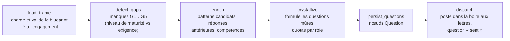
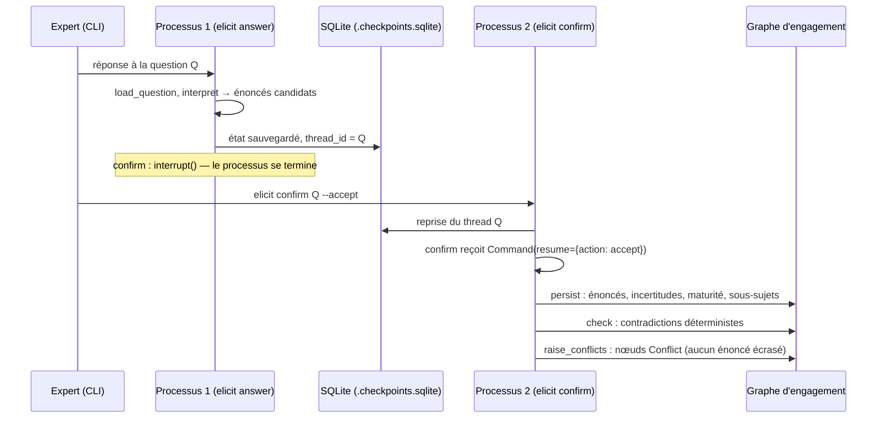
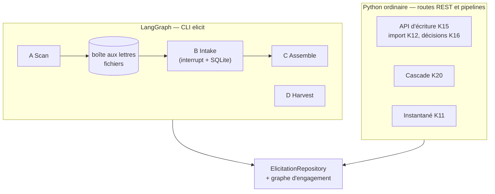

# Zoom — LangGraph dans LLMOps : le moteur d'élicitation

État : 9 octobre 2026, lu dans `tools/elicitation/` (code de `main`). Ce zoom complète [`ARCHITECTURE-LLMOps.md`](ARCHITECTURE-LLMOps.md) §3 ; la vue d'origine est dans [`architecture.md`](architecture.md) §4 et §6, et le guide d'usage dans [`tools/elicitation/README.md`](../tools/elicitation/README.md).

## 1. Ce que LangGraph fait ici, et ce qu'il ne fait pas

**Il fait** : orchestrer des *flux* de l'élicitation, c'est-à-dire des suites d'étapes qui lisent et écrivent le graphe d'engagement, avec un état typé partagé entre les étapes et, pour un seul flux, **une pause durable** qui attend une personne.

**Il ne fait pas** :

- **Aucun modèle de langage n'est appelé.** Il n'y a pas d'agent, pas d'appel d'outil par un modèle, pas de planification dynamique. L'interprétation d'une réponse d'expert est déterministe (`interpreters.py`) : un scénario scripté s'il existe pour l'engagement, sinon un passe-plat qui garde la réponse verbatim comme *incertitude* sans inventer d'énoncé. Chaque candidat est ensuite montré à l'expert avant toute écriture.
- **Aucune arête conditionnelle.** Les six graphes sont **linéaires** (`add_edge` seulement ; ni `add_conditional_edges`, ni boucle, ni parallélisme). Les décisions (« ce manque est-il dispatchable ? », « ce quota est-il atteint ? ») sont prises **à l'intérieur** d'un nœud, par du Python pur.
- **Il n'est pas sur le chemin des routes REST.** L'API d'écriture de l'engagement (K15), l'import (K12), les décisions (K16), la cascade (K20) et l'instantané (K11) sont du Python ordinaire, appelé par les routes. Le moteur d'élicitation n'est atteint que par la CLI `elicit`.

En pratique, LangGraph apporte trois choses : un **état typé** par flux (`TypedDict`), un **ordre d'exécution explicite** et testable, et la primitive **`interrupt`** avec un **checkpointer SQLite** pour la pause durable. Le reste de la logique est dans le dépôt `ElicitationRepository` et dans des fonctions pures.

## 2. Les six flux

| Flux | Fichier | Nœuds (dans l'ordre) | Checkpointer | Lancé par |
|---|---|---|---|---|
| **A — Scan** | `flows/scan.py` | `load_frame` → `detect_gaps` → `enrich` → `crystallize` → `persist_questions` → `dispatch` | non | `elicit scan` |
| **B — Intake** | `flows/intake.py` | `load_question` → `interpret` → **`confirm` (interrupt)** → `persist` → `check` → `raise_conflicts` | **oui, SQLite** | `elicit answer`, `elicit confirm` |
| **C — Assemble** | `flows/assemble.py` | `gather` → `render` → `global_check` → `report` | non | `elicit assemble` |
| **D — Harvest** | `flows/harvest.py` | `harvest` | non | `elicit harvest` |
| **Plan** | `flows/plan.py` | `plan` | non | `elicit plan` |
| **Contribution** | `flows/contribution.py` | `contribution` (une action parmi `submit`, `triage`, `crystallise`, `confirm`, `accept`) | non | `elicit submit`, `triage`, `crystallise`, `confirm-contribution`, `accept` |

Les trois derniers n'ont qu'un nœud : LangGraph n'y apporte que l'uniformité du lancement et de l'état.

### 2.1 Flux A — Scan : de l'état du graphe aux questions à poser

- **Entrée** : un *blueprint* (sections, exigences par sujet, `unlocks`, rôle de routage, compétences, contrôles réglementaires) et le graphe de l'engagement.
- **Verrou de maturité (`gate`)** : un manque n'est *dispatchable* que si le sujet est à un niveau de l'échelle `L0_named → L4_specified` au plus un cran sous le niveau requis ; sinon `held_premature` avec sa raison. Une section qui a déjà un énoncé actif est `satisfied`. Quand les quotas sont atteints, le manque est `held_queued`.
- **Types de manque** : `G1_empty_section`, `G3_unspecified_parameter`, `G4_unaddressed_compliance_control`, `G5_unstaffed_skill_gap`.
- **Quotas** : au plus `max_open_per_role` (6 par défaut) questions ouvertes par rôle et `max_new_per_scan` (12) nouvelles par passage ; stratégie `breadth` (niveaux bas d'abord) ou `depth` (celles qui débloquent le plus de sections d'abord). Le routage tient compte des compétences du roster (meilleur recouvrement).
- **Déterminisme** : `evaluate`, `gate` et le tri sont des fonctions pures ; seuls `persist_questions` et `dispatch` écrivent.

### 2.2 Flux B — Intake : la pause durable

- **Un thread par question** : `thread_id = question_id`. Le checkpoint vit dans `projects/<engagement>/.checkpoints.sqlite` ; on peut interrompre la session et la reprendre **des jours plus tard, depuis un autre processus**.
- **Confirmation** : `interrupt()` expose `candidate_statements`, `candidate_patterns` et le drapeau `no_pattern_for_decomposition`. À la reprise, l'expert peut accepter, rejeter (`rejected: True`, plus rien n'est écrit) ou fournir `edited_statements`.
- **Persistance** : les énoncés sont enregistrés `active`, la question passe à `confirmed`, la maturité du sujet principal avance, les sous-sujets découverts sont créés (`origin: discovered`).
- **Détection de conflits** (`check`) : requête Cypher sur les énoncés actifs d'un même sujet — même prédicat avec valeurs différentes, ou auteurs différents sur des prédicats différents. Les conflits sont **créés, jamais résolus** ici ; l'arbitrage est une étape humaine ultérieure.

### 2.3 Flux C, D, Plan, Contribution

- **C — Assemble** : rassemble les énoncés actifs par section, génère la prose **uniquement** à partir d'eux (un énoncé `assumed` est marqué « sous réserve de confirmation »), calcule le statut global (`provisional` tant qu'il reste un sujet sous `L3_decided` ou un conflit ouvert) et écrit `projects/<engagement>/document.md`.
- **D — Harvest** : lit les candidats à la promotion déclarés dans le profil de l'engagement (`examples/<engagement>/engagement_profile.yaml`) ; rien n'est codé en dur. Ces candidats alimentent le cycle d'enrichissement de la base de connaissance.
- **Plan** : couverture des sections (`empty`, `provisional`, `final`) et profils d'expertise (rôles à pourvoir, rôles pourvus par le roster).
- **Contribution** : cycle d'une contribution spontanée externe (dépôt, tri par le lead, cristallisation en énoncés proposés, confirmation par l'auteur, acceptation par le lead).

## 3. Où cela s'arrête

Les deux familles écrivent dans **le même graphe d'engagement** par le même `ElicitationRepository`, mais avec des **garanties différentes**. C'est la principale chose à savoir avant de faire évoluer ce moteur.

## 4. Écarts connus entre le moteur et le reste de l'architecture

Ces points sont constatés dans le code ; ce sont des sujets de décision, pas des défauts corrigés.

1. **Le flux B écrit des énoncés `active` d'un seul geste.** `persist_node` fixe `status = "active"` après la confirmation de l'expert qui a répondu. L'API d'écriture K15, elle, ne produit que des énoncés `proposed` et exige un `decider` **distinct de l'auteur** pour affirmer ; le journal d'accès, les rôles (K14) et la vérification d'instantané (K11 : `SELF_VALIDATION`, `ASSERTED_WITHOUT_PERSON`) n'interviennent pas sur ce chemin. Un engagement géré peut donc recevoir, par la CLI, des énoncés affirmés que l'API aurait refusés — et l'instantané d'engagement les refusera à l'export (énoncé actif sans valideur). *À trancher : aligner le flux B sur K15 (énoncés proposés, affirmation séparée), ou borner la CLI aux engagements non gérés.*
2. **Le flux B détecte les conflits à sa façon.** `check_node` a sa propre requête ; le dépôt a aussi `run_checks`, utilisé par l'API d'écriture à l'affirmation. Deux détecteurs, deux définitions de « contradiction ».
3. **La cascade (K20) ne passe pas par le flux A.** Les sujets dérivés d'une décision et les questions du blueprint (`unlocks`) sont deux mécanismes : l'un statique (blueprint), l'autre conditionnel (règles K19). Ils ne se coordonnent pas ; le scan ne connaît pas les sujets `origin: derived`.
4. **Les valeurs par défaut des nœuds sont codées en dur** (`"demo-2026"`, `data/kuzu_db`) alors que le serveur résout l'engagement et les chemins par sa configuration (`LLMOPS_ENGAGEMENT`, `LLMOPS_ENGAGEMENTS_DIR`). Le moteur suppose qu'on lui passe l'engagement et le chemin.
5. **Des `print("DEBUG …")` subsistent** dans `intake.py` (dont le contenu intégral du fichier de réponse). À retirer avant tout usage sur des données réelles.

## 5. Quand LangGraph serait justifié davantage

- **Plusieurs experts, plusieurs pauses** sur un même flux (aujourd'hui un `interrupt` par question) : les arêtes conditionnelles et la reprise par thread deviendraient utiles.
- **Un flux B réaligné sur K15** : `confirm` produirait des énoncés *proposés*, et une seconde pause attendrait l'affirmation d'un `decider` distinct ; c'est exactement l'usage prévu de `interrupt`.
- **Un flux unique « décision → cascade → scan »** qui relierait les trois mécanismes du point 3 : seulement si la cascade doit déclencher des questions dans la boîte aux lettres.

Tant que ces besoins n'existent pas, remplacer LangGraph par des fonctions enchaînées ne changerait aucun comportement, à l'exception de la pause durable du flux B, qui est la seule fonction que la bibliothèque rend à moindre coût.
