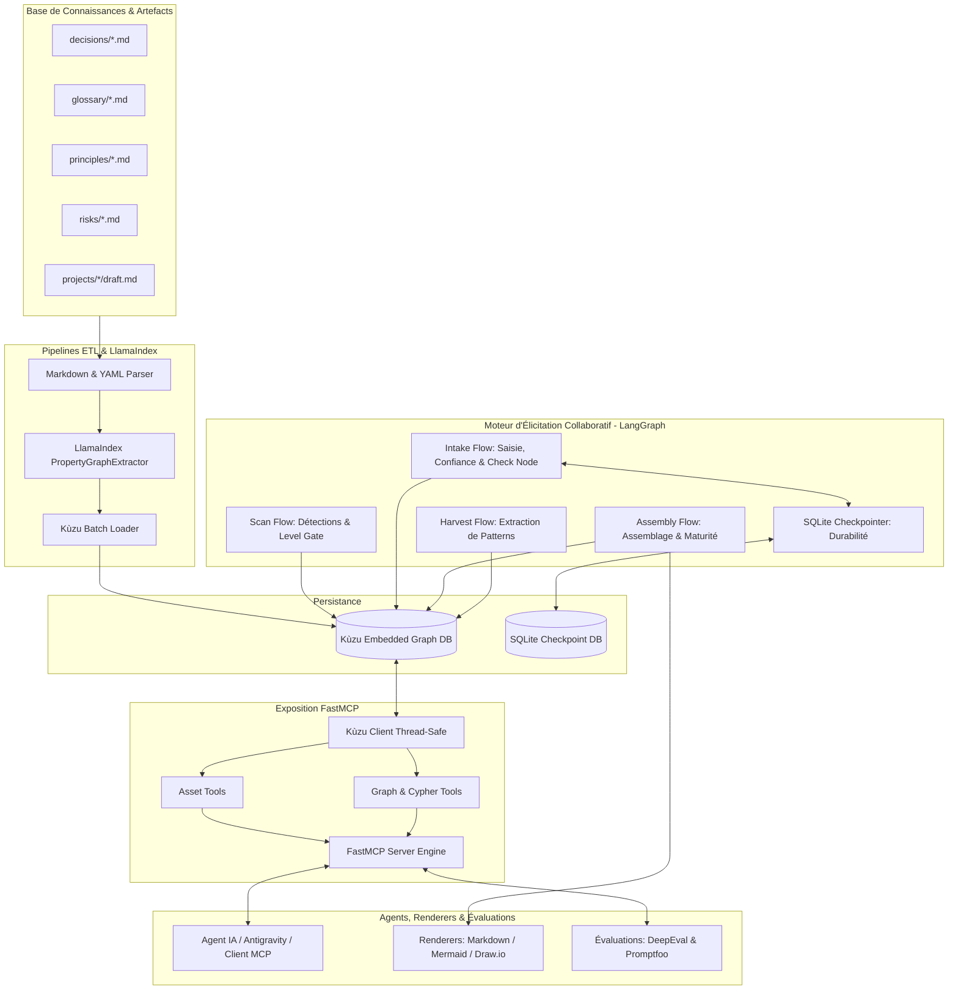
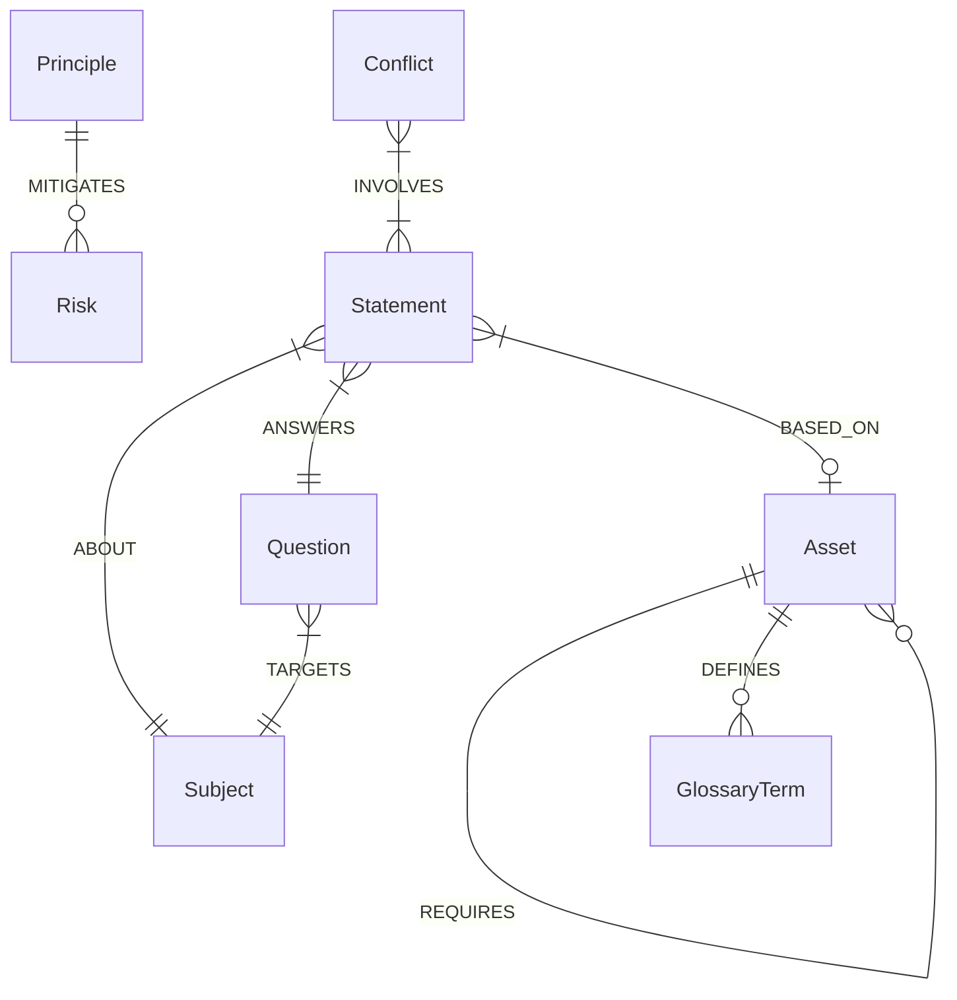
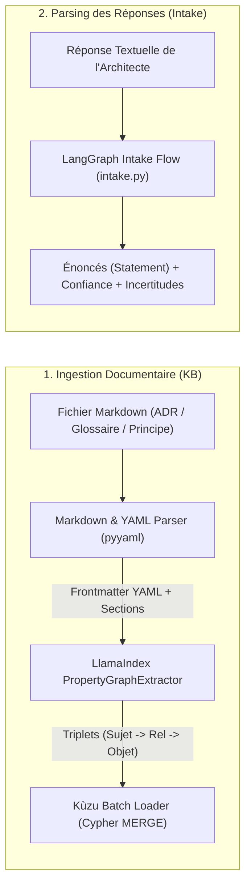
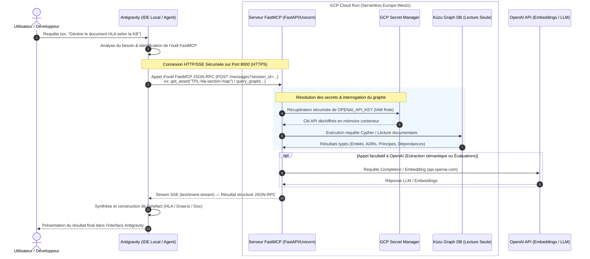

# 🏛 Architecture Logicielle — Plateforme LLMOps Neuro-Symbolique & Élicitation Collaborative

## 1. Vue d'Ensemble & Objectifs

Cette plateforme a pour but d'élaborer et de faire évoluer de manière déterministe et collaborative des documents d'architecture système (ADRs, principes, cadrage, compromis, dépendances, risques) en combinant un dossier documentaire Markdown structuré, un **Graphe de Connaissances LadybugDB / Kùzu DB**, et un **Moteur d'Élicitation Collaboratif (LangGraph)** exposé via **FastMCP** (Model Context Protocol).

### Problèmes résolus
1. **Destruction de la logique système par RAG naïf** : Le chunking textuel classique détruit les liaisons logiques essentielles (ex: une décision `SUPERSEDES` une autre, ou l'explication d'un compromis d'arbitrage).
2. **Spéculation et inventions du LLM** : En l'absence de garde-fous symboliques, un LLM invente des paramètres ou passe sous silence des manques cruciaux.
3. **Collaboration désordonnée multi-acteurs** : Sans modèle formalisé, les contributions de plusieurs architectes se chevauchent, génèrent des contradictions invisibles ou font avancer prématurément des détails techniques avant le cadrage.

### Solution Neuro-Symbolique & Élicitatoire
- **Couche Symbolique & Persistance Dual-Backend :** Graphe de connaissances géré par **LadybugDB** (avec rétrocompatibilité Kùzu DB), garantissant l'intégrité typée des entités (`Asset`, `Subject`, `Statement`, `Conflict`, `Question`, `Uncertainty`) et de leurs relations.
- **Moteur d'Élicitation Collaboratif (LangGraph) :** Orchestration de flux d'état (Scan, Intake, Assembly, Harvest) pilotant un **Level Gate de maturité** (`L0_named` → `L4_specified`), la détection automatique de contradictions, la gestion de conflits déclarés/détectés et l'arbitrage traçable.
- **Persistance Inter-Processus :** Checkpointer SQLite permettant d'interrompre une session d'élicitation et de la reprendre des jours plus tard depuis un process distant.
- **Exposition FastMCP :** Outils typés FastMCP pour la consultation, la recherche Cypher et la restitution sous forme de tableaux et rendus visuels (Mermaid, Draw.io).
- **Hébergement Serverless GCP Cloud Run :** Serverless containerisé sous GCP Cloud Run avec authentification par jeton HTTP SSE (`SERVER_TOKEN`).

---

## 2. Diagramme des Composants Logiciels



---

## 3. Schéma du Graphe de Connaissances (Ontologie Kùzu DB)

Le graphe est modélisé dans Kùzu DB avec des Nœuds et des Relations typés pour la base de connaissances et l'élicitation.



### Types de Nœuds (Node Tables)
- **`Asset`** : `(id STRING, title STRING, type STRING, status STRING, confidence STRING, last_reviewed STRING, path STRING, PRIMARY KEY(id))`
- **`ADR`** : `(id STRING, domain STRING, phase STRING, owner STRING, PRIMARY KEY(id))`
- **`Principle`** : `(id STRING, statement STRING, verification_clause STRING, PRIMARY KEY(id))`
- **`GlossaryTerm`** : `(term STRING, definition STRING, context STRING, PRIMARY KEY(term))`
- **`Risk`** : `(id STRING, severity STRING, mitigation STRING, PRIMARY KEY(id))`
- **`Subject`** : `(name STRING, level STRING, created_at STRING, PRIMARY KEY(name))`
- **`Question`** : `(id STRING, text STRING, subject STRING, target_level STRING, routed_to STRING, status STRING, engagement STRING, PRIMARY KEY(id))`
- **`Statement`** : `(id STRING, section STRING, subject STRING, predicate STRING, value STRING, author STRING, role STRING, confidence STRING, status STRING, verbatim STRING, engagement STRING, PRIMARY KEY(id))`
- **`Conflict`** : `(id STRING, kind STRING, detail STRING, status STRING, origin STRING, resolution STRING, arbitrated_by STRING, engagement STRING, PRIMARY KEY(id))`
- **`Uncertainty`** : `(id STRING, text STRING, author STRING, role STRING, engagement STRING, PRIMARY KEY(id))`

### Types de Relations (Rel Tables)
- **`SUPERSEDES`** : `FROM Asset TO Asset`
- **`REQUIRES`** : `FROM Asset TO Asset`
- **`DEFINES`** : `FROM Asset TO GlossaryTerm`
- **`MITIGATES`** : `FROM Principle TO Risk`
- **`BELONGS_TO`** : `FROM Asset TO Asset`
- **`TARGETS`** : `FROM Question TO Subject`
- **`ABOUT`** : `FROM Statement TO Subject`
- **`ANSWERS`** : `FROM Statement TO Question`
- **`INVOLVES`** : `FROM Conflict TO Statement`
- **`BASED_ON`** : `FROM Statement TO Asset`

---

## 4. À quoi sert LangGraph dans cette Architecture ?

**LangGraph** est le moteur d'orchestration par **machines d'état (State Graphs)** utilisé pour piloter le cycle de vie collaboratif de l'architecture. Contrairement à un simple script séquentiel ou à une boucle de prompt libre, LangGraph apporte trois garanties fondamentales :

### 4.1 Orchestration Déterministe à Nœuds et Arêtes Conditionnelles
Chaque étape du processus d'élicitation est un nœud réutilisable et testable (`load_frame_node`, `detect_gaps_node`, `enrich_node`, `dispatch_node`, `check_node`, `persist_node`). Les transitions d'état entre nœuds sont régies par des règles logiques déterministes (ex: passer en pause si une question nécessite une validation humaine, basculer sur l'arbitrage si une contradiction est détectée).

### 4.2 Interruption, Pause et Reprise Asynchrone (*Human-in-the-Loop*)
Dans un scénario réel, un architecte répond à une question d'élicitation trois jours après son émission. LangGraph permet de mettre le graphe d'exécution en **pause explicite** (`paused` / `Command(resume=...)`) et de sauvegarder l'état complet dans un **Checkpointer SQLite** (`get_sqlite_checkpointer`). La conversation peut alors être reprise depuis un processus Python ou un conteneur complètement indépendant en fournissant simplement le `thread_id`.

### 4.3 Isolation et Séparation des Responsabilités
LangGraph empêche le LLM de contrôler directement la logique métier. Le LLM intervient uniquement pour extraire ou reformuler du texte au sein d'un nœud isolé, tandis que LangGraph contrôle la progression des niveaux de maturité (`Level Gate`), la mise à jour des graphes dans Kùzu DB et la génération des manques.

---

## 5. Comment sont Parsées les Connaissances ?

Le parsing des connaissances s'effectue en deux étapes complémentaires : l'**ingestion de la base de connaissances documentaire** et le **parsing des réponses d'élicitation des architectes**.



### 5.1 Ingestion de la Base Documentaire (`pipelines/ingestion/`)

1. **Parsing des Fichiers Markdown et Métadonnées YAML (`markdown_parser.py`) :**
   - Utilise `PyYAML` (`yaml.safe_load`) pour lire le frontmatter présent en tête des fichiers `.md` (`id`, `title`, `domain`, `status`, `supersedes`, `requires`, `defines`, `mitigates`).
   - Découpe le corps Markdown par niveaux de titres (`#`, `##`) pour isoler les sections (`statement`, `context`, `consequences`, `verification_clause`).

2. **Extraction d'Ontologie Sémantique (`llama_extractor.py`) :**
   - S'appuie sur **LlamaIndex PropertyGraphIndex** et le composant `SchemaLLMPathExtractor`.
   - Le LLM analyse le texte de chaque section pour extraire automatiquement les triplets d'ontologie `(Entité -> Relation -> Entité)` selon le schéma (ex: `Principle` `-[:MITIGATES]->` `Risk`).

3. **Chargement Idempotent dans Kùzu DB (`graph_loader.py`) :**
   - Convertit les métadonnées et triplets en requêtes Cypher `MERGE`.
   - L'utilisation de `MERGE` garantit que l'ingestion est **100% idempotente** : ré-exécuter le pipeline met à jour les propriétés sans dupliquer aucun nœud ni aucune relation.

### 5.2 Parsing des Réponses d'Élicitation (`tools/elicitation/flows/intake.py`)

1. **Extraction d'Énoncés Atomiques (`Statement`) :**
   - La réponse en langage naturel de l'architecte (`answer_text`) est analysée par le nœud d'intake pour extraire des assertions atomiques typées par sujet et prédicat (`subject`, `predicate`, `value`).
2. **Attribution de la Confiance & Traitement de l'Incertitude :**
   - Chaque énoncé reçoit un niveau de confiance (`assumed`, `designed`, `committed`).
   - Si la réponse exprime une indétermination (ex: *"nous ne savons pas encore pour la bande passante"*), le parser crée une entité `Uncertainty` au lieu d'inventer une valeur factuelle.
3. **Traçabilité des Références (`BASED_ON`) :**
   - Si l'architecte mentionne un document de la KB (ex: `file:///projects/nordwave-mcx-2027/draft#section-5.4`), le parser relie l'énoncé au nœud `Asset` correspondant via la relation `BASED_ON`.

---

## 6. Detail du Moteur d'Élicitation (`tools/elicitation/`)

Le moteur d'élicitation structure le travail collaboratif entre plusieurs architectes système fictifs ou réels (*Amina Duarte* - Architecte Service MCX, *Rui Vasconcelos* - Architecte Cœur Mobile, *Sofia Lindqvist* - Architecte Référente).

### 6.1 Modèle de Maturité par Sujet (Level Gate)
Chaque sujet d'architecture (`Subject`) possède une maturité observable qui progresse par paliers stricts :
1. **`L0_named`** : Le sujet est identifié (ex: né d'une décomposition).
2. **`L1_framed`** : Le périmètre et le cadrage global sont définis.
3. **`L2_decomposed`** : Le sujet est décomposé en sous-composants ou patterns d'intégration.
4. **`L3_decided`** : Les arbitrages et choix techniques majeurs sont validés.
5. **`L4_specified`** : Les paramètres et profils techniques fins sont renseignés.

> **Règle du Level Gate :** Le détecteur de manques (`detect_gaps_node`) retient (`held_premature: True`) les questions exigeant un niveau supérieur (ex: `L3_decided` ou `L4_specified`) tant que le sujet concerné n'a pas atteint le niveau requis. Cela évite d'engorger la réflexion avec des détails prématurés.

### 6.2 Détection de Manques et Décomposition Générative (`scan.py`)
- **Éradication des sujets fantômes :** Le scan interroge Kùzu DB dynamiquement via `get_subjects_maturity_board()` pour ne scanner que les sujets **réellement nés dans le graphe**.
- **Effet Génératif de la Décomposition :** Lorsqu'un sujet parent (ex: `mcx-services`) atteint `L2_decomposed`, il matérialise ses sous-sujets (`group-management`, `floor-control`, `media-distribution`, `lmr-interworking`) à `L0_named`. Ces nouveaux sujets engendrent immédiatement leurs propres questions de cadrage et leurs manques retenus par le Level Gate.

### 6.3 Conflits Déclarés vs Détectés (`intake.py` & `repository.py`)
- **Déclaré (`origin: declared`)** : Un architecte conteste explicitement un énoncé via `contest_statement()`. L'énoncé cible passe au statut `contested`, un contre-énoncé `assumed` est créé, et un nœud `Conflict` est réifié.
- **Détecté (`origin: detected`)** : Le nœud de vérification (`check_node` dans `intake.py`) exécute des requêtes Cypher pour détecter automatiquement des affirmations contradictoires sur le même sujet/propriété sans intervention humaine.

### 6.4 Arbitrage Non-Manichéen (`arbitrate_conflict`)
L'arbitrage d'un conflit par un architecte référent (Sofia) ne se limite pas à désigner un vainqueur :
- **Conservation & Amendement :** Permet de conserver un énoncé tout en amendant le second (ex: restriction de portée) pour préserver deux vérités complémentaires.
- **Traçabilité des Motifs :** L'explication d'arbitrage est enregistrée dans le nœud `Conflict` qui passe au statut `arbitrated`, et l'historique des reformulations est conservé sous `previous_values`.

### 6.5 Rétrogradation Non-Monotone (`demote_subject`) & Trajectoire de Maturité
- **Rétrogradation non-monotone :** Lorsqu'un arbitrage ou une réévaluation remet en cause le cadrage d'un sujet, `demote_subject()` rétrograde le sujet vers un niveau inférieur (ex: `L3_decided` → `L2_decomposed`).
- **Flagging sous revue (`under_review`) :** Les énoncés de niveau supérieur ne sont **jamais supprimés**, mais marqués `under_review`.
- **Réouverture avec contexte :** Les questions des niveaux abandonnés sont réouvertes en conservant les réponses antérieures (`prior_answer`) comme contexte d'élaboration.
- **Trajectoire d'avancement (`get_subject_trajectory`) :** Permet d'observer et restituer l'historique complet des étapes de cadrage et de décomposition d'un sujet au fil du temps.

### 6.6 Ingestion Documentaire Spécifiée (`SPEC-DOCUMENT-INGESTION.md`)
- **Pipeline d'ingestion de livrables et drafts :** Lit et découpe les documents d'architecture `.md` selon leurs titres de sections (`1.1`, `4.1`, `5.4`).
- **Extraction sémantique d'énoncés :** Chaque section est parsée pour en extraire les énoncés (`Statement`) avec leur niveau de confiance (`designed`, `stated-by-client`, `assumed`).
- **Rapprochement Cypher avec Kùzu DB :** Les énoncés extraits sont rattachés aux sujets (`ABOUT`) et au blueprint (`requires`), permettant la réconciliation automatique des manques de la base.

### 6.7 Workflow de Contributions Externes (`contribution.py`)
- **Gestion des apports externes :** Permet à un intervenant externe de soumettre un retour d'expérience ou une contrainte terrain (`elicit contribute`).
- **Validation à double confirmation :** La contribution nécessite deux validations explicites avant d'être intégrée dans les énoncés actifs de l'engagement.
- **Propagation dans le Harvest :** Les contributions acceptées sont automatiquement classées comme candidats de promotion (`source: external-contribution`) dans le flux de récolte (`harvest.py`).

### 6.8 Assemblage du Document & Harvest (`assemble.py` & `harvest.py`)
- **Assemblage (`assemble.py`) :** Recompose le document d'architecture global (`document.md`). Le document reste marqué **`provisional`** tant qu'au moins un sujet n'a pas atteint la maturité requise (`L3_decided`) ou qu'un conflit reste ouvert.
- **Récolte (`harvest.py`) :** Identifie les solutions et décompositions généralisables pour proposer des candidats de motifs d'architecture (`Pattern`) destinés à être réutilisés dans la base de connaissances globale.

---

## 7. Architecture des Serveurs FastMCP, Séparation Physique & ADR-0015

Conformément à l'**ADR-0015**, la plateforme repose sur une séparation physique stricte des bases de données graphiques Kùzu DB :

### 7.1 Disposition Physique des Fichiers (Layout ADR-0015)
```
data/
  knowledge.kuzu                   # Base Connaissances Réutilisable (Asset, GlossaryTerm, SUPERSEDES)
  engagements/
    nordwave-mcx-2027.kuzu         # Base Engagement Projet (Subject, Statement, Question, Conflict)
    <engagement-id>.kuzu           # Base dédiée par projet client
```

### 7.2 Découverte Dynamique & Routage des Connexions (`open_connection`)
- **Découverte Automatique (`discover_engagements`)** : Les bases d'engagement sont découvertes dynamiquement par scan du répertoire `data/engagements/*.kuzu`.
- **Routage & Sûreté des Connexions (`open_connection`)** :
  1. **Autorisation en premier** (`authorise(caller, scope)` est appelé avant toute résolution de fichier).
  2. **Validation d'identifiant** : Format contraint à `[a-z0-9-]+` (rejet de `/`, `\`, `..`).
  3. **Connexion en lecture seule** : Pool de connexions Kùzu DB en lecture seule.

### 7.3 Instantanés Atomiques & Publication (`elicit publish`)
L'enregistrement et la publication d'un graphe d'engagement s'effectuent par instantanés atomiques (`elicit publish --engagement <id>`) depuis l'espace de travail vers `data/engagements/<id>.kuzu`. Les opérations d'écriture du moteur d'élicitation et de lecture du serveur MCP sont ainsi strictement isolées.

### 7.4 Spécification du Schéma (`docs/SCHEMA.md`)
La structure du schéma graphique pour chaque plan est documentée de manière automatisée dans [docs/SCHEMA.md](file:///home/momo/Dev/LLMOps/docs/SCHEMA.md) via l'outil `generate_schema_doc.py`.

---

## 8. Stratégie de Qualité & Non-Régression (`tests/`)

La validation repose sur des tests d'intégration complets et des évaluations sémantiques :

1. **Scénario Référent d'Élicitation Collaborative ([test_scenario_nordwave_mcx.py](file:///home/momo/Dev/LLMOps/tests/integration/test_scenario_nordwave_mcx.py)) :**
   - Simulation bout-en-bout de 8 actes avec 3 architectes fictifs (*Amina Duarte*, *Rui Vasconcelos*, *Sofia Lindqvist*).
   - Génération automatisée d'un rapport de progression visuel complet ([artifacts/nordwave-mcx-2027/progression.md](file:///home/momo/Dev/LLMOps/artifacts/nordwave-mcx-2027/progression.md)) projetant l'état réel du graphe à chaque étape (Maturity Boards, tables de preuves non-tronquées, diagrammes Mermaid).
2. **DeepEval Metrics & Promptfoo Benchmarking (`tests/evals/`) :**
   - **FaithfulnessMetric & AnswerRelevancyMetric** : Évaluation de la fidélité des réponses formulées à partir des outils FastMCP.
   - Assertion automatisée sur le dataset `adr_qa_dataset.json`.

---

## 9. Diagramme de Flux d'Interactions (Antigravity ↔ GCP Cloud Run ↔ OpenAI)

Le schéma ci-dessous détaille le flux d'exécution et les échanges de données sécurisés entre l'environnement de développement local (Antigravity), le serveur FastMCP hébergé en Serverless sur GCP Cloud Run, et l'API OpenAI :


