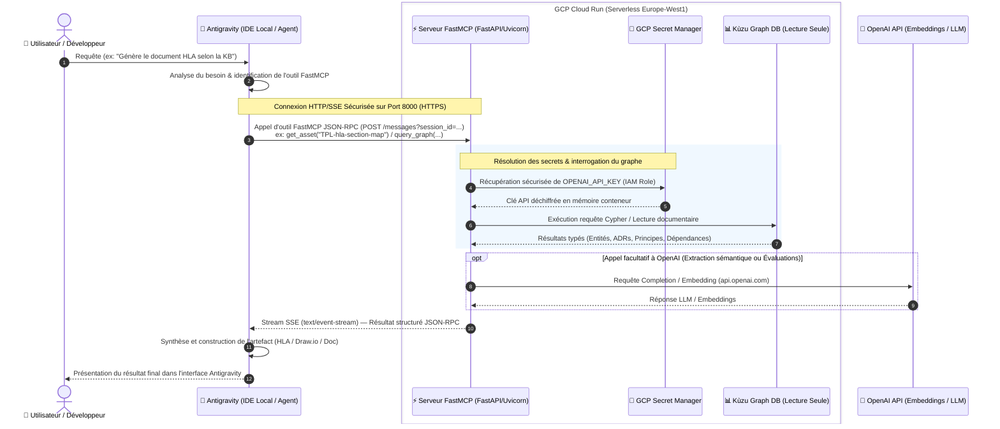

# 🏛 Architecture Logicielle — Plateforme LLMOps Neuro-Symbolique

## 1. Vue d'Ensemble & Objectifs

Cette plateforme a pour but de transformer un dossier documentaire d'architecture système (ADRs, principes, glossaire, dépendances, risques) sous forme de fichiers Markdown structurés (avec frontmatter YAML) en un **Système Neuro-Symbolique de Connaissances** exploitable par des agents IA via **FastMCP** (Model Context Protocol).

### Problème résolu
Le chunking textuel classique (RAG naïf) détruit les liaisons logiques essentielles des dossiers d'architecture (ex: une décision qui en annule une autre `SUPERSEDES`, un principe associé à sa clause de vérification, ou la définition stricte d'un terme de glossaire). La recomposition par un LLM risque de générer des réponses spécieuses ou invalides.

### Solution Neuro-Symbolique
- **Partie Symbolique :** Graphe de connaissances persistant dans **Kùzu DB** garantissant l'intégrité typée des entités et relations.
- **Partie Neuro-Sémantique :** Extraction automatique pilotée par un LLM (**LlamaIndex PropertyGraphIndex**) et exposition via des outils typés **FastMCP** pour la consommation par l'agent.

---

## 2. Diagramme des Composants Logiciels

```mermaid
flowchart TB
    subgraph Data Layer [Base de Connaissances Markdown]
        ADR[decisions/*.md]
        GLOSS[glossary/*.md]
        PRINC[principles/*.md]
        RISK[risks/*.md]
    end

    subgraph Ingestion Layer [Pipelines ETL & LlamaIndex]
        MP[Markdown & YAML Parser]
        LE[LlamaIndex PropertyGraphExtractor]
        GL[Kùzu Batch Loader]
    end

    subgraph Storage Layer [Persistence]
        KUZU[(Kùzu Embedded Graph DB)]
    end

    subgraph MCP Layer [Exposition FastMCP]
        KC[Kùzu Client Thread-Safe]
        AT[Asset Tools]
        GT[Graph & Cypher Tools]
        FSERV[FastMCP Server Engine]
    end

    subgraph Consumer Layer [Agents & Evaluation]
        AGENT[Agent IA / Claude / Cursor]
        DEVAL[DeepEval Regression Engine]
        PFOO[Promptfoo Evaluator]
    end

    Data Layer --> MP
    MP --> LE
    LE --> GL
    GL --> KUZU
    KUZU <--> KC
    KC --> AT
    KC --> GT
    AT --> FSERV
    GT --> FSERV
    FSERV <--> AGENT
    FSERV <--> DEVAL
    FSERV <--> PFOO
```

---

## 3. Schéma du Graphe de Connaissances (Ontologie Kùzu DB)

Le graphe est modélisé dans Kùzu DB avec des types de Nœuds et de Relations rigoureusement typés.

### Types de Nœuds (Node Tables)
- **`Asset`** : `(id STRING, title STRING, type STRING, status STRING, confidence STRING, last_reviewed STRING, path STRING, PRIMARY KEY(id))`
- **`ADR`** : `(id STRING, domain STRING, phase STRING, owner STRING, PRIMARY KEY(id))`
- **`Principle`** : `(id STRING, statement STRING, verification_clause STRING, PRIMARY KEY(id))`
- **`GlossaryTerm`** : `(term STRING, definition STRING, context STRING, PRIMARY KEY(term))`
- **`Risk`** : `(id STRING, severity STRING, mitigation STRING, PRIMARY KEY(id))`

### Types de Relations (Rel Tables)
- **`SUPERSEDES`** : `FROM ADR TO ADR`
- **`REQUIRES`** : `FROM Asset TO Asset`
- **`DEFINES`** : `FROM Asset TO GlossaryTerm`
- **`MITIGATES`** : `FROM Principle TO Risk`
- **`BELONGS_TO`** : `FROM Asset TO Asset`

---

## 4. Pipeline d'Ingestion LlamaIndex (`pipelines/`)

1. **Parsing des fichiers Markdown :**
   `markdown_parser.py` lit chaque fichier, extrait le frontmatter YAML (métadonnées) et sépare le corps Markdown en sections typées.

2. **Extraction d'ontologie via LlamaIndex :**
   Le module `llama_extractor.py` s'appuie sur `PropertyGraphIndex` et `SchemaLLMPathExtractor` pour convertir le contenu en triplets (Nœud -> Relation -> Nœud) conformes au schéma défini.

3. **Chargement Kùzu DB (`graph_loader.py`) :**
   Insertion idempotente via requêtes `MERGE` Cypher pour s'assurer qu'aucune ré-exécution de l'ingestion ne duplique des nœuds existants.

---

## 5. Architecture du Serveur FastMCP (`mcp_server/`)

Le serveur repose sur la bibliothèque **FastMCP** en Python.

### Caractéristiques clés :
- **Connexion Kùzu DB thread-safe :** Gestionnaire de pool/session `kuzu_client.py` en mode lecture seule lors de l'exécution des outils.
- **Strict-Typed Asset Tools :**
  - `get_asset(id)` : Renvoie l'intégralité d'un document avec son état de révision et sa confiance.
  - `get_decision_trail(id)` : Parcourt les relations `SUPERSEDES` dans les deux sens pour reconstituer l'historique d'une décision d'architecture.
  - `get_glossary_term(term)` : Fournit la définition canonique pour éviter toute ambiguïté sémantique par l'agent.
- **Isolation du client :** Les données sous `projects/` nécessitent un filtre explicite `engagement` pour prévenir toute fuite de données client inter-projets.

---

## 6. Stratégie de Qualité & Non-Régression Sémantique (`tests/evals/`)

La validation sémantique garantit que l'agent consommant le FastMCP produit des réponses fiables et conformes.

1. **DeepEval Metrics :**
   - **FaithfulnessMetric :** Vérifie que la réponse de l'agent repose à 100% sur les faits fournis par les outils FastMCP.
   - **AnswerRelevancyMetric :** Mesure la pertinence de la réponse par rapport à la question posée.
2. **Promptfoo Benchmarking :**
   - Assertion automatisée sur les arguments et les résultats des outils FastMCP à partir du dataset `adr_qa_dataset.json`.

---

## 7. Exploitation & CI/CD

- **GitHub Workflows :**
  - `ci.yml` : Validation syntaxique, linting (Ruff), typage (Mypy) et tests unitaires.
  - `ingest-kb.yml` : Reconstitution du graphe Kùzu DB lors d'un push sur `main` modifiant `data/kb/`.
  - `eval.yml` : Exécution des évaluations DeepEval en CI.

---

## 8. Diagramme de Flux d'Interactions (Antigravity ↔ GCP Cloud Run ↔ OpenAI)

Le schéma ci-dessous détaille le flux d'exécution et les échanges de données sécurisés entre l'environnement de développement local (Antigravity), le serveur FastMCP hébergé en Serverless sur GCP Cloud Run, et l'API OpenAI :



### 💡 Points clés d'architecture & sécurité :
- **Séparation des responsabilités :** Antigravity gère le raisonnement local et le dialogue avec le développeur, tandis que le serveur FastMCP sur GCP Cloud Run sert de coffre-fort de connaissances structuré et déterministe.
- **Sécurité des secrets :** `OPENAI_API_KEY` n'est jamais exposée ni envoyée par Antigravity : elle est directement injectée par **GCP Secret Manager** dans la mémoire du conteneur Cloud Run au moment de l'exécution via IAM.
- **Transport SSE / HTTP2 :** Les échanges entre Antigravity et Cloud Run s'effectuent en streaming temps réel via **Server-Sent Events (SSE)**.

### ❓ Pourquoi l'appel à OpenAI est-il facultatif au niveau du Serveur FastMCP ?

1. **Sans appel à OpenAI (0 cost, 0ms latence LLM, 100% déterministe)** :
   Lorsqu'Antigravity appelle un outil MCP standard (`get_asset`, `list_assets`, `get_decision_trail`, `query_graph`, `get_glossary_term`), le serveur FastMCP interroge directement la base de connaissances embarquée **Kùzu DB**. La donnée (Markdown, JSON-RPC, relations Cypher) est renvoyée de manière **purement symbolique et déterministe** sans faire appel à l'API OpenAI. C'est Antigravity qui réalise la synthèse.

2. **Avec appel à OpenAI (`api.openai.com`)** :
   Un appel à OpenAI est déclenché dans les cas suivants :
   - **Ingestion automatique du graphe (`pipelines/ingestion/`)** : Le parser LlamaIndex `SchemaLLMPathExtractor` utilise OpenAI pour extraire les entités et relations implicites des nouveaux documents Markdown.
   - **Évaluations automatisées (`tests/evals/semantic/`)** : DeepEval interroge OpenAI pour calculer les métriques de fidélité sémantique (*Faithfulness*) et de pertinence (*Answer Relevancy*).
   - **Recherche hybride / Embeddings (Extensions futures)** : Calcul d'embeddings vectoriels pour des requêtes en langage naturel sur le texte libre des documents.
