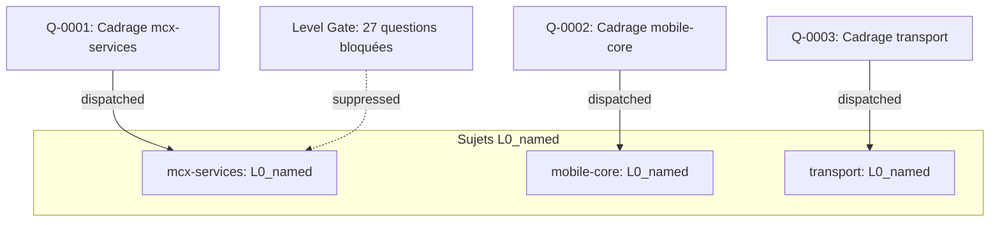
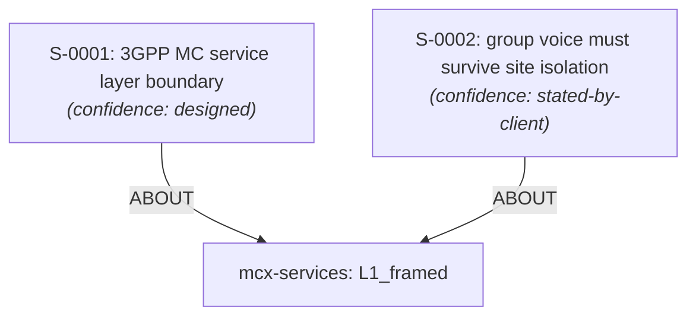
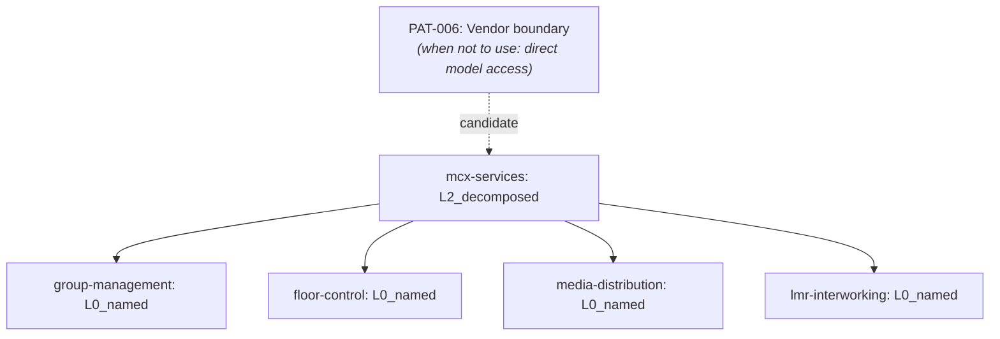
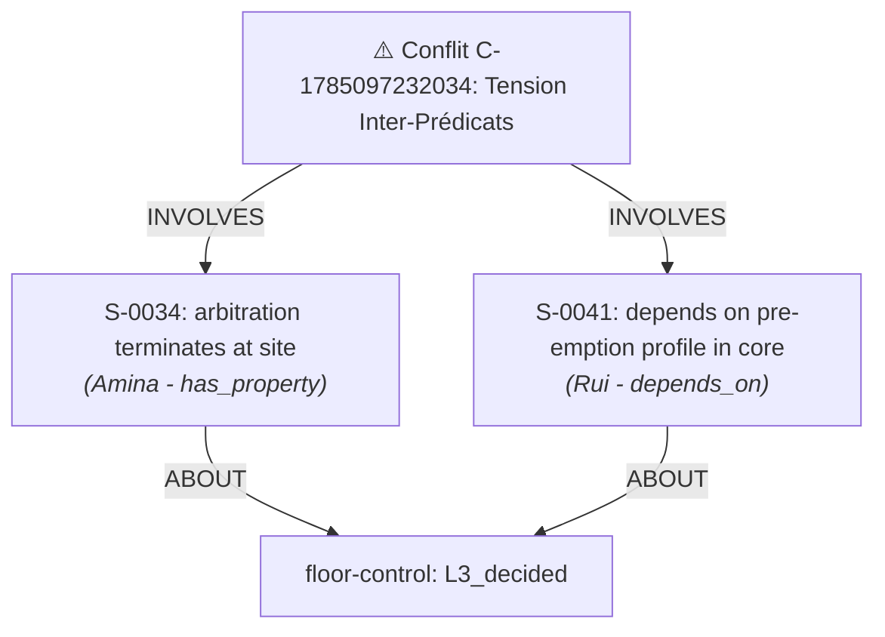
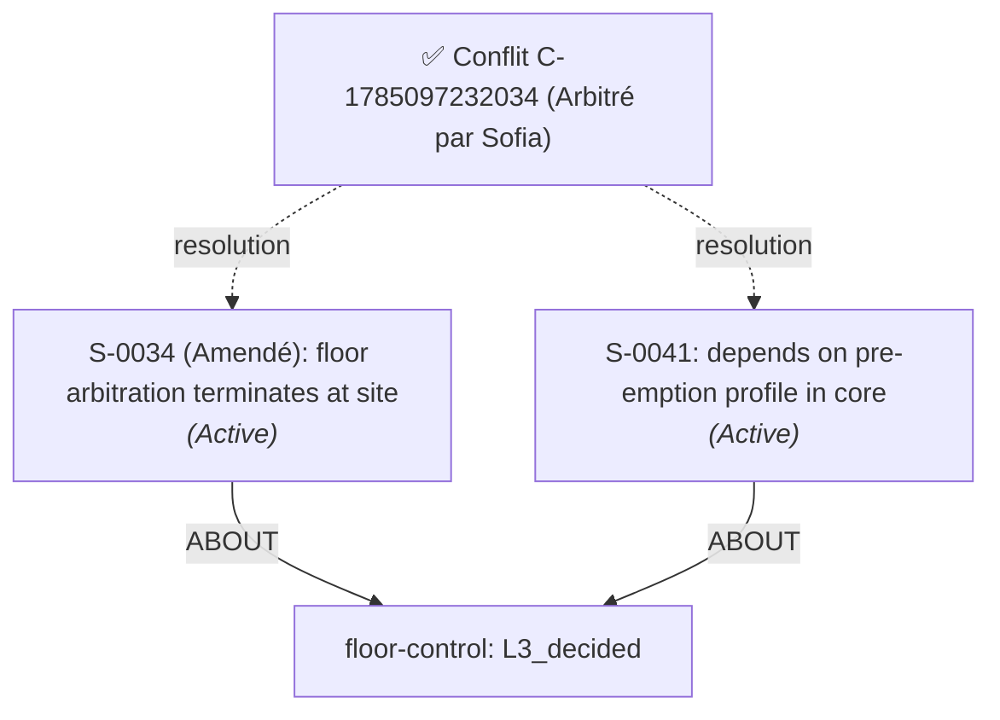

# 📈 Rapport de Progression & Visualisation des Étapes — Scénario Nordwave MCX

Ce rapport retrace la progression étape par étape du document d'architecture pour l'engagement `nordwave-mcx-2027` avec schémas Mermaid et tableaux de maturité.

## 🟢 Acte 1 — Premier Scan & Level Gating (Graphe Vierge)

### État du Graphe :
- **Sujets détectés à L0** : `mcx-services`, `mobile-core`, `transport`
- **Questions émises** : 3 questions de cadrage L1
- **Level Gating** : 27 manques retenus car les sujets sont à L0.

## 🔵 Acte 2 — Cadrage & Confiances d'Énoncé

### Action d'Amina Duarte (`mcx-service-architect`) :
- `mcx-services` passe de `L0_named` à `L1_framed`.
- **Énoncé S-0001** (`confidence: designed`) : "3GPP MC service layer boundary".
- **Énoncé S-0002** (`confidence: stated-by-client`) : "group voice must survive site isolation".

## 🟣 Acte 3 — Décomposition L1 -> L2 & Pattern PAT-006

### Action d'Amina Duarte :
- `mcx-services` passe à `L2_decomposed`.
- **Pattern Proposé** : `PAT-006` (*Vendor boundary through northbound interface*).
- **Sujets Créés (L0)** : `group-management`, `floor-control`, `media-distribution`, `lmr-interworking`.

## 🟠 Acte 5 — Contestation Inter-Prédicats & Conflit C-1785097232034

### Action de Rui Vasconcelos (`mobile-core-architect`) :
- Conteste `S-0034` (`has_property`) avec un prédicat `depends_on`.
- **Conflit C-1785097232034** généré pour tension inter-prédicats sur `floor-control`.

## 🟡 Acte 6 — Arbitrage Multi-Action avec `--amend`

### Action de Sofia Lindqvist (`chief-architect`) :
- Arbitrage avec `--amend S-0034 --to "floor arbitration terminates in the MC service layer at the site" --keep S-0041`.
- `S-0034` amendé et conservé `active`. `S-0041` conservé `active`.

## 📑 Actes 7 & 8 — Statut du Document Assemblé & Maturity Board

### Document Status:
- **Statut Global** : `PROVISIONAL` (PROVISIONAL)
- **Raison** : Des sujets restent sous L3 (`group-management` L0, `media-distribution` L0, `lmr-interworking` L0, etc.).
- **Section 4.3** : `FINAL` (dépendances résolues et `floor-control` à L3).

### Maturity Board Snapshot:
| Sujet | Niveau Atteint | Statut |
|---|---|---|
| `mcx-services` | `L2_decomposed` | OK |
| `group-management` | `L0_named` | OK |
| `floor-control` | `L3_decided` | OK |
| `media-distribution` | `L0_named` | OK |
| `lmr-interworking` | `L0_named` | OK |
